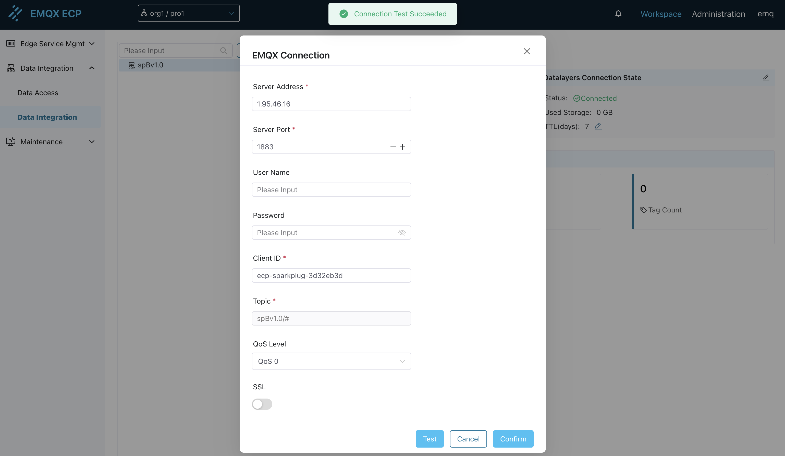
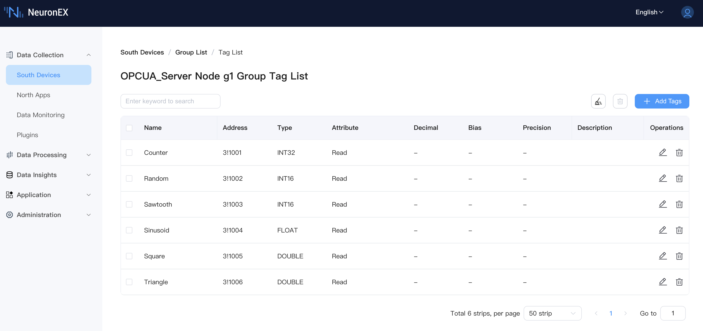
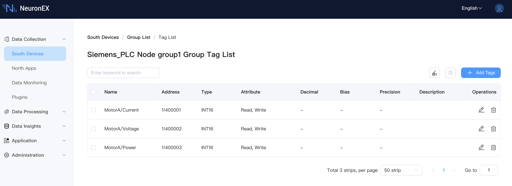
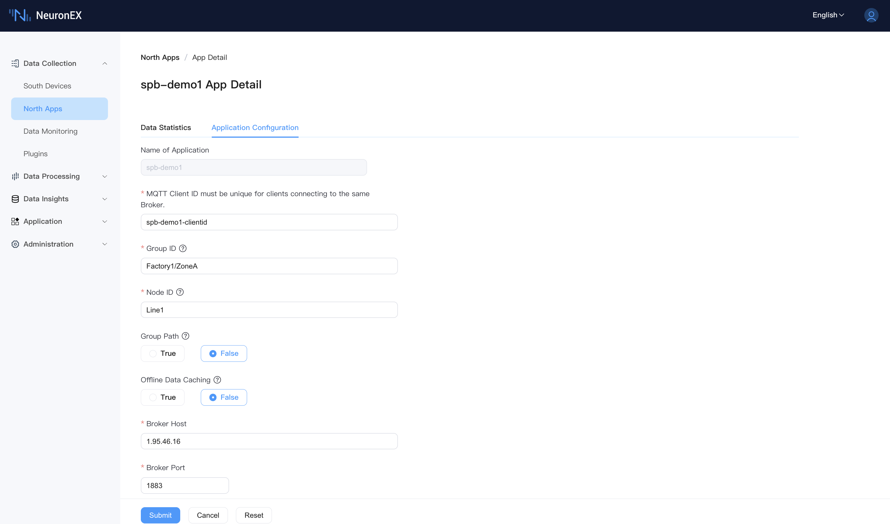
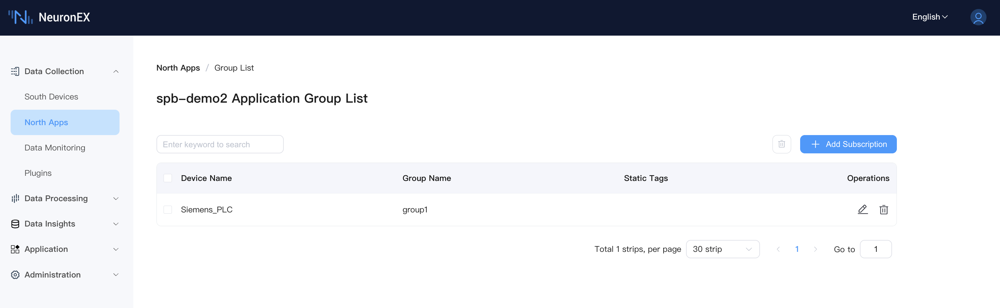

# Configuration Guide

This chapter will guide you through the complete configuration of ECP's data integration functionality, achieving data flow from NeuronEX to ECP.

## Prerequisites

- ECP v2.7.0 or higher has been successfully deployed.
- A running EMQX instance (EMQX v4 or v5 versions are both supported).
- At least one running NeuronEX instance (v3.6.2 or higher) that can communicate normally with the EMQX instance.

By adding the SparkplugB northbound plugin in NeuronEX, subscribing to collection group information from multiple southbound drivers in the SparkplugB plugin, and configuring the [Group ID, Node ID, and Group Path](./introduction.md#neuronex-northbound-plugin-sparkplugb-introduction) parameters, data is sent to EMQX. Then, through ECP subscribing to all compliant data, data integration is achieved.

## Step 1: Basic Configuration of ECP Data Integration

In this step, we configure the basic settings for ECP's data integration functionality, including EMQX connection information and data storage information.

After deploying ECP (>= v2.7.0), log in to the ECP platform, create an organization and project, and then enter the data integration page under the project.

First, you need to configure the EMQX connection information. As shown in the diagram above, NeuronEX's SparkplugB plugin sends tag data to the MQTT Broker (EMQX). Therefore, you need to configure the EMQX connection information in ECP to receive tag data reported by edge node NeuronEX. ECP will automatically subscribe to the `spBv1.0/#` topic to receive all compliant data.

After testing the connection successfully, click Confirm.

By default, ECP has a built-in single-node TSDB that is already in a connected state. It will store received MQTT data into the Datalayers database without requiring configuration changes. When an external multi-node Datalayers database is needed, you can click the edit button to configure the Datalayers database connection information.

In this step, after configuring the MQTT Broker and data storage, we can proceed to step two, configuring data reporting functionality in NeuronEX.

## Step 2: Configure Data Reporting in NeuronEX and Automatically Build Tree Structure in ECP

**1. Configure Southbound Drivers in NeuronEX**

Log in to the deployed NeuronEX 3.6.2 or higher instance, click **Data Collection** -> **Southbound Devices** to enter the southbound devices page. Add 2 southbound drivers to connect to external OPCUA simulator and ModbusTCP simulator respectively.

The OPCUA driver has one collection group `g1` with 6 tags under the collection group, as shown below:

The ModbusTCP driver has one collection group `group1` with 3 tags: `MotorA/Current`, `MotorA/Voltage`, `MotorA/Power`, as shown below:

::: tip

Later in the ECP tree structure page, you can see that the tag `MotorA/Current` will map `MotorA` as a virtual node.

:::

**2. Configure the First SparkplugB Northbound Application in NeuronEX**

On the **Data Collection** -> **Northbound Applications** page, click **Add Application** to add the first SparkplugB application. Below is the configuration in the NeuronEX "Northbound Application / Add Application" interface:

- **Basic Information**
  - Name: spb-demo1
  - Plugin: SparkPlugB
  - MQTT Client ID: spb-demo1-clientid

- **SparkplugB Node Identifier**
  - Group ID: Factory1/ZoneA. Note: This is a UNS virtual node (Group ID) built based on the SparkplugB specification.
  - Node ID: Line1. Note: This is a UNS virtual node (Node ID) built based on the SparkplugB specification.
  - Group Path: False. Note: Setting to False means the southbound driver's collection group name is not mapped to the UNS tree structure.
  - Offline Caching: False

- **Server Connection Information**
  - Server Address: 1.95.46.16. Please enter your own EMQX instance access address. Note that this address must match the server address in the EMQX connection information configured in step one.
  - Server Port: 1883
  - Username/Password: If your EMQX has authentication enabled, please enter the correct credentials.

Add the southbound driver OPCUA_Server as a subscription to this SparkplugB application.

After adding, you can see multiple nodes such as Factory1, ZoneA, Line1, and OPCUA_Server on the ECP tree structure page. The Line1 node indicates that the northbound spb-demo1 node status is online, and the OPCUA_Server node indicates that the southbound driver OPCUA_Server status is online.

**3. Configure the Second SparkplugB Northbound Application in NeuronEX**

On the **Data Collection** -> **Northbound Applications** page, click **Add Application** to add the second SparkplugB application. Below is the configuration in the NeuronEX "Northbound Application / Add Application" interface:

- **Basic Information**
  - Name: spb-demo2
  - Plugin: SparkPlugB
  - MQTT Client ID: spb-demo2-clientid

- **SparkplugB Node Identifier**
  - Group ID: Factory1/ZoneB. Note: This is a UNS virtual node (Group ID) built based on the SparkplugB specification.
  - Node ID: Line2. Note: This is a UNS virtual node (Node ID) built based on the SparkplugB specification.
  - Group Path: False. Note: Setting to False means the southbound driver's collection group name is not mapped to the UNS tree structure.
  - Offline Caching: False

- **Server Connection Information**
  - Server Address: 1.95.46.16. Please enter your own EMQX instance access address. Note that this address must match the server address in the EMQX connection information configured in step one.
  - Server Port: 1883
  - Username/Password: If your EMQX has authentication enabled, please enter the correct credentials.

Add the southbound driver ModbusTCP as a subscription to this SparkplugB application.

After adding, you can see the complete tree structure of the 2 SparkplugB applications in NeuronEX on the ECP tree structure page.

::: tip

You can see that the tag `MotorA/Current` maps `MotorA` as a virtual node. By adding `/` in tag naming, you can freely map multiple tags under one southbound driver to different virtual nodes.

:::

At this point, your data integration pipeline has been successfully established. You can continue to deploy multiple NeuronEX instances and configure different Group ID, Node ID, and Group Path parameters in SparkplugB applications according to business requirements to build a complete UNS (Unified Namespace) for industrial data.

Please browse the following chapters to learn more about ECP data integration configuration and usage:

- [Data Integration - Overview](./overview.md)
- [Data Integration - Data Analysis](./analysis.md)
- [Data Integration - Event Query](./event.md)
- [Data Integration - AI Assistant](./ai_assistant.md)

