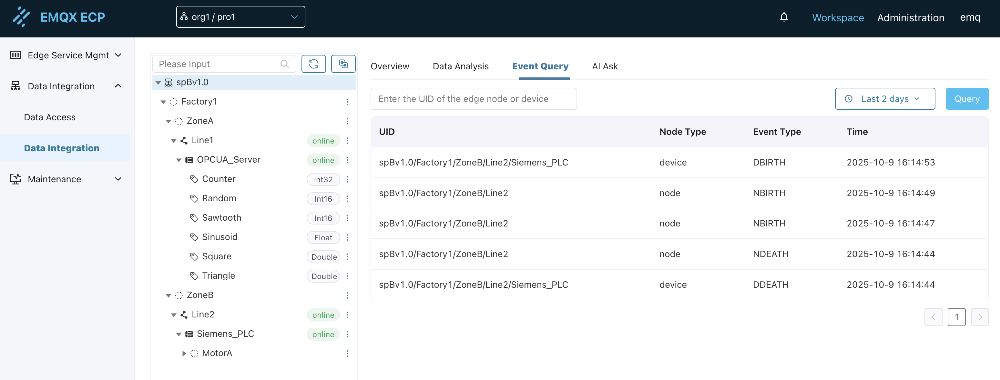

# Event Query

The ECP event query functionality is based on SparkplugB protocol lifecycle messages (Birth/Death), providing comprehensive monitoring and historical tracking of edge node and device online/offline status. Through unified event management, you can grasp the connection status changes of all components in the entire industrial data network in real-time.

## Functionality Overview

The event query functionality automatically records and displays edge node and device online/offline events by monitoring lifecycle messages in the SparkplugB protocol. This event information is crucial for device operations, fault diagnosis, and system monitoring.

### Supported Event Types

| Event Type | Description | Trigger Condition |
|----------|------|----------|
| **NBIRTH** | Edge node online | SparkplugB northbound application in NeuronEX successfully connects and reports node information |
| **NDEATH** | Edge node offline | SparkplugB northbound application in NeuronEX disconnects or exits abnormally |
| **DBIRTH** | Device online | Southbound driver successfully connects and starts reporting device data |
| **DDEATH** | Device offline | Southbound driver disconnects or device goes offline |

## Interface Layout

The event query page adopts a clean layout design, mainly including the following areas:

### Query Criteria Area

**UID Input Box**:
- Label: `Enter the UID of edge node or device`
- Functionality: Supports entering the complete node or device UID for precise queries
- Example: `spBv1.0/Factory1/ZoneB/Line2/Siemens_PLC`

**Time Range Selection**:
- Provides preset time options: Last 1 day, Last 2 days, Last 7 days, Last 30 days
- Default selection: Last 2 days
- Supports custom time range selection

**Query Button**:
- Click to execute query operation
- Supports Enter key shortcut query

### Event List Area

Display query results in table format, including the following columns:

| Column Name | Description | Example |
|------|------|------|
| **UID** | Unique identifier of edge node or device | `spBv1.0/Factory1/ZoneB/Line2` |
| **Node Type** | Entity type (node/device) | `node` / `device` |
| **Event Type** | Specific event type | `NBIRTH` / `NDEATH` / `DBIRTH` / `DDEATH` |
| **Time** | Specific timestamp when the event occurred | `2025-10-9 16:14:49` |

## Query Methods

### 1. Precise Query

Enter the complete edge node or device UID to query all event records of a specific entity:

**Query Example**:
- Input: `spBv1.0/Factory1/ZoneB/Line2`
- Result: Display all online and offline events of this edge node

### 2. Time Range Query

Select a time range to query all events within the specified time period:

**Time Options**:
- Last 1 day: Query events from the past 24 hours
- Last 2 days: Query events from the past 48 hours (default)
- Last 7 days: Query events from the past week
- Last 30 days: Query events from the past month

### 3. Global Query

Without entering UID or selecting a time range, directly click the query button to view all historical event records.

### 4. Combined Query

Use both UID and time range conditions simultaneously to achieve more precise queries:

**Example Scenario**:
- UID: `spBv1.0/Factory1/ZoneA/Line1/OPCUA_Server`
- Time: Last 7 days
- Result: Display all online/offline events of this device in the past week

