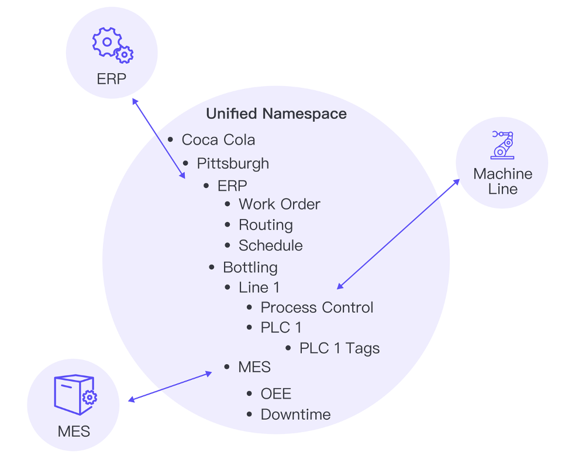
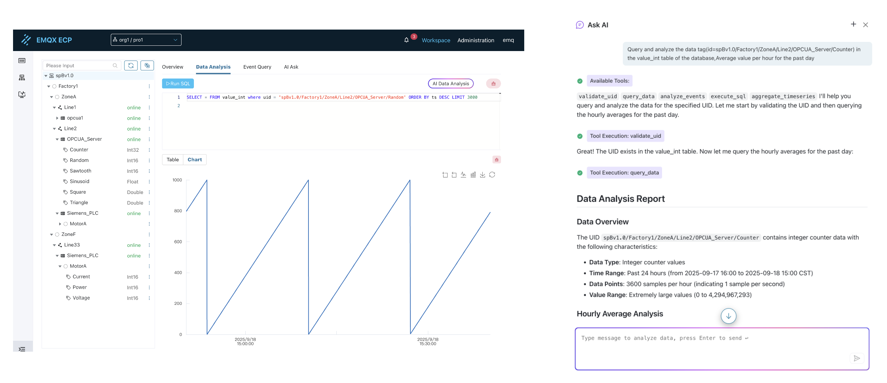

# UNS Data Integration

## Introduction
On the journey towards Industry 4.0, we all recognize one fact: data is the new oil. However, for most manufacturing enterprises, the process of "extracting and refining" this "oil" is exceptionally challenging. Factories are filled with equipment from different eras and different suppliers, each speaking their own "dialect" (PLC, SCADA, MES, ERP...), resulting in data being trapped in isolated systems, forming so-called "data silos."

This fragmented reality creates an insurmountable chasm between OT (Operational Technology) and IT (Information Technology). We cannot obtain a unified, real-time global view of factory operations, let alone leverage this data to drive advanced analytics and artificial intelligence (AI) applications.

Is there an architecture that can completely break down these barriers and allow data to flow freely and orderly? The answer is yes—it's called the Unified Namespace (UNS).

## What is a Unified Namespace (UNS)?
Unified Namespace (UNS) is a revolutionary data architecture concept. Its core principle is to organize all valuable data and events within an enterprise according to unified, structured business logic (e.g., Enterprise/Site/Workshop/Production Line/Equipment/Parameter), aggregating them into a central data hub, thereby building a Single Source of Truth for the entire enterprise.

Under this architecture, any data producer (such as a CNC machine) and data consumer (such as an MES system or an AI algorithm) no longer need complex point-to-point integration. They simply need to connect to this "central hub" and publish or subscribe to data according to predefined "addresses." This greatly simplifies system integration and achieves true "plug-and-play."

UNS is not just a naming convention, but a revolutionary data architecture philosophy that aims to:

- **Build a Single Source of Truth**: Aggregate all real-time, valuable data and events within the enterprise under a unified, structured namespace
- **Provide Data Semantics and Context**: Organize data hierarchically according to business logic, ensuring each data point carries its business meaning and contextual information
- **Enable Event-Driven Real-Time Flow**: Based on publish/subscribe protocols like MQTT, ensure data flows on-demand, efficiently, and in real-time between producers and consumers
- **Completely Decouple Data Producers and Consumers**: Whether it's low-level PLCs, sensors, or upper-level MES, ERP, BI, or AI applications, all can independently connect to UNS

<div align="center">

</div>

## UNS-Based Comprehensive Solution
A comprehensive solution based on UNS architecture includes NeuronEX, EMQX Platform, ECP management platform, and rich application interfaces that seamlessly collaborate to build a powerful industrial AI data hub for you.

### NeuronEX: Industrial Connectivity Gateway
As the "data collection tentacles" of UNS, Industrial Connectivity Gateway (such as NeuronEX) is responsible for connecting various industrial devices in the factory floor. It supports data collection from 100+ industrial protocols (such as Modbus, OPC-UA, Siemens S7, etc.), converting raw, obscure device data into unified MQTT messages with business context and publishing them to UNS. Meanwhile, it can also perform real-time data processing and computation at the edge, reducing latency and network load.

### EMQX Platform: Real-Time Messaging and Data Hub
EMQX Platform is the heart of the UNS architecture. A high-performance MQTT messaging platform (such as EMQX Platform) carries all data exchange for the entire UNS. It receives data from all edge nodes and performs efficient routing based on topics, ensuring any authorized application can subscribe to the data they need in real-time. Its high availability and high concurrency characteristics ensure the stability and reliability of the entire factory data flow.

**Core Capabilities:**

- **UNS Core Messaging Hub**: As a high-performance, highly available distributed MQTT platform
- **Massive Connections and High Throughput**: Supports millions of concurrent connections and millions of messages per second
- **Built-in Rules Engine**: Real-time processing, transformation, and enrichment of UNS data streams
- **AI/Large Model Integration**: As a critical data pipeline, efficiently providing structured UNS data to AI analytics platforms

### ECP Platform: Unified Management and Integration Platform
ECP provides a unified interface for device, data, and application management, simplifying UNS deployment and operations, achieving deep IT/OT integration.

**Core Capabilities:**

- **Unified Device Management**: Centrally manage all devices and systems connected to UNS
- **Data Modeling and Visualization**: Provide intuitive data model management and monitoring interfaces
- **Operations Management**: Simplify UNS system deployment, configuration, and daily operations
- **Security Control**: Provide fine-grained access control and data security protection


## Automated Modeling Based on SparkplugB
Sparkplug B injects the "automation" gene into the UNS architecture. It defines a standard on top of MQTT, elevating the efficiency and reliability of industrial data interaction to new heights. Its core advantages are reflected in the following three points:

1. **Data Semantics Compliance**
   Organize data hierarchically according to business logic (such as: Enterprise/Region/Factory/Production Line/Equipment/Device/Tag), ensuring each data point carries business meaning.

2. **Precise Status Display**
   Built-in "Birth and Death Certificate" mechanism can accurately and real-time display the actual online status of each edge node and device in the network, eliminating status delay concerns and making monitoring and operations more reliable.

3. **Automated Data Persistence**
   After devices connect to the network, the platform can automatically create data storage strategies based on the information they report. This truly realizes "plug-and-play" data persistence without manual configuration, laying the foundation for subsequent analysis.


## Full-Scenario Data Insights and Analysis
Effectively storing and utilizing massive industrial data is the last mile in unlocking its value. Our platform provides a complete toolchain, enabling everyone from data engineers to frontline business experts to easily gain insights from data.

1. **Time-Series Database Storage**
   The platform has a built-in time-series database Datalayers designed specifically for industrial scenarios. It supports efficient querying and analysis of massive, high-frequency time-series data using standard SQL, providing powerful capabilities for various industrial data analysis applications.

2. **Intelligent SQL Editor**
   To improve data query efficiency, we provide an intelligent SQL editor. It supports syntax highlighting and automatic keyword suggestions, significantly reducing SQL writing errors and making the work of data engineers and analysts more efficient and accurate.

3. **AI Data Analysis**
   We believe everyone should be able to leverage data easily. Through AI data analysis functionality, you only need to describe query requirements in natural language, and AI will automatically generate SQL statements, greatly lowering the barrier to data analysis.



## Core Advantages of Embracing UNS
Transitioning from traditional point-to-point integration to advanced UNS architecture will bring immeasurable value to your enterprise:

- **Extremely Simplified Integration**
  Break down data silos and achieve seamless integration of IT and OT systems. Adding a new device or a new system no longer requires weeks of custom development, saving significant costs and time.

- **Drive Real-Time Decision-Making**
  The MQTT publish/subscribe model ensures millisecond-level latency from data generation to consumption. Managers and operators can make the most precise decisions based on the most immediate data.

- **Prepare for the AI Era**
  The success of AI algorithms depends on high-quality, large-scale, real-time data with rich contextual information. The UNS architecture is precisely the "data pipeline" tailor-made for AI models, capable of continuously providing high-quality data streams and accelerating the implementation of predictive maintenance, intelligent scheduling, digital twins, and other applications.


## SparkplugB Introduction

SparkplugB is an open communication protocol specification in the Industrial Internet of Things (IIoT) field, extended based on MQTT 3.1.1 protocol, specifically designed for industrial device interconnection. It defines standardized data formats, topic naming rules, and state management mechanisms between devices and systems, solving core issues such as device data heterogeneity and state consistency in industrial scenarios.

In ECP's data integration functionality, we use the SparkplugB specification, where NeuronEX northbound uses the SparkplugB plugin for data reporting, with NeuronEX acting as a SparkplugB edge node. ECP subscribes to all compliant data through the wildcard `spBv1.0/#`, with ECP acting as a SparkplugB application node.

### SparkplugB Terminology

#### Edge Node
Edge Node is a core component in the SparkplugB architecture, representing a physical or logical edge computing unit responsible for connecting and managing a group of devices.

- **Group ID**: Group identifier to which the edge node belongs
  - Used for logical grouping of edge nodes, typically corresponding to physical areas or functional zones in a factory
  - Examples: `Factory_A`, `Production_Line_1`, `Warehouse_B`
  - All edge nodes within the same group share the same Group ID

- **Node ID**: Unique identifier for the edge node
  - Must be unique within the same Group ID
  - Usually corresponds to a specific physical device or logical unit
  - Examples: `PLC_001`, `Gateway_Station_1`, `Edge_Computer_A`

#### Topic Naming Rules
SparkplugB uses standardized MQTT topic format:
```
spBv1.0/{Group ID}/{Edge Node ID}/{Message Type}
```

**Example Topics:**
- `spBv1.0/Factory_A/PLC_001/NBIRTH` - Node birth message
- `spBv1.0/Factory_A/PLC_001/DDATA` - Device data message
- `spBv1.0/Production_Line_1/Gateway_Station_1/NDEATH` - Node death message

### SparkplugB Core Features

- **Standardized Data Model**:
  Defines unified format for device data (such as Metric structure), including metadata like data types, units, timestamps, eliminating differences between device protocols.

- **State Management**:
  Through Birth (device/node online) and Death (offline) messages, clearly defines device lifecycle, ensuring the system is real-time aware of device status.

- **Data Compression and Efficient Transmission**:
  Uses Protobuf encoding to compress data, reducing network bandwidth usage, suitable for low-power industrial devices.

- **Topology Support**:
  Supports hierarchical device models (such as Edge Node → Device → Metric), naturally fitting factory physical topology

### SparkplugB Typical Message Types

- **NBIRTH** (Node birth), **DBIRTH** (Device birth)
- **NDATA** (Node data), **DDATA** (Device data)
- **NDEATH** (Node death), **DDEATH** (Device death)

## NeuronEX Northbound Plugin SparkplugB Introduction

NeuronEX northbound plugin SparkplugB is a standard SparkplugB edge node. Through this node, you can connect to any MQTT Broker that supports the SparkplugB protocol specification, and SparkplugB Application applications can subscribe to data reported by this node.

### SparkplugB Plugin Usage

On the **Data Collection** -> **Northbound Applications** page, click **Add Application** to add the SparkPlugB plugin.

#### Configure Driver Parameters

SparkplugB is an application-layer protocol running on top of MQTT, so the settings in NeuronEX are similar to the MQTT plugin.

- Among the following parameters, only **Group ID** and **Node ID** come from the Sparkplug B specification.
- The **Group Path** option is used to indicate whether to include the southbound device group name in the tree structure of ECP data integration.
- The rest are MQTT Broker connection parameters.


| Parameter         | Description                                                         |
| ------------- | ------------------------------------------------------------ |
| **Client ID** | MQTT client ID, unique identifier for the connection                                 |
| **Group ID**  | Top-level logical grouping in Sparkplug B protocol, can represent entities like factories or workshops     |
| **Node ID**   | Unique identifier for edge node in Sparkplug B protocol                           |
| **Group Path**   | Whether to include southbound device group names in the ECP data integration tree structure, enabled when value is true, enabled by default |
| **Offline Cache**   | Offline cache switch. When connection is disconnected, cache MQTT messages; when connection is reestablished, sync cached MQTT messages to server, enabled when value is true, disabled by default |
| **Cache Memory Size** | Maximum memory cache size (unit: MB) when MQTT connection is abnormal. Should be smaller than cache disk size. |
| **Cache Disk Size** | Maximum disk cache size (unit: MB) when MQTT connection is abnormal. Should be larger than cache memory size. If not 0, cache memory size should also not be 0. |
| **Cache Message Retransmission Interval**  | Cache message retransmission interval (MS), in milliseconds |
| **Server Address**      | MQTT Broker host                                             |
| **Server Port**      | MQTT Broker port number                                           |
| **Username**  | Username used when connecting to Broker                                  |
| **Password**  | Password used when connecting to Broker                                    |
| **SSL**       | Whether to enable mqtt ssl, default false                                 |
| **CA Certificate**        | ca file, only enabled when ssl value is true                            |
| **Client Certificate**      | cert file, only enabled when ssl value is true                          |
| **Client Private Key**       | key file, only enabled when ssl value is true                           |
| **Private Key Password**   | key file password, only enabled when ssl value is true                     |

#### Subscribe to Southbound Driver Data

Data points are uploaded in groups. Select the point groups you want to upload during subscription.

Click the SparkPlugB node card to enter the group list page, click **Add Subscription** to select the point group to subscribe to, subscribing to the southbound device point groups. After completing the subscription, our northbound SparkPlugB plugin will start accepting southbound data. The SparkplugB plugin will send the subscribed data to the corresponding topics on the MQTT Broker.

