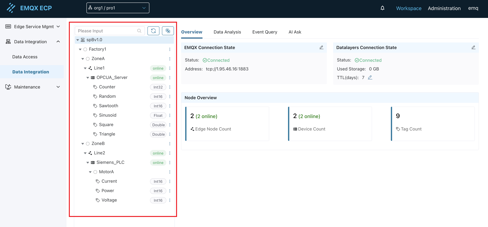
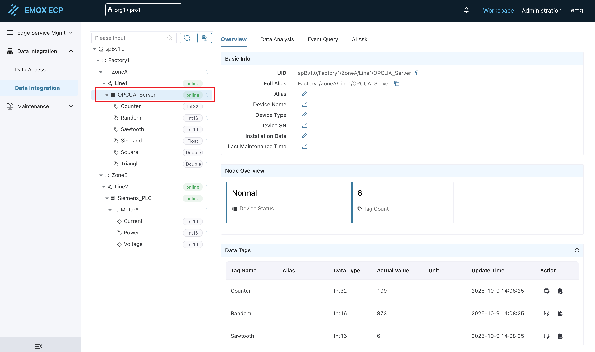

# Overview

In [Data Integration - Configuration Guide](./configuration.md), we configured the basic settings for ECP's data integration functionality, including EMQX connection information and data storage information. In this section, we will introduce the overview section of ECP's data integration functionality.

## Tree Structure Introduction

On the data integration page, the left side is fixed as a tree structure, used to display hierarchical industrial data modeling information.



When a node is selected, the right side will display the detailed information of that node. Node types are divided into `Root Node`, `Virtual Node`, `Edge Node`, `Device Node`, and `Tag`, as follows:

### **Root Node**

The root node represents the root node of the entire industrial data modeling, with the default name `spBv1.0`. When clicking this node, the right side will display the detailed information of the node, including EMQX connection status, Datalayers connection status, node overview, and other content. For detailed configuration of EMQX and Datalayers, please refer to [Configuration Guide](./configuration.md#step-1-basic-configuration-of-ecp-data-integration).


### **Virtual Node**

There are two types of virtual nodes:
- The first type is virtual nodes built based on the Group ID, Node ID, and Group Path parameters configured in the SparkplugB application in NeuronEX. Nodes such as `Factory1`, `ZoneA`, `Line1` in the diagram above belong to this category.
- The second type is virtual nodes built based on the collection group in the southbound driver configured in NeuronEX and the virtual group names split by `/` in tag names. Nodes such as `MotorA` in the diagram above belong to this category.

Virtual nodes are used to build the user's information model and do not have `online` or `offline` status themselves.

When clicking this type of node, the right side will display the detailed information of the node, including `Basic Information` and `Node Overview`.

- Basic Information:
  - UID: Unique identifier of the virtual node, used to uniquely identify this node in the data integration functionality.
  - Full Alias: Full alias including parent nodes.
  - Alias: Custom name defined by the user.
- Node Overview:
  - Edge nodes under this node: Total number of `Edge Nodes` under this node.
  - Devices under this node: Total number of `Devices` under this node.
  - Tags under this node: Total number of `Tags` under this node.


### **Edge Node**

A northbound application SparkplugB node configured in NeuronEX corresponds to an edge node in ECP. The `online` or `offline` status of the edge node is consistent with the `online` or `offline` status of that SparkplugB node on NeuronEX. When clicking this type of node, the right side will display the detailed information of the node, including `Basic Information` and `Node Overview`.

- Basic Information:
  - UID: Unique identifier of the edge node, used to uniquely identify this node in the data integration functionality.
  - Full Alias: Full alias including parent nodes.
  - Alias: Custom name defined by the user.
- Node Overview:
  - Edge node status: Status of this node.
  - Devices under this node: Total number of `Devices` under this node.
  - Tags under this node: Total number of `Tags` under this node.


### **Device Node**

A southbound driver configured in NeuronEX corresponds to a device node in ECP. The `online` or `offline` status of the device node is consistent with the `online` or `offline` status of that southbound driver on NeuronEX. When clicking this type of node, the right side will display the detailed information of the node, including `Basic Information`, `Node Overview`, and `Data Tags`.

- Basic Information:
  - UID: Unique identifier of the device node, used to uniquely identify this node in the data integration functionality.
  - Full Alias: Full alias including parent nodes.
  - Alias: Custom name defined by the user.
  - Device Name: Custom name defined by the user.
  - Device Type: Custom type defined by the user.
  - Device Model: Custom model defined by the user.
  - Installation Date: Custom installation date defined by the user.
  - Last Maintenance Time: Custom last maintenance time defined by the user.
- Node Overview:
  - Device Status: Status of this node.
  - Tags under this node: Total number of `Tags` under this node.
- Data Tags:
  - Display all data tags under this device node in detail in list format.
  - View the latest reported values in real-time.
  - Edit and modify tag unit information.
  - Achieve reverse control of device tags through the `Edit Tag Value` button.



::: tip
1. A device node must belong to an edge node.

2. The southbound driver must be subscribed to the SparkplugB application to be visible as a device node in ECP.
:::

### **Tag**

A tag is a data point in the NeuronEX southbound driver, corresponding to a tag in ECP. The data type of the tag is the data type used during SparkplugB transmission. When clicking this type of node, the right side will display the detailed information of the node, including `Basic Information` and `Real-time Data`.

- Basic Information:
  - UID: Unique identifier of the tag, used to uniquely identify this node in the data integration functionality.
  - Full Alias: Full alias including parent nodes.
  - Datalayers Storage Table: The storage table name of this tag in the Datalayers database.
  - Alias: Custom name defined by the user.
- Real-time Data:
  - Display the latest value, unit, last update time, data type, and other information of this tag.


## Tree Structure Features

At the top of the tree structure, there are several function buttons such as `Search`, `Refresh`, and `Switch Alias`.

### Search

Enter the node name to search and filter nodes in the tree structure.

### Refresh

Click this button to refresh the tree structure and view the latest tree structure information, node status, etc.

### Switch Alias

Click this button to switch the display names of nodes in the tree structure. By default, it displays node names defined in NeuronEX, including Group ID, Node ID, southbound driver names, tag names, etc. After clicking, it can be switched to user-defined aliases.

### Node Deletion

ECP supports deletion of test or unused nodes. The deletion operation only removes node information in ECP and does not affect the running state of NeuronEX.

#### Deletion Rules

Different types of nodes have different deletion conditions:

**Root Node (spBv1.0)**
- Cannot be deleted

**First Type Virtual Nodes** (nodes generated based on SparkplugB application configuration)
- Deletion condition: There are no edge nodes under this node, or all edge nodes are in offline status
- Deletion scope: Delete this node and all its child nodes and tag information

**Second Type Virtual Nodes** (nodes generated based on southbound driver collection groups and tag names) and **Tag Nodes**
- Can be deleted at any time

**Edge Nodes** and **Device Nodes**
- Deletion condition: The node must be in offline status
- Cannot be deleted when online

#### Deletion Impact

After deleting a node, the following impacts will occur:

1. **Automatic Cleanup of Associated Information**:
   - Delete alias information for this node
   - Delete user-defined device information
   - Delete tags bound to this node

2. **Historical Data Retention**:
   - Historical data in the Datalayers database will not be deleted. Historical data will be automatically deleted according to Datalayers TTL settings.

3. **Data Re-reporting**:
   - If NeuronEX reconnects and reports the same node or tag information, these nodes will reappear in the tree structure.

## Tag Control

ECP's data integration functionality supports reverse control (write operations) of device tags through multiple methods.

### UI Control

Select a single tag in the tree structure and click the `Edit Tag Value` button to directly modify the value of that tag, achieving real-time control of the device. For detailed operations, refer to [Tag](#tag).

### API Control

ECP provides RESTful API interfaces that support programmatic control of device tags. This interface supports single-tag and multi-tag batch control, and multiple tags can belong to different southbound drivers.

**Interface Information**

- **Interface Path**: `/api/sparkplug/metrics/metric/values`
- **Request Method**: POST
- **Content-Type**: application/json

**Request Parameter Description**

| Parameter | Type | Required | Description |
|--------|------|------|------|
| metrics | Array | Yes | Tag control array |
| metrics[].id | String | Yes | Unique identifier (UID) of the tag |
| metrics[].value | Any | Yes | Tag value to be written, type should match the tag data type |

**Request Example**

```json
{
  "metrics": [
    {"id": "spBv1.0/Factory1/ZoneB/Line2/Siemens_PLC/MotorA/Current", "value": 11},
    {"id": "spBv1.0/Factory1/ZoneB/Line2/Siemens_PLC/MotorA/Voltage", "value": 22},
    {"id": "spBv1.0/Factory1/ZoneA/Line1/OPCUA_Server/Counter", "value": 33}
  ]
}
```

**Response Parameter Description**

| Parameter | Type | Description |
|--------|------|------|
| results | Array | Tag control result array |
| results[].id | String | Unique identifier (UID) of the tag |
| results[].success | Boolean | Whether the control operation was successful |

**Response Example**

```json
{
    "results": [
        {
            "id": "spBv1.0/Factory1/ZoneB/Line2/Siemens_PLC/MotorA/Current",
            "success": true
        },
        {
            "id": "spBv1.0/Factory1/ZoneB/Line2/Siemens_PLC/MotorA/Voltage",
            "success": true
        },
        {
            "id": "spBv1.0/Factory1/ZoneA/Line1/OPCUA_Server/Counter",
            "success": true
        }
    ]
}
```


### MQTT Control

ECP supports controlling device tags through MQTT messages. Users need to publish control messages to the specified MQTT topic, and ECP will execute the corresponding control operations after receiving them.

**MQTT Topic**

- **Subscribe Topic**: `ecp/device_control`

**Message Format Description**

| Parameter | Type | Required | Description |
|--------|------|------|------|
| metrics | Array | Yes | Tag control array |
| metrics[].id | String | Yes | Unique identifier (UID) of the tag |
| metrics[].value | Any | Yes | Tag value to be written, type should match the tag data type |

**Publish Message Example**

```json
{
  "metrics": [
    {"id": "spBv1.0/Factory1/ZoneB/Line2/Siemens_PLC/MotorA/Current", "value": 11},
    {"id": "spBv1.0/Factory1/ZoneB/Line2/Siemens_PLC/MotorA/Voltage", "value": 22},
    {"id": "spBv1.0/Factory1/ZoneA/Line1/OPCUA_Server/Counter", "value": 33}
  ]
}
```

**Response Description**

After processing the control message, ECP will publish the execution result to the response topic. The response message contains the control status of each tag.

**Response Parameter Description**

| Parameter | Type | Description |
|--------|------|------|
| results | Array | Tag control result array |
| results[].id | String | Unique identifier (UID) of the tag |
| results[].success | Boolean | Whether the control operation was successful |

**Response Message Example**

```json
{
  "results": [
    {
      "id": "spBv1.0/Factory1/ZoneB/Line2/Siemens_PLC/MotorA/Current",
      "success": true
    },
    {
      "id": "spBv1.0/Factory1/ZoneB/Line2/Siemens_PLC/MotorA/Voltage",
      "success": true
    },
    {
      "id": "spBv1.0/Factory1/ZoneA/Line1/OPCUA_Server/Counter",
      "success": true
    }
  ]
}
```
