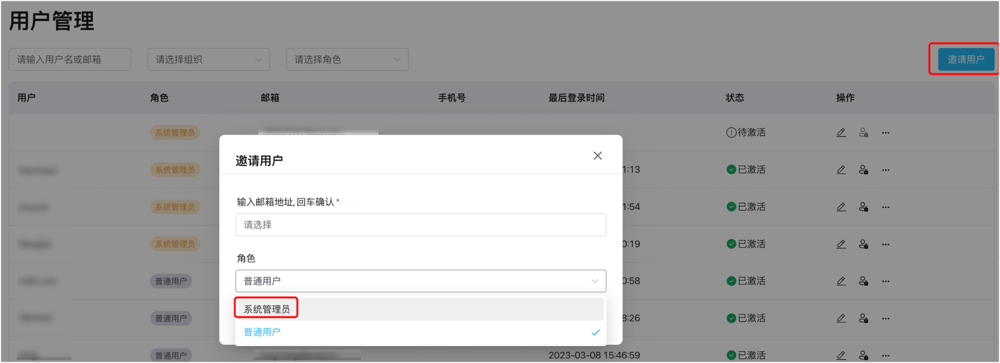
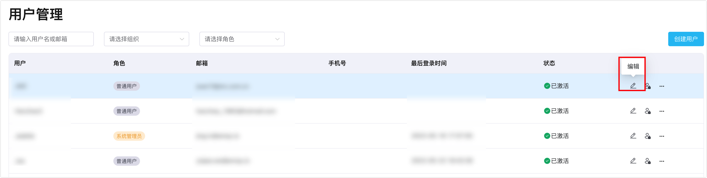

# 授权

ECP 采用了基于 RBAC (Role-Based Access Control) 模型设计的角色权限系统。系统管理员将不同的权限赋给不同的角色，并将这些角色分配给各个用户，使其能访问特定资源。这种方式简化了权限管理的复杂性，也更安全、更易控制。

## 角色和权限

为满足企业客户的权限要求并简化角色权限赋权流程，ECP 将用户分为四类角色，每类角色的权限是上一级角色权限的子集：

```
系统管理员 > 组织管理员 > 项目管理员 > 普通用户
```

每类角色的权责范围如下：

- **系统管理员**：系统内最高权限的角色，拥有系统内所有权限，可由其他系统管理员赋权，也可以授权**组织**/**项目管理员**和**普通用户**等角色。

  第一个系统管理员（超级用户）在安装 ECP 时创建，具体请参考[创建超级管理员](../install/install_ecp_on_linux.md#创建超级管理员)。  

- **组织管理员**：组织内最高权限的角色，拥有组织内所有权限，可由系统管理员赋权，可以在本组织内授权**项目管理员**角色和普通用户，不可跨组织赋权。  

- **项目管理员**：项目内最高权限的角色，拥有项目内所有权限，可由系统/组织管理员赋权，可以在本项目内授权可访问组织的**普通用户**，不可跨项目赋权。  

- **普通用户**：可被系统/组织/项目管理员添加或邀请到组织中，经授权后，对授权项目有查看权限。

## 角色权限一览表

关于角色权限请参考下表，功能模块的权限分为只读和编辑。

<font size=1>

|  权限/角色   | 系统管理员 | 组织管理员  | 项目管理员  | 普通用户 |
| :----------: | :--------: | :---------: | :---------: | :------: |
|   组织管理   |    编辑    | 组织内 编辑 |    只读     |    -     |
|   项目管理   |    编辑    | 组织内 编辑 | 项目内 编辑 |    -     |
|   用户管理   |    编辑    | 组织内 编辑 | 项目内 编辑 |    -     |
|   操作审计   |    只读    | 组织内 只读 | 项目内 只读 |    -     |
|   系统设置   |    编辑    |      -      |      -      |    -     |
|    许可证    |    编辑    |      -      |      -      |    -     |
|   用户授权   |    编辑    | 组织内 编辑 | 项目内 编辑 |    -     |
| 云端集群管理 |    编辑    |    编辑     |    编辑     |   只读   |
| 边缘服务管理 |    编辑    |    编辑     |    编辑     |   只读   |
|     监控     |    只读    |    只读     |    只读     |   只读   |
|     告警     |    编辑    |    编辑     |    编辑     |   只读   |
|     日志     |    只读    |    只读     |    只读     |   只读   |
|   标签管理   |    编辑    |    编辑     |    编辑     |   只读   |
| 边缘配置下发 |    编辑    |    编辑     |    编辑     |   只读   |

</font> 

## 设置用户角色

ECP 支持系统管理员在创建用户时同时完成赋权操作。

作为系统管理员登录 ECP，在**系统管理**页面，点击并进入**用户管理**界面。在此页面点击**创建用户**（或[**邀请用户**](../system_admin/user_management.md#邀请用户)），完成必要的设置并将用户指定为管理员或普通用户。

  

## 编辑用户角色

对于已创建的用户，您还可通过点击**操作**下的编辑图片修改其角色。




