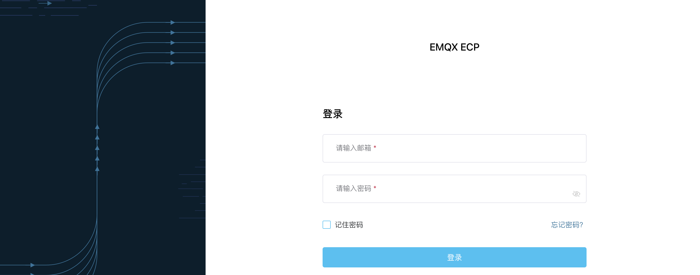
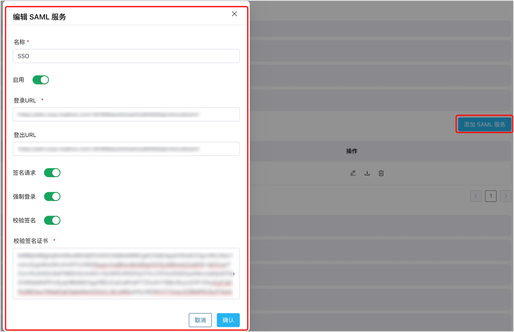

# ECP 登录认证

ECP 认证系统用于验证用户身份，包括用户帐户管理、用户身份验证、授权和访问控制等功能，为用户身份验证提供一种可靠、安全、实用的机制。

ECP 提供了以下两种登陆认证方式：

- [基于用户名和密码的基础认证](#通过用户名密码登录)
- [对接基于 SAML 协议的第三方认证系统](#对接第三方认证)

## 通过用户名密码登录

超级管理员可通过[邀请或创建](../system_admin/user_management.md)的方式为 ECP 平台创建管理员或普通用户。超级管理员完成用户添加操作后，用户可通过邮箱及密码登录 ECP 平台。

您可勾选**记住密码**复选框，方便后续快速登录。

## 重置密码

如您忘记了登陆密码，可在登录页面点击**忘记密码**，并根据页面提示选择联系系统管理员或通过邮箱重置密码。

## 对接第三方认证

ECP 同样支持集成基于 SAML 协议的第三方认证系统。

SAML（Security Assertion Markup Language）是一种基于 XML 的开放标准协议，用于在跨网络通信中传递身份验证和授权数据。SAML 旨在促进各种网络资源之间的安全通信和用户/身份验证的单点登录（SSO），使得不同组织间的用户可以使用单个身份验证登录不同的系统和服务，无需为每个服务单独登录和身份验证。

### 配置单点登录

1. 使用**系统管理员**账户登录 ECP。
2. 在系统管理界面，点击**系统设置**-> **通用配置** -> **单点登录**。
3. 点击**添加 SAML 服务**，在弹出的对话框中进行如下配置
   - 添加 SSO **名称**；
   - 点击**启用** SAML 服务；
   - 填写**登录 URL**，即第三方认证的登录地址；
   - [可选] 填写**登出 URL**，即第三方认证的登出地址；
   - [可选] 选择是否开启**签名请求**，如开启，ECP 会自动生成一个签名；
   - [可选] 选择是否开启**强制登录**，如开启，当用户通过第三方登录时，ECP 会要求其输入用户名密码；
   - [可选] 选择是否开启**校验签名**，如开启，请上传从第三方认证系统导出的公钥文件（经 Base64 加密）；
   - [可选] 选择是否开启**自动绑定 IdP 用户**，如开启，第三方认证系统使用的用户邮箱将绑定 ECP 的用户邮箱，在用户使用单点登录时，自动完成 ECP 端的用户创建或激活；如未开启，使用第三方认证系统首次登录 ECP 时，用户需手动填写注册信息以完成 ECP 端的用户创建。
   - 点击**确认**，以上配置生效。

