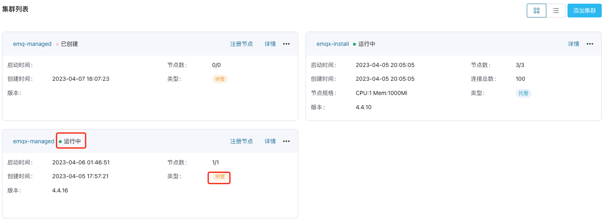

# 纳管集群

如果您已经部署了一套或几套 EMQX 集群，可以使用 ECP 的集群纳管功能管理已有集群，该功能通过一个集群纳管代理来完成管理工作。ECP 目前支持 EMQX v4 企业版（4.4.6 及以上）及 v5 企业版（5.6.0 及以上）的纳管。

## ECP 纳管 EMQX 集群

1. 以系统/组织/项目管理员的身份登录 ECP。在**工作台** -> **数据集成** -> **数据接入**页面，在集群列表页点击**纳管集群**。

2. 按集群命名规则填写**集群名称**；1-200 个字符，并支持 空格、"-"、"_"。

3. 如果纳管的是 EMQX v5 集群，需要填写集群服务地址，即 EMQX dashboard 访问地址。也可以稍后通过“编辑”集群来设置集群服务地址。

4. 点击**确认**。此时集群列表会新增一个纳管的集群。

 

5. 在集群卡片或集群列表中，点击**注册节点**，将弹出集群注册引导页。

    

6. 在注册引导页，确定**注册方式**和**CPU 架构**，以选择合适的集群纳管代理进行下载安装。目前支持二进制包和 Kubernetes 两种安装方式 ，二进制安装方式下可以从 AMD64、ARM、ARM64 三种架构中进行选择。

7. 登录到 EMQX 集群安装的虚机环境，按照引导完成集群纳管代理的下载。

   ```bash
   # 下载 EMQX Agent 
   sudo curl -L -f -k --output /usr/local/bin/emqxee-agent https://[emqxee-agent]
   
   # 修改 Agent 权限
   sudo chmod +x /usr/local/bin/emqxee-agent
   
   # 启动 Agent
   sudo /usr/local/bin/emqxee-agent start
   ```

8. 根据提示，在**节点配置**部分填写注册必要的信息。填写的内容将自动填充到注册命令中：

   - 如果使用二进制包安装方式，集群纳管代理与 EMQX 集群在同一台虚机上，`dashboardUrl` 和 `apiUrl` 可使用本地地址。
   - 如果使用 Kubernetes 安装方式，请确保集群纳管代理可以通过填写的 `dashboardUrl` 和 `apiUrl` 访问到 EMQX 集群。
   - 如果需要开启 EMQX 集群日志采集功能，`enableLog` 设置为 `True`，并且在 `logDir` 中指定纳管代理能访问到的集群日志所在文件夹路径。

9. 拷贝**注册**部分的命令，在 EMQX 集群安装的虚机环境上运行命令，完成注册。

   ```bash
   # 注册到 ECP
   sudo /usr/local/bin/emqxee-agent register --url https://[ecp] --registration-token [token] --emqx-dashboard-username [emqx-username] --emqx-dashboard-password [emqx-password] --emqx-dashboard-url [emqx-dashboard-url] --emqx-api-url [emqx-api-url]
   ```

10. 回到 ECP **数据接入**页，查看集群列表，可以看到被纳管的 EMQX 集群已被注册到 ECP 中，状态显示为**运行中**。
      

11. 如果纳管的是 v4 版本集群，集群正常运行后，在操作列将出现 **进入Dashboard** 按钮，点击后可访问集群的 dashboard。如果没有出现该按钮，请检查 ECP 配置文件中的 `cluster.agent` 是否配置正确并可被 agent 访问。

12. 如果纳管的是 v5 版本集群，正确设置集群服务地址后，在操作列将出现 **进入Dashboard** 按钮，点击即可在新窗口中直接查看集群的 dashboard。

## 集群状态

纳管的 EMQX 集群的状态如下：

|  状态  | 说明                                                         |
| :----: | :----------------------------------------------------------- |
| 已创建 | 新建集群，还未注册节点时的状态                               |
| 注册中 | 注册节点过程中的中间状态                                     |
| 运行中 | 集群正常运行状态                                             |
| 删除中 | 删除集群后的中间状态                                         |
|  异常  | 集群未正常运行，或者 agent 无法访问集群，或者 agent 无法与 ECP 正常通信 |

如果集群状态显示为**异常**，可以点击**异常**状态查看原因。

## 使用限制

ECP 端每个纳管集群应对应单个 EMQX 集群，请不要注册多个 ECP 端纳管集群到同一个 EMQX 集群。