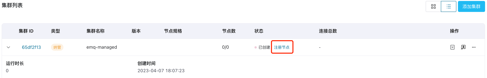
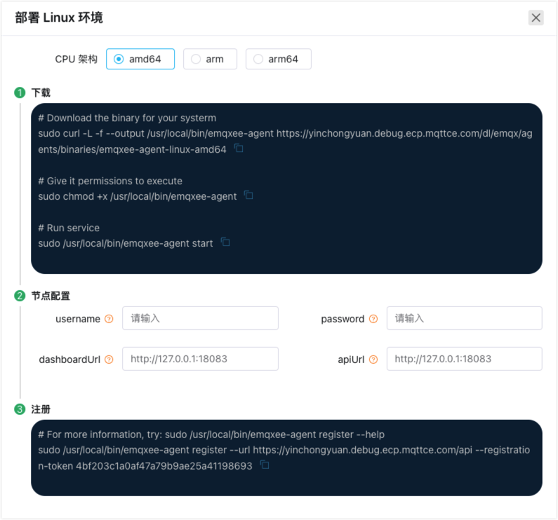

# 添加集群

ECP 支持通过两种方式添加集群：通过 ECP 一键部署 EMQX 集群（即托管方式）或纳管已有集群。

ECP 推荐通过 ECP 一键部署 EMQX 集群，以便体验更加丰富的集群管理功能，同时享受共享许可证和连接数等高级特性。

下表为由 ECP 托管集群和纳管集群在集群管理方面的功能差异：

|功能名称|ECP **托管**集群|ECP **纳管**集群|
|:--------:|:----:|:----:|
|启停|✅|❌|
|水平扩展|✅|❌|
|垂直扩展|✅|❌|
|修改网络类型|✅|❌|
|修改连接数|✅|❌|
|升降级|✅|❌|
|集群转移|✅|✅|
|删除|✅|✅|
|集群日志|✅|✅|

## ECP 托管集群

1. 以系统/组织/项目管理员的身份登录 ECP。在**工作台** -> **云端集群**页面，在集群列表页点击**添加集群**。
2. 集群类型选择**新建集群**。
3. 按集群命名规则填写**集群名称**；1-200 个字符，并支持 "-"、"_" 和空格。
4. 填写**连接数**，请注意连接数受许可和[集群资源配额](../system_admin/resource_config.md#集群资源配额)限制。
5. 选择**规格**，规格设置在请参考[集群资源配额](../system_admin/resource_config.md#集群资源配额)。
6. 选择**节点数**，当前单集群最多支持 7 个节点。
7. 选择**镜像**，镜像可以动态添加，方便用户升级，请参考 [EMQX 容器镜像列表](../system_admin/resource_config.md#emqx-容器镜像列表)和[镜像服务信息](../system_admin/resource_config.md#配置镜像服务信息)。
8. 最后，点击**确认**。


新建集群将出现在**云端集群**的**集群列表**区域。集群状态为**更新中**，集群创建完成后，状态将变成**运行中**，即可投入生产使用。


## ECP 纳管现有集群

如果您已经部署了一套或几套 EMQX 集群，也可通过 ECP 的集群纳管功能管理已有集群。ECP 支持 EMQX v4（4.4.6 及以上版本） 和 EMQX v5 （5.6.0 及以上版本）的纳管。

### ECP 纳管 v4 版本 EMQX 集群

1. 以系统/组织/项目管理员的身份登录 ECP。在**工作台** -> **云端集群**页面，在集群列表页点击**添加集群**。

2. 集群类型选择**现有集群**。

3. 集群版本选择**v4**。

4. 按集群命名规则填写**集群名称**；1-200 个字符，并支持 空格、"-"、"_"

5. 最后，点击**确认**。此时集群列表会新增一个纳管的集群。

6. 在集群卡片或集群列表中，点击**注册节点**，将弹出集群注册引导页。

   

     


6. 在注册引导页，选择 CPU 架构，当前支持 AMD64、ARM、ARM64 三种架构；按照注册引导页的提示完成注册。

   

    


7. 登录到 EMQX 集群安装的虚机或容器环境，例：登录到命名空间 `emqx-69f4249c` 中名称为 `emqx-69f4249c-emqx-ee-0` 的容器中；

   ```bash
   # 查看 Pod 名称
   $ kubectl -n emqx-69f4249c get pod                          
   
   NAME                     READY  STATUS   RESTARTS  AGE
   emqx-69f4249c-emax-ee-0  3/3    Running  0         28d
   
   # 进入 Pod
   $ kubectl -n emqx-69f4249c exec -it emqx-69f4249c-emqx-ee-0 -c emqx -- sh
   
   # 下载 EMQX Agent
   $ sudo curl -L -f --output /usr/local/bin/emqxee-agent https://[emqxee-agent]
   ```

8. 按顺序执行注册引导页中的命令；

   ```bash
   # 下载 EMQX Agent 
   sudo curl -L -f --output /usr/local/bin/emqxee-agent https://[emqxee-agent]
   
   # 修改 Agent 权限
   sudo chmod +x /usr/local/bin/emqxee-agent
   
   # 启动 Agent
   sudo /usr/local/bin/emqxee-agent start
   
   # 注册到 ECP
   sudo /usr/local/bin/emqxee-agent register --url https://[emqxee-agent] --registration-token bf2779e5176446cd8e18fde81d826497
   ```

8. 回到 ECP **云端集群**页，查看集群列表，可以看到被纳管的 EMQX 集群已被注册到 ECP 中，状态显示为**运行中**；

   

    

### ECP 纳管 v5 版本 EMQX 集群

1. 以系统/组织/项目管理员的身份登录 ECP。在**工作台** -> **云端集群**页面，在集群列表页点击**添加集群**。
2. 集群类型选择**现有集群**。
3. 集群版本选择**v5**。
4. 按集群命名规则填写**集群名称**；1-200 个字符，并支持 空格、"-"、"_"
5. 填写集群服务地址（即 EMQX dashboard 访问地址）和 dashbaord 登录用户名及密码
6. 最后，点击**确认**。此时集群列表会新增一个纳管的集群。

  

点击操作列的**详情**按钮，进入集群详情，然后点击**进入Dashboard**按钮，您将在新窗口中直接查看 EMQX v5 的 dashboard。

  

## 集群状态

根据您业务场景的变化，您可对集群进行启停操作。

1. 以系统/组织/项目管理员的身份登录 ECP。
2. 在目标集群上，点击停止/启动。

此外，EMQX 集群状态除了上一节说到的**更新中**和**运行中**，还有如下状态：

|    状态    | 说明                                                         |
| :--------: | :----------------------------------------------------------- |
|   创建中   | 新建集群过程的中间状态                                       |
|   更新中   | 水平、垂直扩容，修改网络类型，修改连接数，集群升降级          |
|   启动中   | 点击启动服务                                                 |
|   运行中   | 集群正常运行状态                                             |
|   停止中   | 点击停止服务，或者删除集群后的中间状态                        |
|   已停止   | 停止完成，删除                                               |
| 状态同步中 | 水平、垂直扩容，集群升降级，修改网络类型，修改连接数         |
| 降级运行中 | 集群一个或多个节点不可用， 但集群整体依然可用                |
|    异常    | 集群最近的一个任务执行失败（可自动恢复），或者集群发生故障或者脏数据（极少出现该状态） |
|   不存在   | 集群创建任务没有下发成功，                                   |

如果集群状态显示为**异常**，可以进行尝试**修复**，如果修复成功，集群状态显示**运行中**；如果修复失败，请删除集群或联系 EMQ 技术支持。