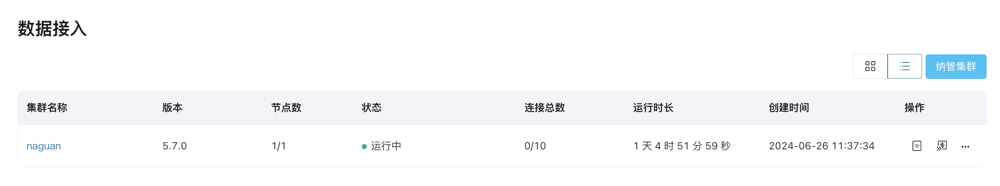
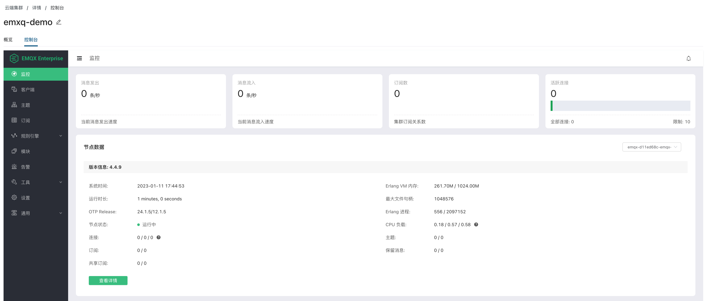

# EMQX 集群详情

在**数据接入**页面的**集群列表**中，您可选择以卡片（默认）或列表的形式查看集群详情。

以下为页面每个字段的详细解释：

- **集群名称**：您可通过“编辑”操作修改集群名称。
- **版本**：EMQX 集群版本。
- **节点数**：每个集群中配置的 EMQX 节点的数量。
- **状态**：集群的运行状态，可以是**已创建**（与注册节点一起出现）、**注册中**、**运行中**、**删除中**、**异常**。
- **连接总数**：已建立的连接数及允许建立的最大连接数。
- **运行时长**：集群已运行的时间。
- **创建时间**：集群的创建时间。

## 通过 EMQX Dashboard 查看集群详情

在**集群**页，用户可点击右上角的 **进入 Dashboard** 通过 EMQX Dashboard 查看集群详情。

Dashboard 是 EMQX 提供的一个 Web 端控制台，用户可通过 EMQX Dashboard 查看服务器节点和集群的运行状态、统计指标，客户端的在线情况和订阅关系等信息，并进行插件配置与停启，HTTP API 密钥管理，EMQX 集群的热配置管理和 MQTT 连接测试等操作。关于 EMQX 企业版的管理控制请参考 [EMQX 企业版产品手册](https://docs.emqx.com/zh/enterprise/v4.4/)。

