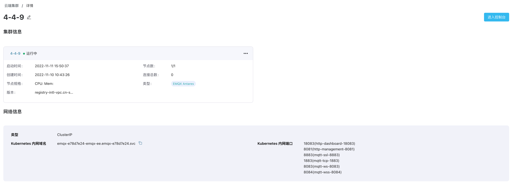

# EMQX 集群详情

在**云端集群**页面的**集群列表**中，您可选择以卡片（默认）或列表的形式查看集群详情。此外，您还可点击**集群名称**或**详情**进入到集群详情页，集群详情页提供了集群状态监控、集群基本信息和网络信息。

以下为页面每个字段的详细解释：

- **集群名称**：您可单击集群名称（或列表视图中的**集群 ID**）进入集群详情页并获取网络信息。
- **状态**：集群的运行状态，可以是**创建中**、**运行中**、**已创建** （针对纳管集群，通常与注册节点一起出现）、**停止中**、**已停止**、**启动中**和**错误**。
- **注册节点**：将已有 EMQX 集群注册到 ECP。
- **启动时间**：集群启动的时间。
- **节点数**：每个集群中配置的 EMQX 节点的数量。
- **创建时间**：集群的创建时间。
- **连接总数**：允许建立的最大连接数。
- **节点规格**：集群中节点的规格。对于由 ECP 创建的集群，系统管理员可更改集群规格。详情请参见[资源设置](../system_admin/resource_config.md#集群资源配额)。
- **类型**：当前集群是托管集群（由 ECP 创建）还是托管集群（由用户自行创建）。
- **版本**：EMQX 集群版本。

## 通过 EMQX Dashboard 查看集群详情

在**集群/详情**页，用户可点击右上角的 **进入 Dashboard** 通过 EMQX Dashboard 查看集群详情。

Dashboard 是 EMQX 提供的一个 Web 端控制台，用户可通过 EMQX Dashboard 查看服务器节点和集群的运行状态、统计指标，客户端的在线情况和订阅关系等信息，并进行插件配置与停启，HTTP API 密钥管理，EMQX 集群的热配置管理和 MQTT 连接测试等操作。关于 EMQX 企业版的管理控制请参考 [EMQX 企业版产品手册](https://docs.emqx.com/zh/enterprise/v4.4/)。

