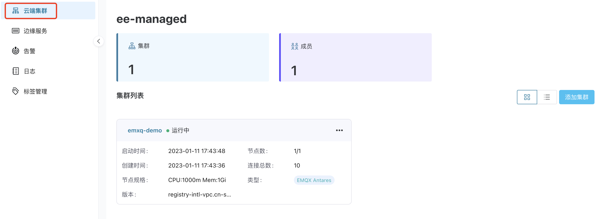

# EMQX 集群管理

## EMQX 集群

EMQX 是一款基于 MQTT 协议开发的开源物联网消息服务器。MQTT 是一种轻量级消息协议，用于在物联网设备之间进行通信。它具有小巧、可靠、可扩展、易于实现等优点。而 EMQX 就是将 MQTT 协议实现为一个实时高可用的消息服务器。关于 EMQX 详细介绍请参考 [EMQX 企业版](https://docs.emqx.com/zh/enterprise/v4.4/)。  

ECP 平台提供 EMQX 集群管理功能，集群管理在分租户分项目的基础上实现多集群管理，可以纳管已有集群，并对管理的集群进行修改连接数、集群转移、删除等操作，并可视化提供集群信息概览、集群监控、集群告警和集群日志功能。

## 访问 EMQX 集群页面

用户登陆后，点击工具栏的**工作台**按钮进入**工作台**界面，然后进入**数据集成**下的**数据接入**页面。您可在此查看 ECP 纳管的 EMQX 集群。

:::tip
系统管理员、组织管理员、项目管理员和该项目的普通用户均可访问此页面。

有关不同用户角色的权限说明，见[角色权限一览表](../acl/authorize.md#角色权限一览表) 
:::

系统管理员、组织管理员、项目管理员可在云端集群页面执行纳管已有集群的操作，具体操作步骤，见[添加集群](./add_manage.md)。

所添加集群将出现在**数据接入**页面的集群列表中，您可选择以卡片（默认）或列表的形式查看集群详情，具体操作，见[查看集群详情](./cluster_details.md)。

## 不同版本 EMQX 纳管集群的功能差异

被纳管的 v4 和 v5 版本的 EMQX 集群，在功能上存在差异，具体如下：

|  功能名称  | ECP 纳管 v4 集群 | ECP 纳管 v5 集群 |
| :--------: | :--------------: | :--------------: |
| 修改连接数 |        ❌         |       ✅ *        |
|  集群日志  |        ✅         |        ✅         |
|  集群监控  |        ❌         |        ✅         |
|  集群告警  |        ❌         |        ✅         |
|  集群转移  |        ✅         |        ✅         |
|    删除    |        ✅         |        ✅         |

\* **修改连接数**功能适用于 EMQX v5.7.0 及以上版本。 