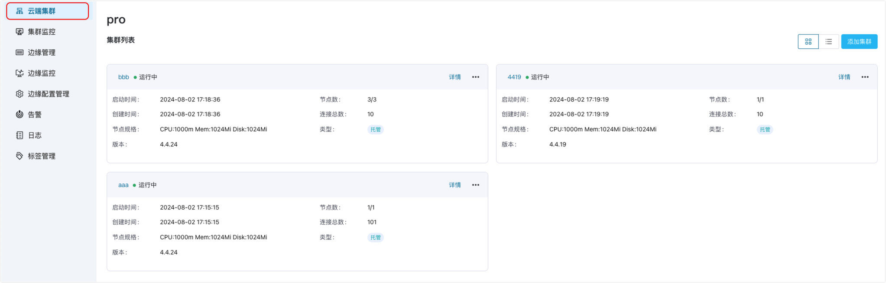

# EMQX 集群管理

## EMQX 集群

EMQX 是一款基于 MQTT 协议开发的开源物联网消息服务器。MQTT 是一种轻量级消息协议，用于在物联网设备之间进行通信。它具有小巧、可靠、可扩展、易于实现等优点。而 EMQX 就是将 MQTT 协议实现为一个实时高可用的消息服务器。关于 EMQX 详细介绍请参考 [EMQX 企业版](https://docs.emqx.com/zh/enterprise/v4.4/)。  

EMQX 集群管理是 ECP 平台核心功能之一，集群管理在分租户分项目的基础上实现多集群管理，可以创建新集群或纳管已有集群，并对管理的集群进行修复、水平扩展、修改网络类型、修改连接数、升降级、集群转让、垂直扩展、删除等操作，并可视化提供集群信息概览、集群监控、集群告警和集群日志功能。

## 访问 EMQX 集群页面

用户登陆后，点击工具栏的**工作台**按钮进入**工作台**界面，即可进入**云端集群**页面。您可在此查看由 ECP 创建或纳管的 EMQX 集群数。

:::tip
系统管理员、组织管理员、项目管理员和该项目的普通用户均可访问此页面。对于普通项目用户，登录 ECP 后将直接进入**工作台**的**云端集群**页面。

有关不同用户角色的权限说明，见[角色权限一览表](../acl/authorize.md#角色权限一览表) 
:::

系统管理员、组织管理员、项目管理员可在云端集群页面执行新建集群操作或者纳管已有集群，具体操作步骤，见[添加集群](./add_manage.md)。

所添加集群将出现在**云端集群**页面的**集群列表**中，您可选择以卡片（默认）或列表的形式查看集群详情，具体操作，见[查看集群详情](./cluster_details.md)。

## 托管与纳管EMQX集群的功能差异

**托管EMQX集群**：托管 EMQX 集群是指由 ECP 平台通过Kubernetes的方式创建部署的 EMQX 集群，称之为托管 EMQX 集群。

**纳管EMQX集群**：纳管 EMQX 集群是指由用户创建部署的 EMQX 集群，并在 ECP 平台添加纳入管理，称之为纳管 EMQX 集群。

托管与纳管的 EMQX 集群在功能上存在差异，具体如下：

|功能名称|ECP **托管** v4 集群|ECP **纳管 **v4 集群|ECP **纳管 **v5 集群|
|:--------:|:----:|:----:|:----:|
|启停|✅|❌|❌|
|删除|✅|✅|✅|
|水平扩展|✅|❌|❌|
|垂直扩展|✅|❌|❌|
|修改网络类型|✅|❌|❌|
|修改连接数|✅|❌|✅*|
|升降级|✅|❌|❌|
|集群日志|✅|✅|✅|
|集群监控|❌|❌|✅|
|集群告警|❌|❌|✅|
|集群转移|✅|✅|✅|

\* 针对纳管的集群，**修改连接数**功能适用于 EMQX 企业版 5.7.0 及以上版本。