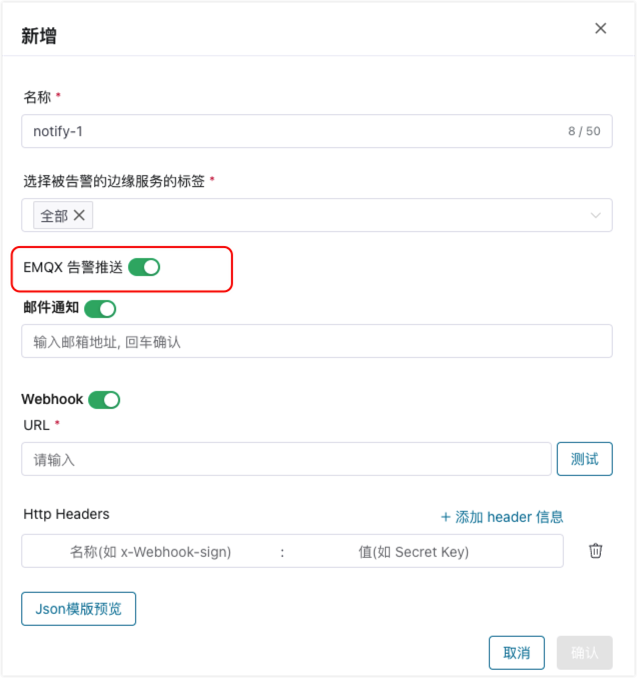

# EMQX 集群管理运维

ECP 为 EMQX 集群管理提供了丰富的管理运维服务，您可以在 ECP 上集中管理运维纳管的 EMQX 集群。 

:::tip 提示
对于不同版本的 EMQX 集群，在集群管理上存在一定的功能差异，具体请参考 [不同版本EMQX纳管集群的功能差异](./introduction.md#不同版本-emqx-纳管集群的功能差异)。 

:::

## 修改集群连接数

您可根据业务需求动态修改集群的连接数。

1. 以系统/组织/项目管理员的身份登录 ECP。
2. 在目标集群，点击更多图标并选择**修改连接数**，如果修改成功，稍等片刻更改即生效。

:::tip 

- 5.7.0 及以上版本的纳管集群支持修改连接数，您需要提前获得包含 v5 集群的 ECP 许可证。

- 连接数受许可证总连接数的限制，请注意所有集群的总连接数不要超过许可证限额。

- 取消注册节点，或成功删除集群后，将释放集群使用的连接数，您可以通过在 EMQX dashboard 中 **重置License** 来恢复集群的默认连接数。

  :::

## 集群转移

为了方便管理，ECP 提供了 EMQX 集群跨项目转移功能。

1. 以系统/组织/项目管理员的身份登录 ECP。
2. 在目标集群，点击更多图标并选择**转移**；在弹出的对话框中，选择待转移的目标项目。
3. 点击**确认**，即刻完成集群转移。此时，该集群将出现在目标项目的集群列表中；

## 集群日志

使用纳管集群的日志功能，在注册节点时需要开启日志并指定集群日志位置。
- 开启日志收集参数：`--emqx-log-collection-enabled`
- 指定集群日志所在文件夹路径参数：`--emqx-log-collection-dir /opt/emqx/log `。如果集群是使用 docker 方式安装的，需要提前将日志文件夹映射到宿主机上。

然后，在已注册的目标集群中，点击更多图标并选择**日志**，随即将进入集群日志页。您可在此查看集群名称、类别、创建时间、日志级别及日志内容，并可通过筛选功能快速定位某条日志。有关日志功能的详细解释，请参考[统一日志](../log/introduction.md)。

## 集群删除

如果一个集群已经不再需要被 ECP 管理，您可以删除该集群。

1. 以系统/组织/项目管理员的身份登录 ECP。
2. 在目标集群，点击更多图标并选择**删除**。在弹出的对话框中再次确认删除操作。ECP 会尝试删除集群。对纳管集群的删除操作只会将该集群的注册信息从 ECP 移除，并不会真正删除该集群的节点。

:::tip

- 删除 5.7.0 及以上版本的纳管集群时，会首先释放集群连接数，释放成功后才会删除集群注册信息。如果进行删除操作时集群状态为“异常”，很可能无法释放连接数导致删除失败。如果排除 agent 与集群连接问题及 agent 与 ECP 连接问题后，仍然无法恢复集群状态，您可以点击更多图标选择**重新注册**，尝试重新注册该集群，使它恢复正常运行状态后再进行删除。

  :::

## 集群监控

ECP 在 **工作台** -> **监控运维** -> **监控** 页面提供了纳管集群的运行状态概览。详情请参考[EMQX 集群监控](../monitor/monitor_cluster.md)。

:::tip

- 仅 EMQX v5 版本的纳管集群支持监控功能。

  :::

## 集群告警

ECP **工作台** -> **监控运维** -> **告警** 页面支持纳管集群的规则及连接器异常告警。

如果您需要对集群中发生的告警设置邮件或 Webhook 通知，在创建告警推送时请启用“EMQX 告警推送”。

有关告警功能的其他详细解释，请参考[告警](../monitor/alarm_rules.md)。

:::tip

- 仅 EMQX v5 版本的纳管集群支持告警功能。

  :::