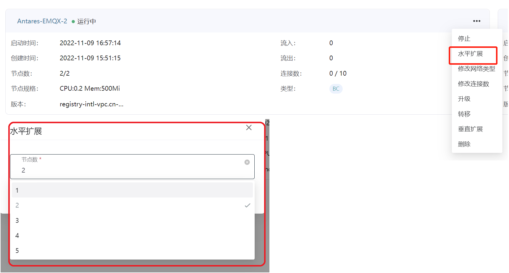
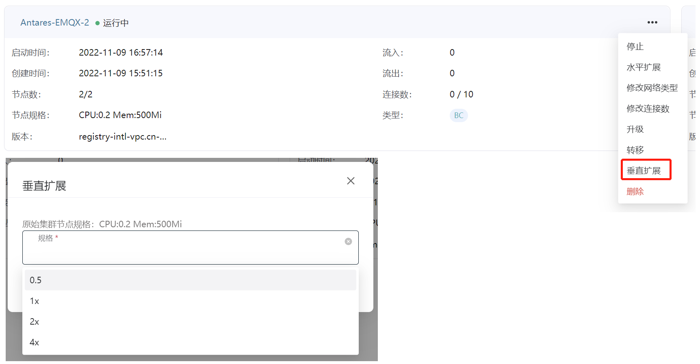
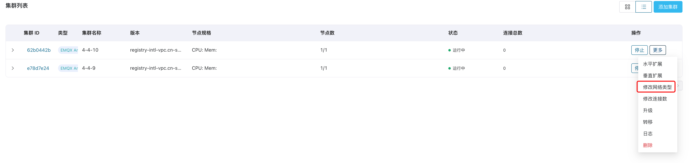
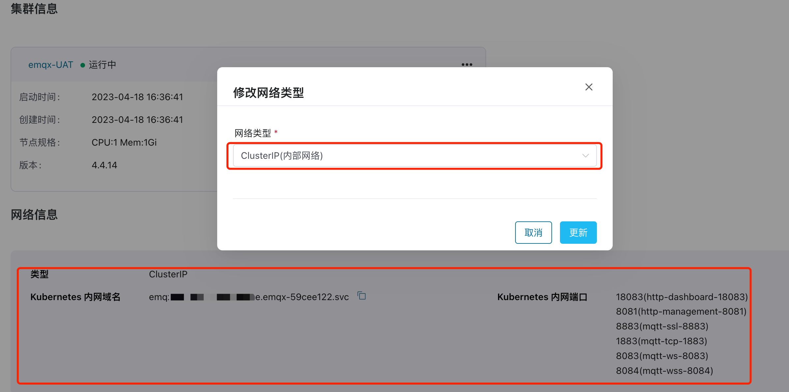
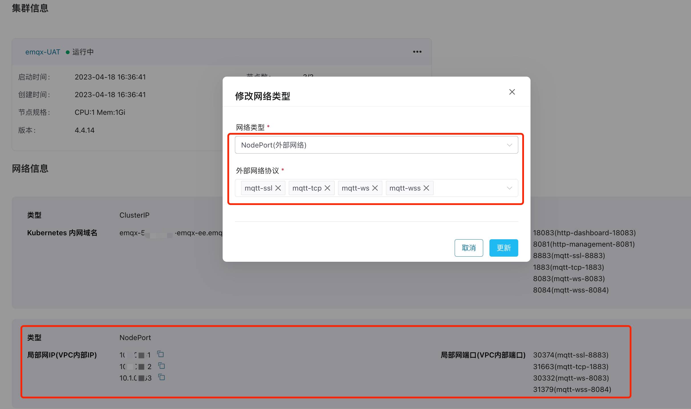
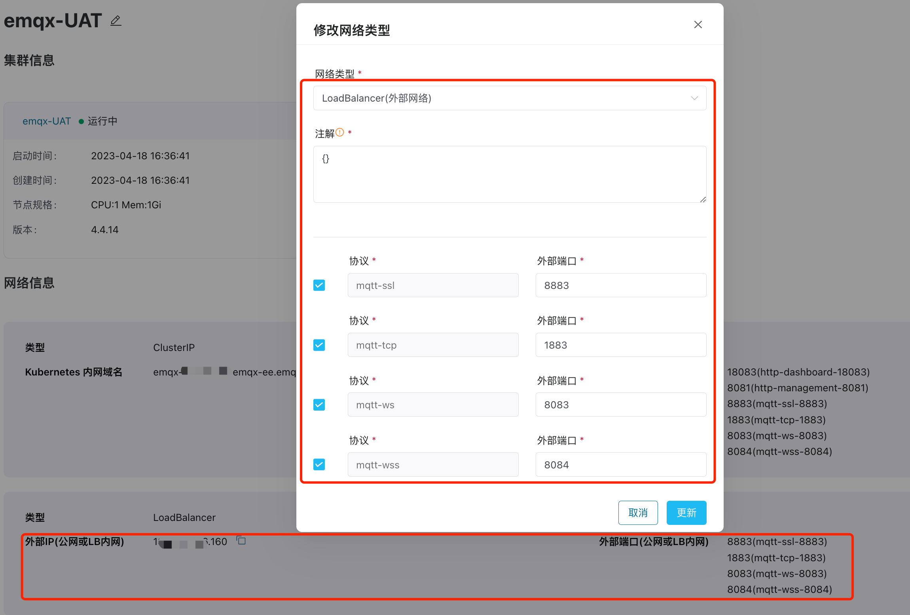
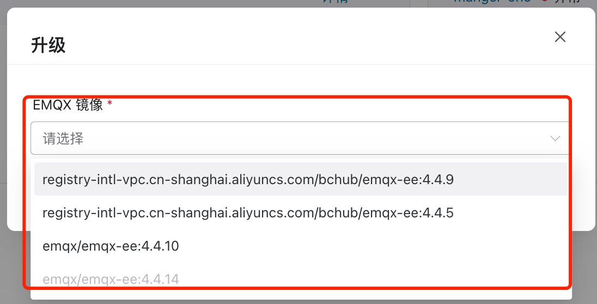
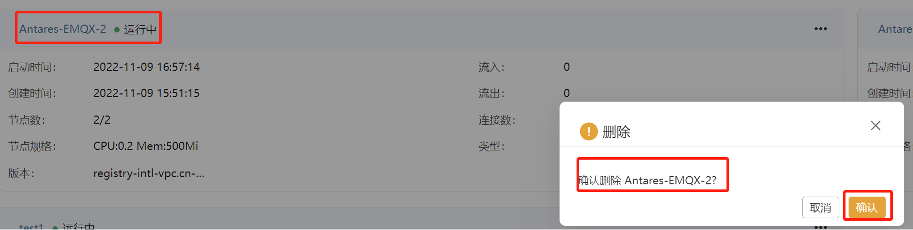

# EMQX 集群管理运维

ECP 为 EMQX 集群管理提供了丰富的管理运维服务，您可以在 ECP 上集中管理运维所有 EMQX 集群。 

:::tip
对于基于 Kubernetes 和基于 Docker 部署的 ECP，在集群管理上存在一定的功能差异，具体请参考 [Kubernetes 与 Docker 部署的功能差异](../install/introduction.md#kubernetes-与-docker-部署的功能差异)。
:::

## 水平扩展（Kubernetes 部署）

水平扩展，指增加或减少集群的节点数量，每个 EMQX 集群最多支持 7 个节点。

1. 以系统/组织/项目管理员的身份登录 ECP。

2. 在目标集群，点击更多图标并选择水平扩展，按照业务需求选择节点数量。

   

    

## 垂直扩展（Kubernetes 部署）

垂直扩展，是对节点的规格进行扩缩容，可选择的规格范围是[资源配额](../system_admin/resource_config.md#集群资源配额)中设置的从最小规格到最大规格。

1. 以系统/组织/项目管理员的身份登录 ECP。
2. 在目标集群，点击更多图标并选择垂直扩展，按照业务需求选择目标规则。

 

## 修改网络访问方式（Kubernetes 部署）

网络管理员可通过**修改网络类型**管理和配置 EMQX 可访问的地址。ECP 提供了三种网络访问方式：

|   网络类型   |          定义          | 说明                                                         |
| :----------: | :--------------------: | :----------------------------------------------------------- |
|  ClusterIP   | Kubernetes 内网访问地址 | 仅限于 Kubernetes 内网访问，可以使用提供的 Kubernetes 内网域名和端口访问 |
|   NodePort   |        局域网 IP        | Kubernetes 所在局域网络或所在 VPC 的 IP 地址，可以使用提供的局域网 IP 和端口进行访问 |
| LoadBalancer |         外部 IP         | 一般为公网或 LoadBalancer 所在网络的地址  如果是公网 IP，可以在任何地域访问此 IP。  如通过负载均衡器访问，ECP 已支持在阿里云配置的 LoadBalancer；如您在使用其他公有云或私有云环境，请联系 EMQ 技术支持。 |

### ClusterIP

ECP 在创建 EMQX 集群时，会默认选择 ClusterIP 网络访问方式，并生成 Kubernetes 内网服务域名和端口。

### NodePort

如希望通过局域网 IP 访问 ECP：

1. 以系统/组织/项目管理员的身份登录 ECP。
2. 在目标集群，点击更多图标并选择**修改网络类型**。在弹出的对话框中：
   - **网络类型**：选择 NodePort（外部网络）
   - **外部网络协议**：指定网络协议，目前 ECP 支持 MQTT-SSL、MQTT-TCP、MQTT-WS 和 MQTT-WSS 四种协议，您可同时配置多个网络协议。
3. 点击**更新**保存设置。

设置完成后，如希望查看局域网 IP 和端口，可点击集群名称或 ID 进入集群详情页。

 

### LoadBalancer

如希望通过公网 IP 访问 ECP：

1. 以系统/组织/项目管理员的身份登录 ECP。
2. 在目标集群，点击更多图标并选择**修改网络类型**。在弹出的对话框中：
   - **网络类型**：选择 LoadBalancer(外部网络)
   - **注解**：使用注解来配置负载均衡器。具体步骤，参考[资源配置 - 注解配置负载均衡](../system_admin/resource_config.md#注解配置负载均衡)。
   - **协议和端口**: 通过勾选指定网络协议并配置端口。您可同时配置多个网络协议。
3. 点击**更新**保存设置。

设置完成后，如希望查看公网 IP 和端口，可点击集群名称或 ID 进入集群详情页。

:::tip

LoadBalancer 一般为公有云环境使用。如希望通过 LoadBalancer 访问 ECP，更改网络设置后，请勿轻易修改连接数，否则可能会因 IP 地址变化而造成访问异常。

:::

## 修改连接数（Kubernetes 部署）

您可根据业务需求动态修改集群的连接数。

1. 以系统/组织/项目管理员的身份登录 ECP。
2. 在目标集群，点击更多图标并选择**修改连接数**，所做更改将即刻生效。
3. 

:::tip  
  - 连接数受许可证总连接数的限制，请注意所有集群的总连接数不要超过许可证限额。
  - 使用 LoadBalancer 网络类型，如无必要请不要修改连接数，否则可能会因 IP 地址的变化而造成访问异常。
:::

## 升级（Kubernetes 部署）

ECP 提供了 EMQX 集群的升级服务，支持不宕机升级 EMQX 集群。

1. 以系统/组织/项目管理员的身份登录 ECP。
2. 在目标集群，点击更多图标并选择**升级**。在弹出的升级对话框，选择目标镜像版本，如所选镜像版本低于当前版本，将执行降级操作，如所选镜像版本高于当前版本，将执行降级操作。
3. 点击**确认**，等待集群节点更新；

节点更新时，状态会显示**更新中**，此时业务可能会发生闪断；待节点全部更新完成后，集群状态会显示**运行中**，此时业务将完全恢复。

## 集群转移

为了方便管理，ECP 提供了 EMQX 集群跨项目转移功能。

1. 以系统/组织/项目管理员的身份登录 ECP。
2. 在目标集群，点击更多图标并选择**转移**；在弹出的对话框中，选择待转移的目标项目。
3. 点击**确认**，即刻完成集群转移。此时，该集群将出现在目标项目的集群列表中；

## 集群日志

ECP 提供了统一日志服务。

1. 以系统/组织/项目管理员的身份登录 ECP。
2. 在目标集群，点击更多图标并选择**日志**。

您随即将进入集群日志页，您可在此查看集群名称、类别、创建时间、日志级别及日志内容，并可通过筛选功能快速定位某条日志。有关日志功能的详细解释，请参考[统一日志](../log/introduction.md)。

## 集群删除

如果一个集群已经不再使用，建议删除该集群节省IT资源。

1. 以系统/组织/项目管理员的身份登录 ECP。
2. 在目标集群，点击更多图标并选择**删除**。在弹出的对话框中再次确认删除操作。ECP 会首先停止集群，然后进行删除。

