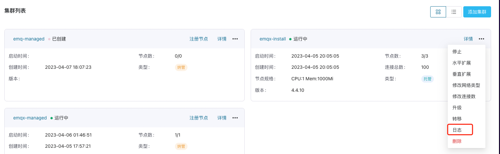

# EMQX 集群管理运维

ECP 端每个纳管集群都对应一个 EMQX 集群。如果您需要管理多个集群，请为每个 EMQX 集群分别创建纳管集群入口，并在每个 EMQX 集群所在的虚机上安装纳管代理，注册到对应的纳管集群入口上。

- 如果您管理的 EMQX 集群包含多个节点，并且需要采集每个节点的 EMQX 日志，可以通过在**每个节点**上分别安装纳管代理来实现，具体参考 [多节点集群日志采集](./ops.md#多节点集群日志采集)。

- 如果您没有日志采集的需求，可以选择在 EMQX 集群的**其中一个节点**所在虚机上安装纳管代理，它可为您管理所有的集群节点信息。

通过纳管代理将 EMQX 集群注册到 ECP 上后，您就可以在 ECP 上集中管理运维纳管的 EMQX 集群。

:::tip 提示
对于不同版本的 EMQX 集群，在集群管理上存在一定的功能差异，具体请参考 [不同版本EMQX纳管集群的功能差异](./introduction.md#不同版本-emqx-纳管集群的功能差异)。 

:::

## 修改集群连接数

您可根据业务需求动态修改集群的连接数上限。

1. 以系统/组织/项目管理员的身份登录 ECP。

2. 在目标集群，点击更多图标并选择**修改连接数**。如果目标集群还未开启动态 license 管理功能，点击 `True` 选项开启，然后设置所需的集群连接数。如果修改成功，稍等片刻更改即生效。

3. 如果需要关闭目标集群的动态 license 管理功能，点击 `False` 选项。如果关闭成功，稍等片刻后生效。

:::tip 

- 如果您使用 EMQX v4 企业版，4.4.6 及以上版本的纳管集群支持动态修改 license 连接数，您需要提前获得包含 v4 集群的 ECP 许可证。

- 如果您使用 EMQX v5 企业版，5.7.0 及以上版本的纳管集群支持动态修改 license 连接数，您需要提前获得包含 v5 集群的 ECP 许可证。

- 连接数受许可证总连接数的限制，请注意所有集群的总连接数不要超过许可证限额。

- 取消注册节点，或成功删除集群，或关闭动态 license 管理功能后，集群使用的 license 连接数将被回收（不影响已连接的客户端），您可以通过在 EMQX dashboard 中 **更新License** 或 **重置License** 来恢复集群的默认连接数。

  :::

## 集群转移

为了方便管理，ECP 提供了 EMQX 集群跨项目转移功能。

1. 以系统/组织/项目管理员的身份登录 ECP。
2. 在目标集群，点击更多图标并选择**转移**；在弹出的对话框中，选择待转移的目标项目。
3. 点击**确认**，即刻完成集群转移。此时，该集群将出现在目标项目的集群列表中；

## 集群日志

使用纳管集群的日志功能，在注册节点时需要开启日志并指定集群日志位置。如果集群是使用 docker 方式安装的，需要提前将日志文件夹映射到宿主机上。

然后，在已注册的目标集群中，点击更多图标并选择**日志**，随即将进入集群日志页。您可在此查看集群名称、类别、创建时间、日志级别及日志内容，并可通过筛选功能快速定位某条日志。有关日志功能的详细解释，请参考[统一日志](../log/introduction.md)。

### 多节点集群日志采集

如果 EMQX 集群包含多个节点，为采集各个节点上的 EMQX 日志，需要在每个节点所在的服务器上分别安装并注册纳管代理，并开启日志，指定节点上 EMQX 日志的保存位置。注册时，`dashboardUrl` 和 `apiUrl` 使用本地地址或该节点的 ip/host 地址，以确保各个纳管代理能正确访问到相应的节点。注册完成后，点击更多图标并选择**查看节点信息**，可查看各个节点是否均处于正常的纳管状态。然后选择**日志**，以查看集群各个节点上的 EMQX 日志内容。

## 集群删除

如果一个集群已经不再需要被 ECP 管理，您可以删除该集群。

1. 以系统/组织/项目管理员的身份登录 ECP。
2. 在目标集群，点击更多图标并选择**删除**。在弹出的对话框中再次确认删除操作。ECP 会尝试删除集群。对纳管集群的删除操作只会将该集群的注册信息从 ECP 移除，并不会真正删除该集群的节点。

:::tip

- 删除 5.7.0 及以上版本的纳管集群时，会首先释放集群连接数，释放成功后才会删除集群注册信息。如果进行删除操作时集群状态为“异常”，很可能无法释放连接数导致删除失败。如果排除 agent 与集群连接问题及 agent 与 ECP 连接问题后，仍然无法恢复集群状态，您可以点击更多图标选择**重新注册**，尝试重新注册该集群，使它恢复正常运行状态后再进行删除。

  :::

## 集群监控

ECP 在 **工作台** -> **监控运维** -> **监控** 页面提供了纳管集群的运行状态概览。详情请参考[EMQX 集群监控](../monitor/monitor_cluster.md)。

:::tip

- 仅 EMQX v5 版本的纳管集群支持监控功能。

  :::

## 集群告警

ECP **工作台** -> **监控运维** -> **告警** 页面支持纳管集群的规则及连接器异常告警。

如果您需要对集群中发生的告警设置邮件或 Webhook 通知，在创建告警推送时请启用“EMQX 告警推送”。

有关告警功能的其他详细解释，请参考[告警](../monitor/alarm_rules.md)。

:::tip

- 仅 EMQX v5 版本的纳管集群支持告警功能。

  :::