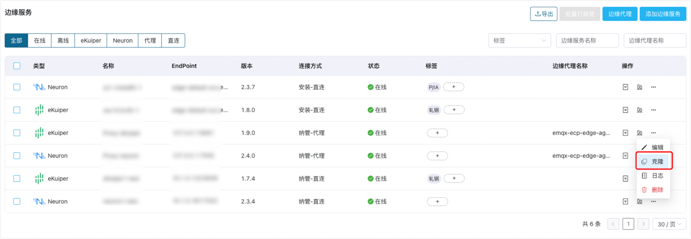
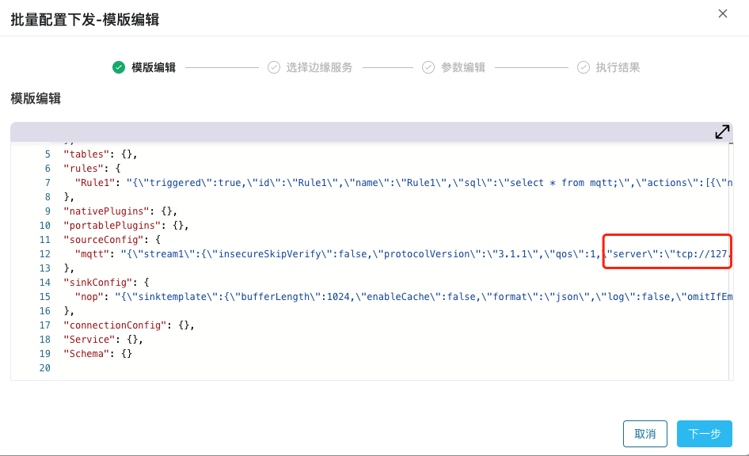
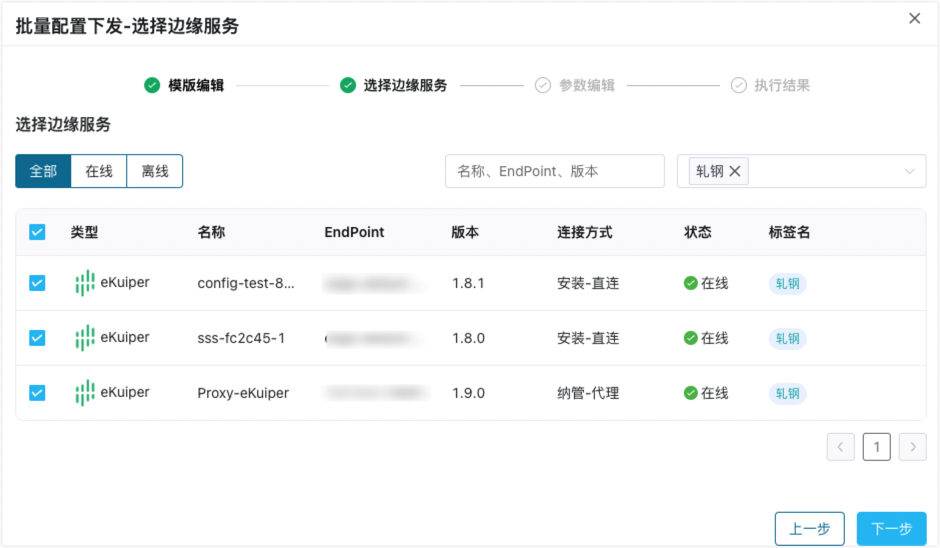
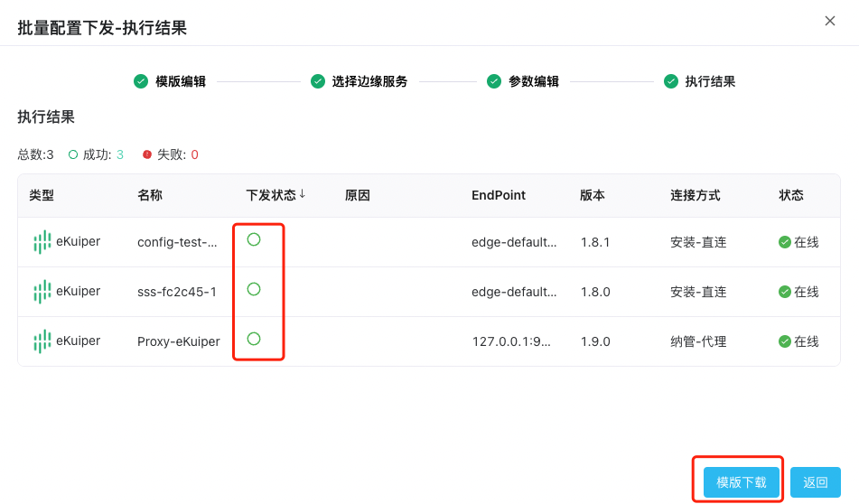

# 边缘配置批量下发

在边缘计算环境中，边缘设备通常运行着多种边缘软件，而这些软件需要根据应用程序和业务需求进行不同的配置。

ECP 提供了配置的批量下发功能，支持将相同或类似的配置信息同时下发给多个边缘设备上的边缘服务。  

配置的批量下发功能可以帮助管理员快速实现一致和可靠的配置策略，提高边缘计算环境的稳定性和可靠性，降低因配置错误或不一致导致的故障和损失。  

:::tip
关于批量配置下发功能的使用限制，见[系统使用限制](../others/known_limitations)和[版本兼容性限制](../others/version_limitations)。
:::


## 克隆指定边缘服务实例

在边缘服务列表页，ECP 支持可以使用某一个边缘服务的配置制作成模版。

如需配置模版：

1. 以系统/组织/项目管理员的身份登录 ECP。
2. 在边缘服务管理页，在目标边缘服务实例行，点击**操作**栏下的更多图标，选择**克隆**。
3. 在随即弹出的对话框中，ECP 会抽象出待制作的模版参数。



## 功能选择

选择  `数采功能` 或  `数据处理功能`，将相应功能的配置批量下发到其他边缘服务。


## 模版编辑  

使用 **\$\{\}** 参数化 Json 标签、数字、字符串、或其他文本。

 例如将  `tcp://127.0.0.1:1883` 参数化为 `tcp_addr`。



参数化前和参数化后的配置如下所示：

参数化前：

```
"mqtt": "{\"stream1\":{\"insecureSkipVerify\":false,\"protocolVersion\":\"3.1.1\",\"qos\":1,\"server\":\"tcp://127.0.0.1:1883\"}}"
```

参数化后：

```
"mqtt": "{\"stream1\":{\"insecureSkipVerify\":false,\"protocolVersion\":\"3.1.1\",\"qos\":1,\"server\":\" ${tcp_addr} \"}}"
```

编辑完成后，点击**下一步**进入选择边缘服务页。

## 选择边缘服务

在**选择边缘服务**页，您可基于边缘服务名称、EndPoint、版本、或标签快速定位待同步参数的服务实例，然后点击实例前的复选框快速选择。



## 参数编辑  

在**参数编辑**页，您可批量为多个边缘服务的参数赋值，提高边缘配置的效率。

1. 在参数编辑页，ECP 会根据模版参数和选择的边缘服务，生成一个可下载的参数模版文件；  

   

   

2. 点击按钮**参数模版下载**下载到本地，您可通过 Excel 等工具在本地编辑：

   - 例如将 `tcp_addr` 的默认值设为 `tcp://10.0.0.1:8008`。

   - 将 `Proxy-eKuiper` 的 `tcp_addr` 值设为 `tcp://10.0.0.2:8008`。

   - 将 `config-test-83bd0f-1` 的 `tcp_addr` 值设为 `tcp://10.0.0.3:8008`。

   - `sss-fc2c45-1` 不做任何设置，将使用 `tcp_addr`  的默认值 `tcp://10.0.0.1:8008`。

     


3. 重新上传编辑后的参数到**参数编辑**页；

   

   

4. 可以使用预览功能查看一个边缘服务的配置实例；

   

   

5. 配置好批量参数以后，使用**检查**功能校验模版和参数内容是否合法。

6. 检查完成的模版和参数即可执行配置下发任务，点击**执行**，进入执行结果页。

## 查看配置下发进度  

点击确认后，将弹出批量配置下发的结果对话框，您可在此查看：

- 待配置的实例总数、成功数和失败数；其中”灰圈“表示正在执行，”✅“表示执行成功，”⭕️“表示执行失败

- 对于配置失败的情况，您可在**原因**列查看失败的原因

  

  

点击**模版下载**即可下载本次已成功执行的**配置模版**和**参数结果**，方便在后续配置更新时复用。

如果需要查看边缘配置下发的历史结果，可以在**系统管理**界面的**操作审计**中查找。


