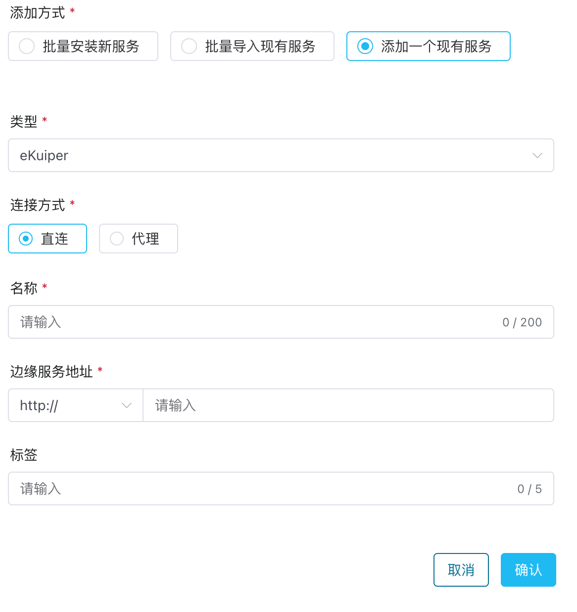
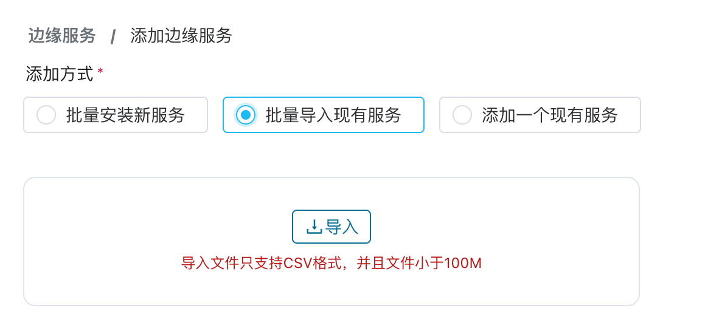

# 导入现有边缘服务

除经由 ECP 批量安装边缘服务外，ECP 还支持[添加一个现有边缘服务](#添加一个现有服务)，或者通过 CSV 文件[批量导入](#批量导入现有服务)现有边缘服务。

## 添加一个现有服务

ECP 支持直连模式导入一个边缘服务，[直连模式](#直连模式)下，ECP 和边缘服务在同一网络或 VPC中。

::: tip 提示
直连模式是指 ECP 平台可以直接访问到边缘服务，即 ECP 和边缘服务在同一网络或 VPC中。
:::

### 直连模式

1. 以系统/组织/项目管理员的身份登录 ECP。
2. 点击**添加边缘服务**按钮，进入添加边缘服务页面。
3. **添加方式**选择**添加一个现有服务**。
4. **类型**选择 **NeuronEX**。
5. 连接方式选择**直连**。
6. 输入该边缘服务的名称；1 - 200 个字符，并支持 "-" 和空格。
7. 输入边缘服务的地址，支持 HTTP 和 HTTPS 协议。
8. [可选] 添加标签，方便后续维护。
9. 点击**确认**，保存边缘服务信息；新增的边缘服务被添加到边缘服务列表中。

 

## 批量导入现有服务

ECP 支持通过 CSV 文件批量导入已有的边缘服务：

1. 以系统/组织/项目管理员的身份登录 ECP。
2. 点击**添加边缘服务**按钮，进入添加边缘服务页面。
3. **添加方式**选择**批量导入现有服务**。
4. 导入准备好的 CSV 文件，文件大小不应超过 100 MB。

导入完成的边缘服务会自动显示在边缘服务列表中。注意：如果文件中包含无效数据，ECP 将仅导入其中的有效数据，并标记和提示错误格式的数据。

CSV 文件的列名解释如下：

| 列名 | 解释 |
| :------| :---------------|
|category|边缘产品类型|
|name|边缘服务名称[]|
|nodeType|直连/代理|
|endpoint|边缘服务地址|
|scheme|http/https/MQTT|
|agentID|边缘代理 ID，非必填|
|tagName|标签名称，非必填|

