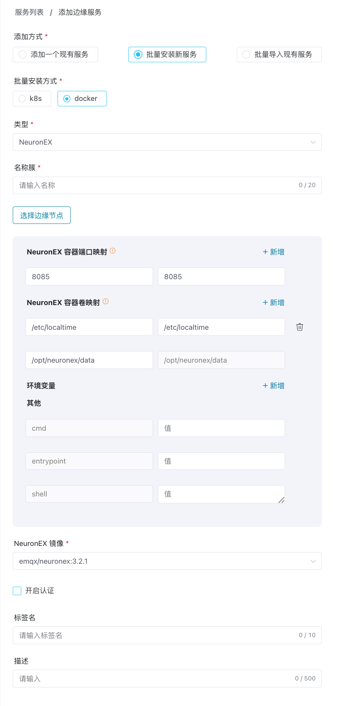
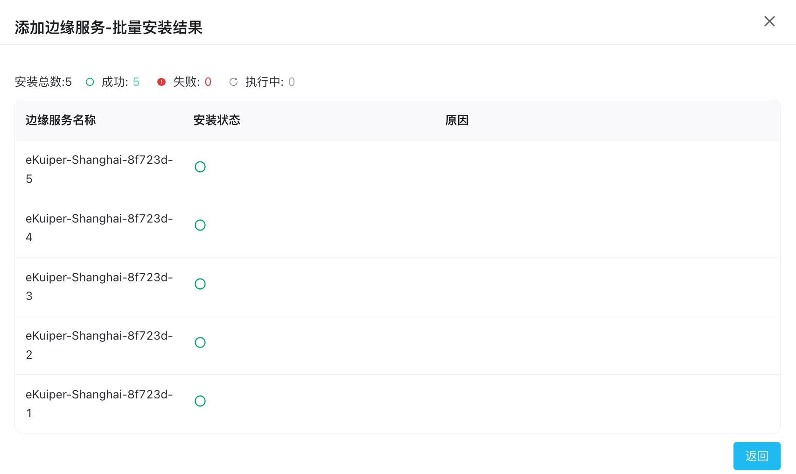

# 批量安装边缘服务

基于 Docker 部署的 ECP 平台，如果边缘服务的硬件支持部署Docker 容器，可在 ECP 平台上批量安装边缘服务，缩短边缘服务的安装与部署时间，提高部署效率和一致性。

## 前置条件

边缘服务的批量安装之前，需要完成以下准备工作：
- 完成[Docker连接配置](../system_admin/resource_config.md#docker连接配置)
- 添加[边缘服务镜像](../system_admin/resource_config.md#边缘服务镜像列表)
- 添加[边缘节点](./docker_node.md)，边缘服务将安装在边缘节点上

## 批量安装

1. 以系统/组织/项目管理员的身份登录，在**工作台**页面，点击左侧导航栏的**边缘服务**。

2. 点击**添加边缘服务**按钮，进入添加边缘服务页。

3. **添加方式**选择**批量安装新服务**。

4. **类型**可以选择 NeuronEX。

5. **连接方式**默认为**直连**，不可更改。

6. 输入边缘服务的名称前缀，系统会根据名称前缀自动生成唯一的服务名称；1-20 个字符，并支持 "-" 和空格。

7. 选择一个或多个**边缘节点**，ECP要会在每一个边缘节点部署一个所选择**类型**的边缘服务实例。

8. 对边缘服务的配置参数进行设置，不修改将默认使用全局配置中的参数。

9. 选择需要安装边缘服务的镜像。

10. [可选]安装 NeuronEX 实例，可选择是否开启认证，具体信息，可查看[边缘服务认证](./e2c.md)。

11. [可选] 可以选择为边缘服务实例添加标签，方便后续维护。

12. ECP 会根据以上设定自动在页面右侧生成本次安装的信息概览，您可在此进行确认，如信息确认无误，可点击**确认**按钮，进行批量边缘服务的安装。

## 查看安装进度

点击确认后，将弹出批量安装结果对话框，您可在此查看：

- 安装总数、安装成功数、安装失败数和正在执行安装的统计数据；
- 对于安装失败的情况，您可在**原因**列查看安装失败的原因；

点击**返回**，返回到**边缘服务**页，新安装的边缘服务将出现在页面的边缘服务部分。

此外，ECP 会记录本次批量安装的全部信息，系统/组织/项目管理员可在[操作审计](../system_admin/operation_audit)中查看。

:::tip
批量安装的使用限制请参考[系统使用限制](../others/known_limitations)和[版本兼容性限制](../others/version_limitations)。
:::