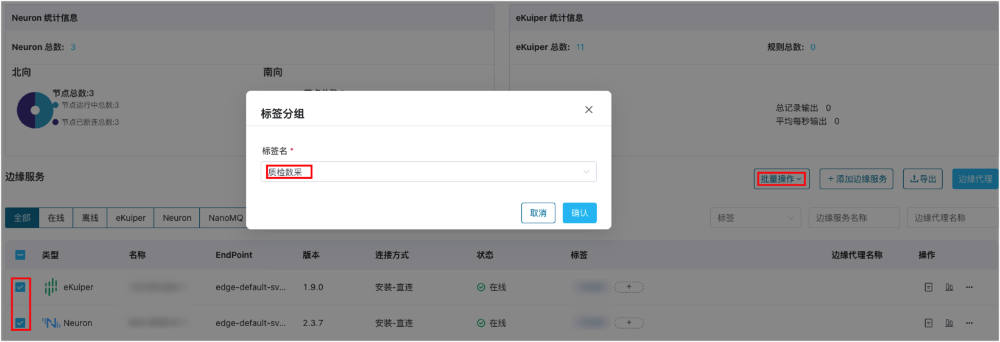

# 标签及分组

ECP 提供了标签服务，可用于对边缘服务进行分类、整理以及筛选，提高搜索和检索的效率和准确性。另外，您还可通过批量打标签将业务归类，对边缘服务进行批量控制、实现配置的批量下等操作。

## 新建标签

以系统/组织/项目管理员的身份登录 ECP。点击功能区的**工作台**按钮，切换至**工作台**页面，点击左侧导航栏的**标签管理**，进入标签页。

1. 点击**新建标签**，弹出新建标签页。
2. 按标签命名规则填入标签名称：1-10 个字符，并支持 "-"。
3. 在下方的边缘服务列表中，勾选待打标签的服务。
4. 最后，点击**确认**按钮，保存新建标签并绑定服务；

## 管理标签

对于已创建的标签，您可点击标签**操作**栏的编辑按钮进行编辑，包括标签名和绑定的服务；您也可点击删除按钮删除对应标签。

## 通过标签执行批量操作

在边缘服务页，您可通过**批量操作**下的**标签分组**执行批量操作。

如希望为多个边缘服务添加标签：

1. 勾选需要打标签的边缘服务复选框。

1. 点击**批量操作** -> **标签分组**按钮。

2. 在弹出的对话框输入标签名称：1-10 个字符，并支持 "-"。

3. 点击**确认**按钮完成设定。

   

:::tip
一个服务最多可以标记 10 个标签，具体参考[系统使用限制](../others/known_limitations)。
:::

完成批量标签操作后，新建标签将自动出现在对应边缘服务实例的**标签**列。您也可点击 + 为该示例增加更多标签。