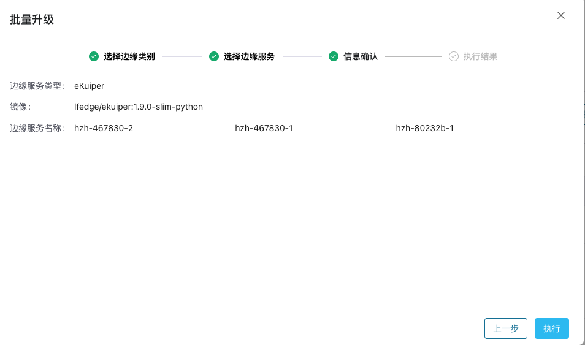

# 升级边缘服务

ECP 支持对单边缘服务实例进行升级、或同时对多个边缘服务进行批量升级。相比单实例升级，批量升级可以方便、快捷地统一升级多个边缘服务，提高运维效率和减少人力成本。

## 单实例升级

如希望升级单个边缘服务实例：

1. 以系统/组织/项目管理员的身份登录 ECP。
2. 在边缘服务管理页，点击目标实例，点击**更多**图标，选择**升级**。
3. 在弹出的升级对话框中，选择版本**镜像**，点击**确认**。

## 批量升级

如希望批量升级多个边缘服务实例：

1. 以系统/组织/项目管理员的身份登录 ECP。
1. 在边缘服务管理页，点击**批量操作** -> **升级**。
2. 在弹出的批量升级对话框，选择要升级的**边缘服务类型**，选择边缘服务的**版本镜像**，点击**下一步**。

3. 在随机出现的边缘服务列表中，选择一个或多个待升级的边缘服务。

4. 确认以上信息，如果选择无误请点击**执行**。

## 查看升级进度

点击**执行**后，将弹出批量升级结果对话框，您可在此查看：

- 升级总数、成功数、失败数和执行中的节点数
- 对于升级失败的情况，您可在**原因**列查看失败原因

待升级完成后，返回边缘服务管理页，您可在此看到待升级的边缘服务实例已经升级到目标版本。