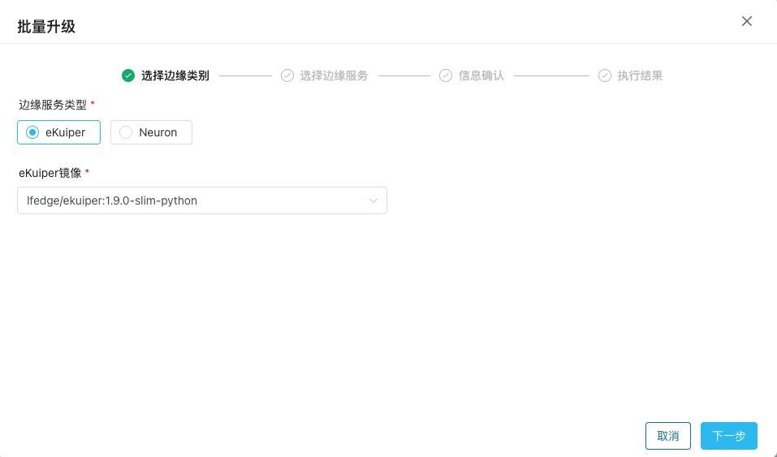
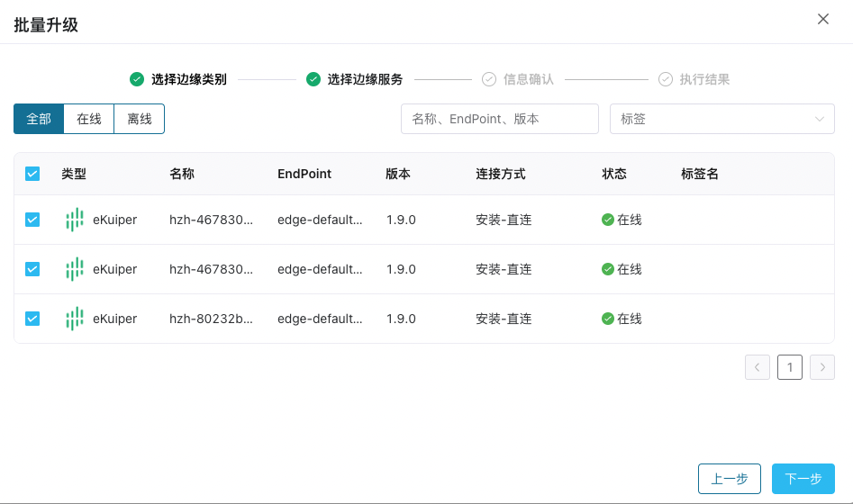
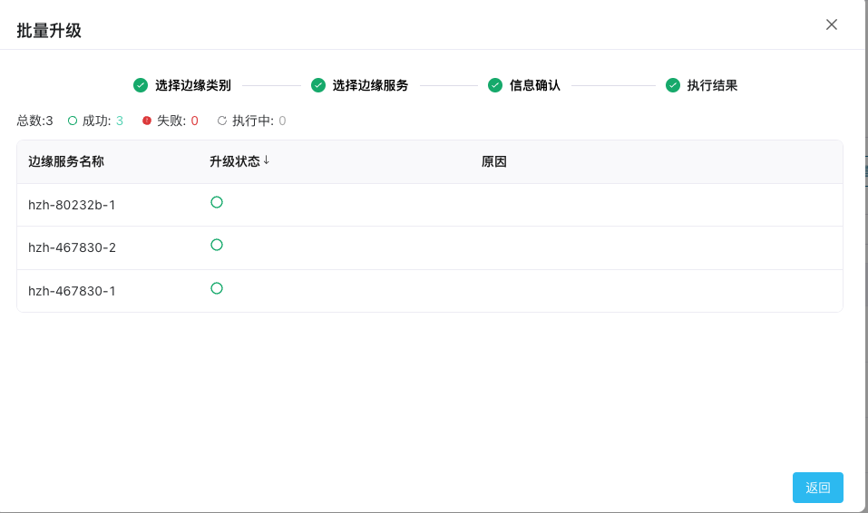

# 升级边缘服务

ECP 支持对一个或多个托管的边缘服务实例，以批量的方式方便快捷地进行统一升级，提高运维效率和减少人力成本。

## 批量升级

1. 以系统/组织/项目管理员的身份登录 ECP。
2. 在边缘服务管理页，点击 **升级**。

3. 在弹出的批量升级对话框，选择边缘服务的**版本镜像**，点击**下一步**。

4. 在随即出现的边缘服务列表中，选择一个或多个待升级的边缘服务。

5. 确认以上信息，如果选择无误请点击**执行**。

## 查看升级进度

点击**执行**后，将弹出批量升级结果对话框，您可在此查看：

- 升级总数、成功数、失败数和执行中的边缘服务数量
- 对于升级失败的情况，您可在**原因**列查看失败原因

待升级完成后，返回边缘服务管理页，您可在此看到待升级的边缘服务实例已经升级到目标版本。