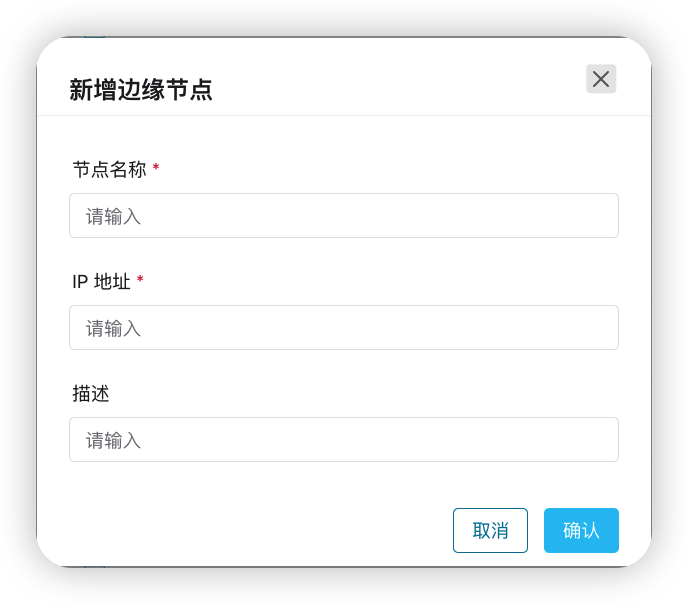
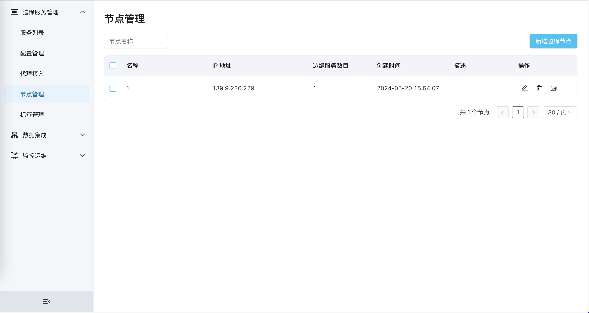
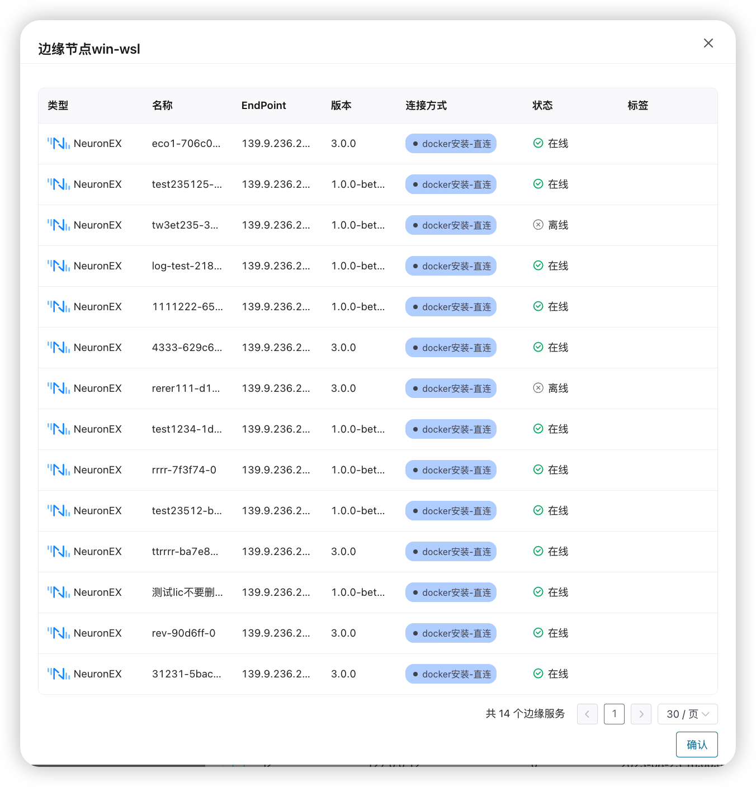

# 边缘节点管理

## 边缘节点注册
Docker 节点只有注册后才可以通过 ECP 在指定的 Docker 节点上部署边缘服务；

1. 选择 **组织** -> **项目**;
2. 点击 **边缘管理** ， 选择 **边缘节点** ， 点击新增边缘节点;
3. 填写边缘节点的名称、IP 地址、描述;

## 边缘节点列表管理
1. 选择 **组织** -> **项目**;
2. 点击 **边缘管理** ， 选择 **边缘节点**; 
3. 在列表中选择要管理的节点， 可以 **编辑**、**删除**、**查看**, 查看按钮表示该节点上的边缘服务列表；

## 边缘节点上的边缘服务列表
在边缘节点列表上点击某边缘节点最右侧的 **查看** 按钮后， 可以看到该节点上的边缘服务列表；
可以在列表中看到这些边缘服务的状态等信息。

