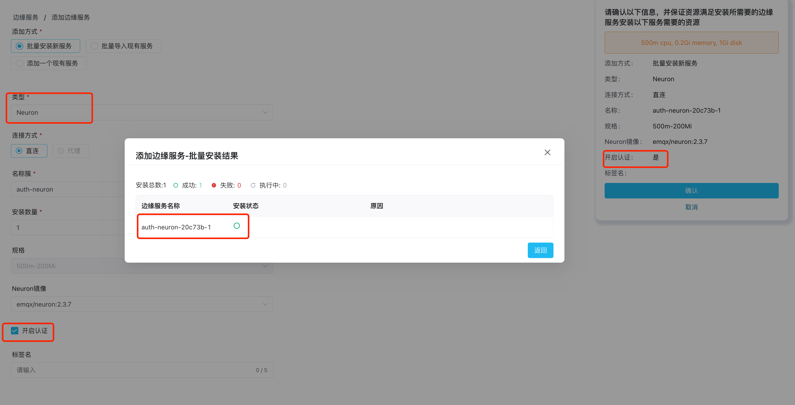
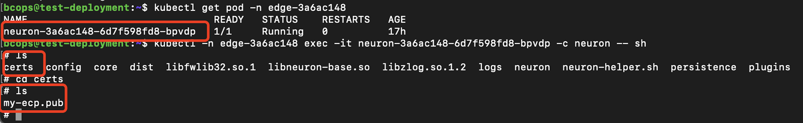
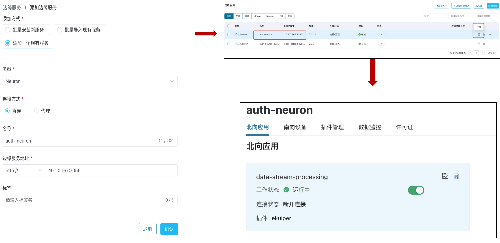

# 边缘服务认证

在管理边缘服务之前，如果边缘服务开启了认证，首先需要进行认证配置。ECP 支持在 Neuron、eKuiper 侧和 NanoMQ 侧的认证，本篇将以 Neuron 和 eKuiper 为例演示如何进行认证配置，关于 NanoMQ 侧的配置，见[纳管 Neuron 的认证授权](#纳管-neuron-侧的认证授权)部分。

Neuron 侧的认证，ECP 支持新建和纳管的 Neuron 上的认证授权。对于由 ECP 批量安装的 Neuron 实例，需要在安装配置时开启认证；对于由 ECP 纳管的 Neuron，要在 Neuron 配置文件中开启认证。

eKuiper 侧的认证，ECP 目前仅支持对纳管的 eKuiper 上的认证授权，同样需要在 eKuiper 配置文件中开启认证。

## 新建 Neuron 侧的认证授权

当用户通过 ECP 批量安装 Neuron 时，可在安装时指定是否开启认证服务，开启认证后，ECP 会把 RSA 公钥文件安装到 Neuorn 指定的文件夹下。

关于 Neuron 的批量安装请参考[批量安装边缘服务](../edge_service/batch_intall)功能。



## 纳管 Neuron 侧的认证授权

如果 ECP 需要纳管已经开启认证的 Neuron 服务，需要进行如下操作

1. 以系统/项目/组织管理员的身份登录 ECP。
2. 下载公钥文件：在**系统管理**页面，点击**系统设置** -> **资源配置**，在**资源配置**页面，点击展开**边缘服务配置**部分，点击**认证配置** -> **公钥导出**。关于公钥文件的说明请参考[认证配置](../system_admin/resource_config.md#认证配置)。
3. 登录到 Neuron 所在的容器或虚机，把 ECP 中下载的公钥文件上传到 Neuron 安装目录下的 `certs` 目录中。

   

## 纳管 eKuiper 侧的认证授权

如果 ECP 需要纳管已经开启认证的 eKuiper 服务，需要进行如下操作

1. 以系统/项目/组织管理员的身份登录 ECP。
2. 下载公钥文件：在**系统管理**页面，点击**系统设置** -> **资源配置**，在**资源配置**页面，点击展开**边缘服务配置**部分，点击**认证配置** -> **公钥导出**。关于公钥文件的说明请参考[认证配置](../system_admin/resource_config.md#认证配置)。
3. 登录到 eKuiper 所在的容器或虚机，把 ECP 中下载的公钥文件上传到 eKuiper 安装目录下的 `etc/mgmt` 目录中。

::: tip 提示
如果已经纳管的 eKuiper 的认证开启需要更改，请先从 ECP 端删除纳管的 eKuiper，然后在 eKuiper 中开启或关闭认证，再从 ECP 端重新纳管该 eKuiper。
:::

## 认证配置验证

完成认证授权配置后，您可通过添加一个已开启认证的 Neuron 或 eKuiper 服务来验证配置是否成功。具体操作步骤，见[添加一个现有服务](../edge_service/batch_import)。

如认证配置被正确添加，该实例将能被正常添加，您也可点击该实例进入详情页。

  


## RSA 签名认证简介

RSA 使用“密钥对”对数据进行加密解密，在加密解密前需要先生成公钥（Public Key）和私钥（Private Key）。  

- 公钥：用于加密数据，可公开分享，一般存放在数据提供方，例如 Neuron 服务器。  
- 私钥：用于解密数据，私钥泄露会造成安全问题，应保密存储，一般存放在 ECP 服务器。  


认证过程如下：


## ECP 侧的 RSA 密钥对管理

ECP 在安装部署时会自动生成并管理密钥对，如果安装时未能成功生成密钥对，系统会提示您重新安装。

如您希望自行管理秘钥对，可按以下方式获取密钥对信息。  
- K8S 环境，假设命名空间为 `emqx-ci-dev`，可通过如下命令查看 RSA 密钥对。

  ```bash
  $ kubectl get ns # 获取命名空间 emqx-ci-dev
  
  $ kubectl get pod -n emqx-ci-dev # 获取命名空间 emqx-ci-dev 中的 POD 信息，找到 ECP 容器名称
  
  $ kubectl -n emqx-ci-dev exec -it emqx-bc-main-658b5f5fd6-74vnd -c emqx-bc-main -- sh # 进入容器
  
  $ ls # 查看密钥对
  ```

  

- Docker 环境，假设容器 ID 为 `717aee745efb`，可通过如下命令查看 RSA 密钥对。

  ```bash
  $ docker ps # 获取 POD 信息，找到 ECP 容器ID为 '717aee745efb'
  
  $ docker exec -it 717aee745efb -- sh # 进入容器
  
  $ ls # 查看密钥对
  ```

