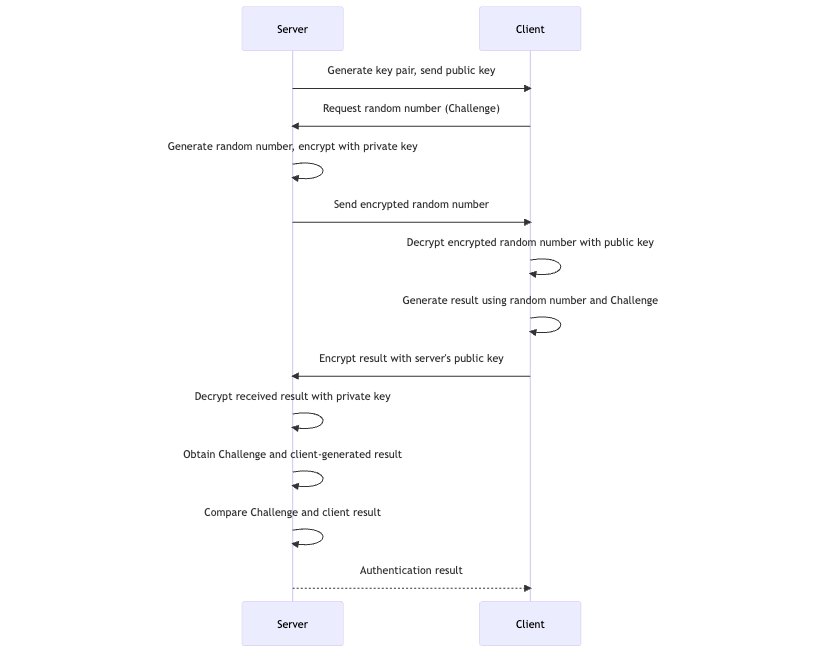
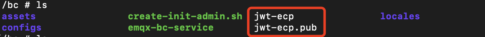

# 边缘服务认证

在管理边缘服务 NeuronEX 之前，如果边缘服务开启了认证，首先需要进行认证配置。ECP 支持托管和纳管的 NeuronEX 上的认证授权。
- 对于由 ECP 批量安装的 NeuronEX 实例，可在安装时选择是否开启认证，具体请参考[托管部署的 NeuronEX 的认证授权](#托管部署的-neuronex-的认证授权)；
- 对于由 ECP 纳管的 NeuronEX，需要将 ECP 证书放置到 NeuronEX 配置文件中，具体请参考[纳管 NeuronEX 的认证授权](#纳管-neuronex-的认证授权)。

## 托管部署的 NeuronEX 的认证授权

当用户通过 ECP 批量安装 NeuronEX 时，可在安装时指定是否开启认证服务，开启认证后，ECP 会把 RSA 公钥文件安装到 NeuornEX 指定的文件夹下。

关于 NeuronEX 的批量安装请参考[批量安装边缘服务](../edge_service/batch_install)功能。

## 纳管 NeuronEX 的认证授权

如果 ECP 需要纳管已经开启认证的 NeuronEX 服务，需要进行如下操作：

1. 以系统/项目/组织管理员的身份登录 ECP。
2. 下载公钥文件：在**系统管理**页面，点击**系统设置** -> **资源配置**，在**资源配置**页面，点击展开**纳管边缘服务认证配置**部分，点击**公钥导出**。关于公钥文件的说明请参考[纳管边缘服务认证配置](../system_admin/resource_config.md#纳管边缘服务认证配置)。
3. 登录到 NeuronEX 所在的容器或虚机，把 ECP 中下载的公钥文件 `my-ecp.pub` 上传到 NeuronEX 安装目录下的 `etc` 目录中。以 Docker 安装的 NeuronEX 容器 `neuronex-test` 为例，在 NeuronEX 部署的机器上执行以下命令：

  ```bash
  $ docker cp my-ecp.pub neuronex-test:/opt/neuronex/etc/my-ecp.pub
  ```


完成认证授权配置后，您可通过添加一个已开启认证的 NeuronEX 实例来验证配置是否成功。如认证配置被正确添加，该实例将能被正常纳管。

:::tip
  ECP 纳管 NeuronEX 的情况，NeuronEX 本身支持关闭鉴权的部署方式，具体请参考[ NeuronEX 配置管理](https://docs.emqx.com/zh/neuronex/latest/admin/conf-management.html#%E7%8E%AF%E5%A2%83%E5%8F%98%E9%87%8F)，如果 NeuronEX未开启认证，ECP 可直接对 NeuronEX 进行管理。
:::

## RSA 签名认证简介

RSA 使用“密钥对”对数据进行加密解密，在加密解密前需要先生成公钥（Public Key）和私钥（Private Key）。  

- 公钥：用于加密数据，可公开分享，一般存放在数据提供方，例如 Neuron 服务器。  
- 私钥：用于解密数据，私钥泄露会造成安全问题，应保密存储，一般存放在 ECP 服务器。  


认证过程如下：



## ECP 侧的 RSA 密钥对管理

ECP 在安装部署时会自动生成并管理密钥对，如果安装时未能成功生成密钥对，系统会提示您重新安装。

如您希望自行管理秘钥对，可按以下方式获取密钥对信息。  
- K8S 环境，假设命名空间为 `emqx-ci-dev`，可通过如下命令查看 RSA 密钥对。

  ```bash
  $ kubectl get ns # 获取命名空间 emqx-ci-dev
  
  $ kubectl get pod -n emqx-ci-dev # 获取命名空间 emqx-ci-dev 中的 POD 信息，找到 ECP 容器名称
  
  $ kubectl -n emqx-ci-dev exec -it emqx-bc-main-658b5f5fd6-74vnd -c emqx-bc-main -- sh # 进入容器
  
  $ ls # 查看密钥对
  ```

  

- Docker 环境，假设容器 ID 为 `717aee745efb`，可通过如下命令查看 RSA 密钥对。

  ```bash
  $ docker ps # 获取 POD 信息，找到 ECP 容器ID为 '717aee745efb'
  
  $ docker exec -it 717aee745efb -- sh # 进入容器
  
  $ ls # 查看密钥对
  ```

