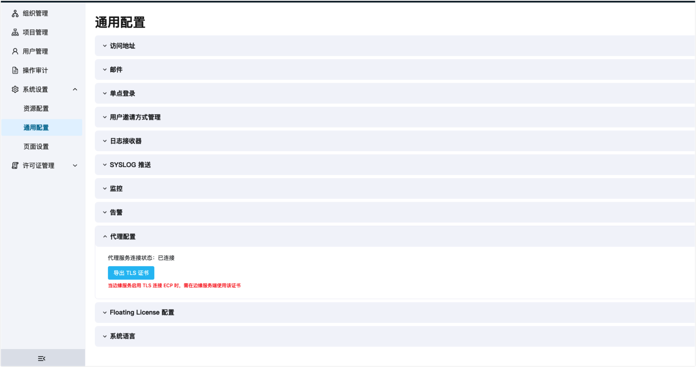
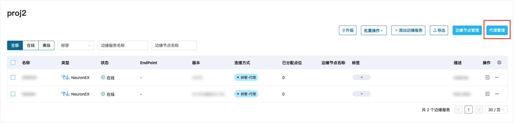
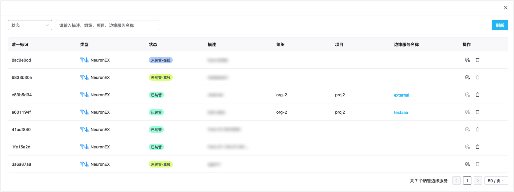
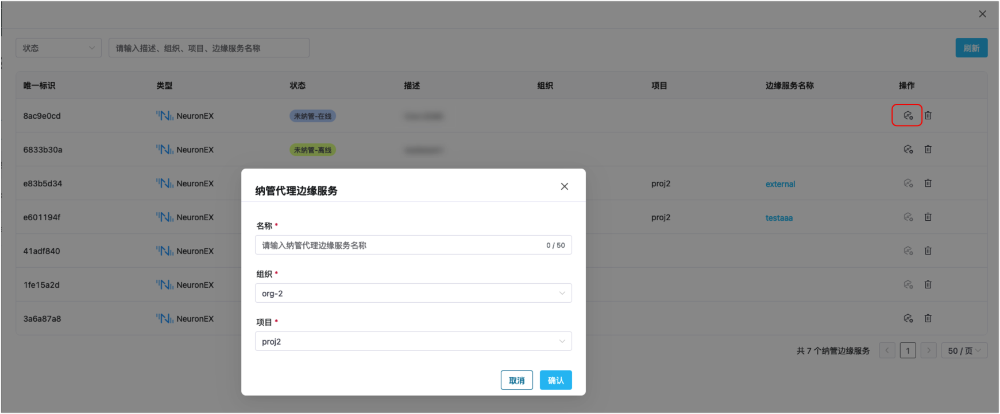

# 代理方式管理边缘服务

如果 NeuronEX 所在边缘节点 IP 不固定，或者 NeuronEX 处于自己的 VPC 或局域网中，ECP 无法主动获取到 NeuronEX 所在边缘节点的 IP 信息，直连模式导入边缘服务将不再适用。ECP 提供了代理纳管方式，对上述场景中的 NeuronEX 进行管理接入。

## 配置代理服务 

代理模式下，ECP 与 NeuronEX 之间使用 MQTT 协议进行通信，在 ECP 端和 NeuronEX 端都需要先配置 MQTT 并开启代理服务。NeuronEX 端的代理功能配置请参考[NeuronEX 代理功能配置](https://docs.emqx.com/zh/neuronex/latest/admin/sys-configuration.html#%E4%BB%A3%E7%90%86%E5%8A%9F%E8%83%BD%E9%85%8D%E7%BD%AE)。ECP 端安装时已自带 MQTT 服务器，可以使用该服务器，也可以自行安装。如果使用自行安装的 MQTT 服务器，需要按以下方式手动配置 MQTT 相关配置项。

### 基于 Docker 部署的 ECP

进入安装文件所在目录后，修改 configs/main/main.yaml 配置文件中的 mqtt 相关配置项，并重启 ECP。

```
mqtt:
  # 是否启用ssl
  useSSL: false
  # mqtt broker，格式为<mqtt服务地址>:<mqtt服务端口>
  addr: mqtt:1883
  # 连接mqtt服务验证用的用户名，如果未开启验证，可以不设置
  username: "ecp-mqtt-cloud"
  # 连接mqtt服务验证用的密码，如果未开启验证，可以不设置
  password: "ecp-mqtt-cloud1!"
  # 最大重连间隔，单位秒
  maxReconnectInterval: 3
  # 连接超时时间，单位秒
  connectTimeout: 8
  # 是否清理 session
  cleanSession: true
  # 是否校验证书，适用于ssl启用场景
  verifyCertificate: false
  # CA证书文件位置，适用于ssl启用场景，如果使用的是可信机构签发的证书，可以不设置
  cacertFile: ""
  # ECP端证书文件位置，适用于ssl启用场景
  certFile: ""
  # ECP端证书密钥文件位置，适用于ssl启用场景
  keyFile: ""
```

### 基于 Kubernetes 部署的 ECP

修改 configmap 中 mqtt 相关配置项。配置项具体内容与上文基于 Docker 方式部署的相同。

```
kubectl -n emqx-ecp edit configmap kube-ecp-stack-main-conf
```

## 检查代理服务状态 

在**系统管理**页面，点击**系统设置** -> **通用配置**，并点击展开**代理配置**部分，可以查看代理服务是否已正常连接。如果启用了 TLS/SSL 连接，也可以导出相应证书文件，在 NeuronEX 端使用。



## 管理边缘代理

以系统/组织/项目管理员的身份登录 ECP，点击**工作台** -> **边缘服务**进入边缘服务页，点击页面右侧的**代理管理**按钮，打开**边缘代理管理**窗口。



您可在此窗口查看所有注册到 ECP 的 NeuronEX 代理。尚未被 ECP 纳管的代理显示为“未纳管“状态，实际在线情况也一并显示。您可以删除未被纳管的 NeuronEX 代理，也可以通过页面的筛选功能快速定位。



## 代理纳管边缘服务

在未被纳管的 NeuronEX 代理的**操作**列点击**纳管**按钮，输入边缘服务的名称，选择目标组织和项目，并点击**确认**按钮，将以代理方式完成对 NeuronEX 的纳管。



纳管后，**边缘代理管理**窗口中该代理的状态将更新为”已纳管“，纳管后代理将无法从代理管理页面直接删除，需要先取消对应边缘服务的纳管后再删除。

从代理管理窗口**边缘服务名称**列链接可跳转到对应边缘服务，并进行正常的边缘服务管理操作。