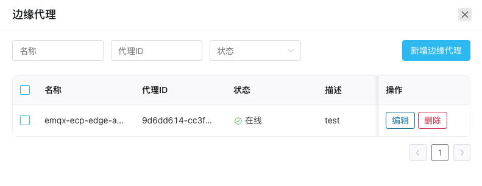

# ECP 边缘代理

批量安装模式适合边缘服务和 ECP 在同一网络或 VPC 的情况，如果边缘侧有自己的 VPC 或局域网，用户则需要先安装 ECP 边缘代理t，用于实现边缘侧和云端服务的通信。

ECP 边缘代理是 ECP 自主开发的一款边缘端软件，运行在边缘侧，通过将边缘软件（neuron、eKuiper）注册到 ECP 平台，实现集中管控，保护系统的数据安全和稳定性。  

## 安装 ECP 边缘代理

使用 ECP 边缘代理前，您首先需要在边缘网络完成安装并确保 ECP 边缘代理可通过边缘网关连接到 ECP。具体安装步骤，见[安装 ECP 边缘代理](../install/install_edge_agent)。

## 管理 ECP 边缘代理

ECP 边缘代理安装并启动后，会自动注册到 ECP 云边一体化平台。登录 ECP 后，您可在对应组织/项目下，点击**工作台** -> **边缘服务**进入边缘服务页，点击页面右侧的**边缘代理**按钮，打开**边缘代理**管理窗口。 

您可在此窗口编辑和删除边缘代理，或通过页面的筛选功能快速定位。

 
