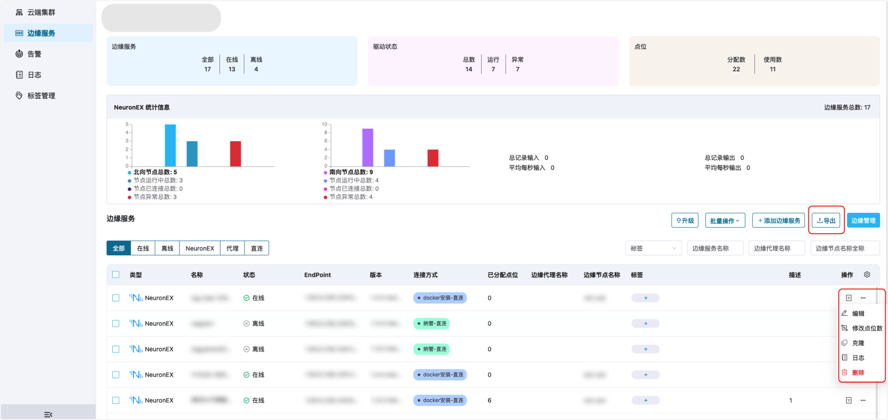
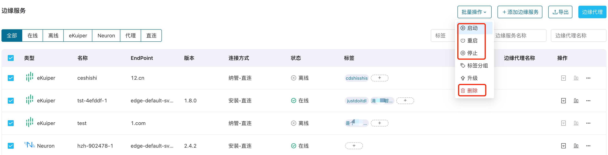
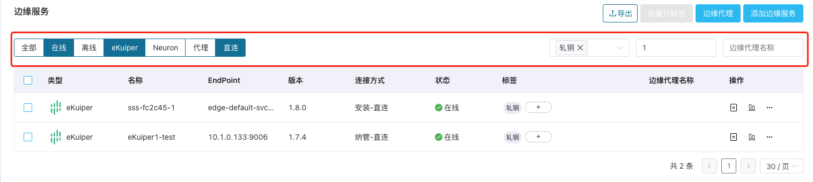

# 边缘服务管理运维

ECP 中集成了多个版本的 Neuron 和 eKuiper 的用户界面，允许用户远程连接、配置、监控和管理各个边缘服务。此外，在由 Kubernetes 部署的 ECP 平台中，您还可通过批量管理功能，方便集中管理多个边缘服务实例，进一步提升边缘服务管理的效率。

   

## 管理边缘服务实例

### 管理 Neuron 实例

ECP 集成了多版本的 Neuron UI，您可以在 ECP 平台配置多个 Neuron 实例，远程配置 Neuron 的北向应用、南向设备、Group、Tag、驱动、订阅、管理插件、监控实时数据和更新许可证。

关于各界面配置项的功能说明，参考 [Neuron 在线文档](https://neugates.io/docs/zh/latest/)。

### 管理 eKuiper 实例

ECP 集成了多版本的 eKuiper UI，您可以在 ECP 平台配置多个 eKuiper 实例，远程配置 eKuiper 的源表、规则、扩展插件、文件、算法包、函数和模版。

关于各界面配置项的功能说明，参考 [eKuiper 在线文档](https://ekuiper.org/docs/zh/latest/)。

## 批量管理边缘服务实例

批量控制是指对边缘服务进行批量启动、停止、重启、删除的操作。

:::tip
关于批量配置的使用限制，参见[系统使用限制](../others/known_limitations)和[版本兼容性限制](../others/version_limitations)。
:::

如希望执行批量管理操作：

1. 以系统/组织/项目管理员的身份登录 ECP。

2. 在**工作台** -> **边缘服务**管理页，找到边缘服务列表部分。

3. 点击勾选目标边缘服务实例，点击操作栏的更多图标，选择待执行的批量操作，如重启、停止、升级、删除等。

   注意：删除操作不可撤销，请谨慎操作。

## 导出边缘服务列表

为了满足企业客户，ECP 提供了批量导出边缘服务功能，导出为该项目下所有的边缘服务信息并以 CSV 文件存储在本地。注意：管理员和普通用户均可执行导出操作。

## 筛选边缘服务

ECP 还提供了针对边缘服务的筛选功能：

- 状态：根据在线/离线状态进行筛选
- 产品类别：针对产品类别进行筛选，如 eKuiper 或 Neuron
- 连接方式：直连模式，或代理模式
- 标签筛选：针对选择业务标签进行筛选，如筛选同时包含标签 `180` 和 `质检数采` 的边缘服务。

 - 模糊搜索：搜索名称相似的所有服务

您可综合以上筛选方式进行快速定位，如下图所示：

## 编辑实例配置

对于由 ECP 托管或纳管的边缘服务实例，您均可点击服务实例后**更多**图标，并选择**编辑**。对于由 ECP 安装的边缘服务，您可修改**名称**；对于由 ECP 纳管的边缘服务，可以修改**类型**、**连接方式**、**名称**和**边缘服务地址**。

## 更多运维操作

ECP 在各边缘服务实例的操作列还提供了更多的运维操作：

- 点击详情图标，可查看边缘服务的详情信息。
- 点击监控图标，可查看边缘服务的运行状态，关于监控的更多信息，见[边缘服务监控](../monitor/monitor_edge.md)。
- 如希望查看边缘服务实例的运行日志，可点击更多图标，并选择**日志**。
- 此外，您还可删除边缘服务实例：
  - 对于由 ECP 创建的边缘服务实例，点击删除后，该实例将被完全删除。
  - 对于由 ECP 纳管的边缘服务实例，点击删除后，ECP 会将该实例的注册信息删除，不会直接删除该实例。