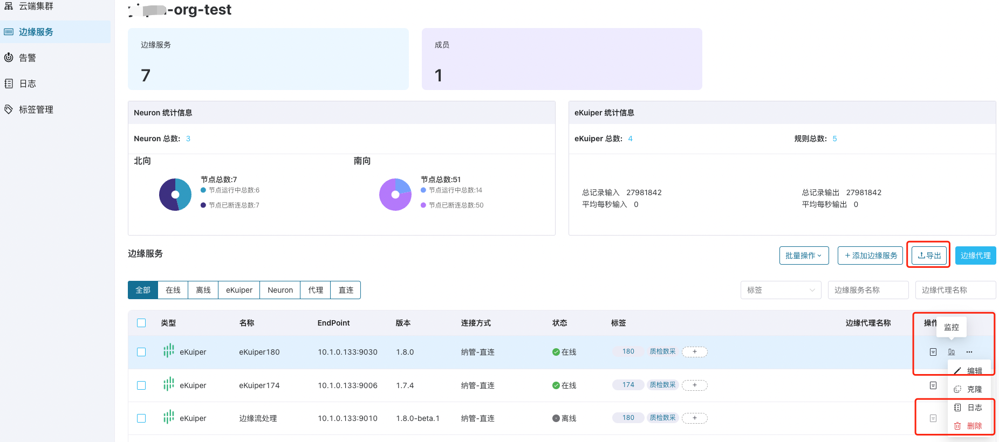

# 边缘服务管理运维

ECP 中集成了NeuronEX 的用户界面，允许用户远程连接、配置、监控和管理各个边缘服务。

:::tip 提示
此外，由 ECP **托管**创建的边缘服务，您还可通过批量管理功能，对一个或多个边缘服务进行安装、启停、升级等操作，进一步提升边缘服务管理的效率。
:::

   

## 管理边缘服务实例

### 管理 NeuronEX 实例

ECP 集成了 NeuronEX UI，您可以在 ECP 平台配置多个不同版本的 NeuronEX 实例，对 NeuronEX 的数采功能和数据处理功能进行远程配置：

- 数采功能的管理包括南向驱动、北向应用、Group、Tag、订阅、管理插件、监控实时数据。

- 数据处理功能的管理包括多源数据接入、规则、扩展插件、算法包、函数和模版。

各配置项的功能说明，请参考 [NeuronEX 在线文档](https://docs.emqx.com/zh/neuronex/latest/)。

## 导出边缘服务列表

为了满足企业客户需求，ECP 提供了批量导出边缘服务功能，可将该项目下部分或所有的边缘服务信息以 CSV 文件格式导出并存储在本地。

:::tip 注意
管理员和普通用户均可执行导出操作。
:::

## 筛选边缘服务

ECP 还提供了针对边缘服务的筛选功能：

- 状态：根据在线/离线状态进行筛选
- 连接方式：直连模式，或代理模式
- 标签筛选：针对选择业务标签进行筛选，如筛选同时包含标签 `180` 和 `质检数采` 的边缘服务。

 - 模糊搜索：搜索名称相似的所有服务

您可综合以上筛选方式进行快速定位，如下图所示：

## 编辑实例配置

对于由 ECP 托管或纳管的边缘服务实例，您均可点击服务实例后**更多**图标，并选择**编辑**。对于由 ECP 安装的边缘服务，您可修改**名称**；对于由 ECP 纳管的边缘服务，可以修改**类型**、**连接方式**、**名称**和**边缘服务地址**。

:::tip 注意
仅管理员可执行编辑操作。
:::

## 修改 NeuronEX 点位数

如果需要对 ECP 托管或纳管的在线 NeuronEX 实例所分配的点位数进行修改，您可以点击服务实例后**更多**图标，并选择**修改点位数**。

在弹出对话框中，将鼠标悬浮在  `?`  提示信息处，可查看当前已分配的点位数及许可证支持的总点位数，以及在该边缘服务中已经实际配置使用的点位数。在修改当前边缘服务点位数时，请确保新设置的点位数不少于实际配置使用的点位数，并且不会超过许可证的点位数限额。

:::tip 注意
仅管理员可执行修改点位数操作。
:::

## 查看边缘服务详情

您可以点击服务实例后**操作**栏的**详情**图标，查看边缘服务的详细信息。

:::tip 注意
管理员和普通用户均可执行查看详情操作。
:::

## 查看日志

您可以点击服务实例后**更多**图标，并选择**日志**，查看该边缘服务实例的运行日志。

:::tip 注意
管理员和普通用户均可执行查看详情操作。
:::

## 删除边缘服务

您可以通过点击服务实例后**更多**图标，并选择**删除**操作，对单个边缘服务进行删除。或者通过点击**批量操作** -> **删除**，对多个边缘服务进行指删除：

- 对于由 ECP 创建的边缘服务实例，点击删除后，该实例将被完全删除。
- 对于由 ECP 纳管的边缘服务实例，点击删除后，ECP 会将该实例的注册信息删除，不会直接删除该实例。

:::tip 注意
仅管理员可执行删除操作。
:::