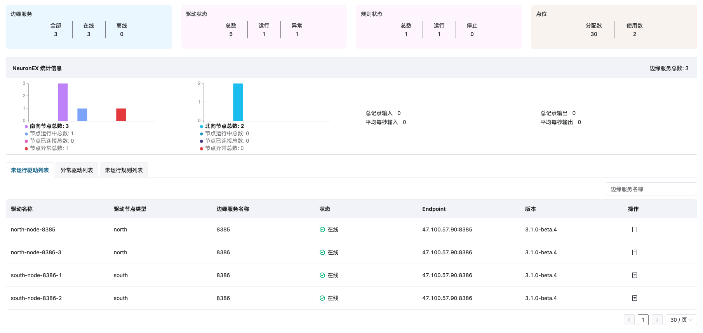

# 项目级监控统计

完成边缘服务的批量创建/导入后，您可在 ECP 边缘服务页查看项目级别的边缘服务统计信息。

## 基础统计信息

- 边缘服务：项目内全部、在线及离线的边缘服务数量。
- 驱动状态：项目内北向及南向节点总数量、运行中节点数量及异常节点数量。
- 点位：项目内已分配给边缘服务的点位数量及边缘服务中实际已使用的点位数量。

## NeuronEX 统计信息

- 边缘服务总数：项目内所有 NeuronEX 实例数。
- 北向：北向设备统计信息
   - 节点总数：项目内所有 NeuronEX 实例的北向节点总和。
   - 节点运行中总数：项目内所有 NeuronEX 实例中正在运行的北向节点总和。
   - 节点已连接总数：项目内所有 NeuronEX 实例中已连接的北向节点总和。
   - 节点异常总数：项目内所有 NeuronEX 实例中异常的北向节点总和。
- 南向：南向设备统计信息
   - 节点总数：项目内所有 NeuronEX 实例的南向节点总和。
   - 节点运行中总数：项目内所有 NeuronEX 实例中正在运行的南向节点总和。
   - 节点已连接总数：项目内所有 NeuronEX 实例中已连接的南向节点总和。
   - 节点异常总数：项目内所有 NeuronEX 实例中异常的南向节点总和。

- 数据流入流出统计信息
  - 总记录输入：项目内所有 NeuronEX 实例中的总输入数据。
  - 总记录输出：项目内所有 NeuronEX 实例中的总流出数据。
  - 平均每秒输入：项目内所有 NeuronEX 实例中平均每秒的数据流入量。
  - 平均每秒输出：项目内所有 NeuronEX 实例中平均每秒的数据流出量。

您还可在统计卡片下查看目前 ECP 管理的边缘服务列表，其中包括每个实例的详细信息，包括类型、名称、EndPoint、版本、连接方式、状态、标签和边缘代理名称。此外，你还可以对每个实例执行运维操作。
