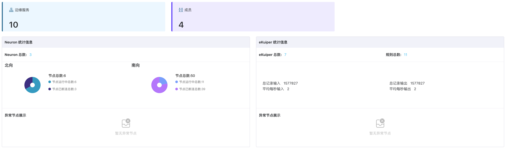

# 边缘服务监控统计

完成边缘服务的批量创建/导入后，您可在 ECP 边缘服务页查看项目级别的边缘服务统计信息。

## 基础统计信息

- 边缘服务：项目内全部、在线及离线的边缘服务数量。
- 驱动状态：项目内北向应用及南向设备的节点总数量、运行中节点数量及异常节点数量。
- 规则状态：项目内全部、运行中及停止的规则数量。
- 点位：项目内已分配给边缘服务的点位数量及边缘服务中实际已使用的点位数量。

## NeuronEX 统计信息

- 边缘服务总数：项目内所有 NeuronEX 实例数。
- 南向：南向设备统计信息
   - 节点总数：项目内所有 NeuronEX 实例的南向节点总和。
   - 节点运行中总数：项目内所有 NeuronEX 实例中正在运行的南向节点总和。
   - 节点已连接总数：项目内所有 NeuronEX 实例中已连接的南向节点总和。
   - 节点异常总数：项目内所有 NeuronEX 实例中异常的南向节点总和。
- 北向：北向设备统计信息
   - 节点总数：项目内所有 NeuronEX 实例的北向节点总和。
   - 节点运行中总数：项目内所有 NeuronEX 实例中正在运行的北向节点总和。
   - 节点已连接总数：项目内所有 NeuronEX 实例中已连接的北向节点总和。
   - 节点异常总数：项目内所有 NeuronEX 实例中异常的北向节点总和。
- 数据流入流出统计信息
  - 总记录输入：项目内所有 NeuronEX 实例中的总输入数据。
  - 总记录输出：项目内所有 NeuronEX 实例中的总流出数据。
  - 平均每秒输入：项目内所有 NeuronEX 实例中平均每秒的数据流入量。
  - 平均每秒输出：项目内所有 NeuronEX 实例中平均每秒的数据流出量。

## 驱动和规则列表

您还可在统计卡片下查看目前项目 ECP 管理的边缘服务中，非正常状态的驱动和规则的详细信息，如未运行驱动、异常驱动、未运行规则。在这些列表中，包括驱动或规则的名称、类型，所在边缘服务的服务名称、连接状态、EndPoint、版本信息。您可以通过边缘服务的名称对列表内容进行筛选。此外，您也可以通过点击操作栏中的“详情”按钮，对每个边缘服务实例执行运维操作。