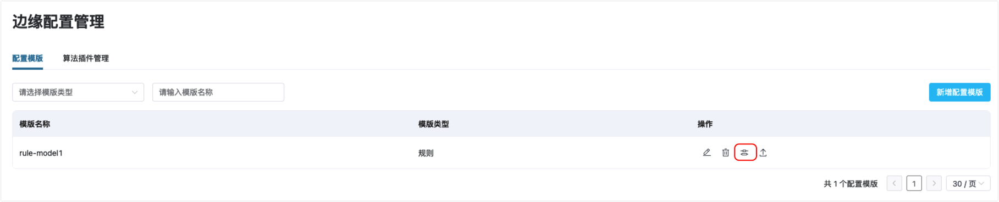

# 边缘服务配置管理和下发

针对工业场景大规模的设备接入需求，ECP 提供了边缘配置的管理和下发功能，支持将相同的配置信息下发给一个或多个边缘服务，通过该功能可以加快 IIOT 项目的快速部署实施及运维效率。   

配置的下发功能可以帮助管理员快速实现一致和可靠的配置策略，提高边缘计算环境的稳定性和可靠性，降低因配置错误或不一致导致的故障和损失。  

:::tip
关于批量配置下发功能的使用限制，见[系统使用限制](../others/known_limitations)和[版本兼容性限制](../others/version_limitations)。
:::

## 配置模版管理和下发

ECP 支持创建 NeuronEX 规则或南向驱动的模版，并使用模版将配置下发给其他边缘服务。

### 创建配置模版

以系统/组织/项目管理员的身份登录 ECP，在**边缘配置管理**页面的**配置模版**选项卡中，点击**新增配置模版**按钮。

模版类型支持规则模版和南向驱动模版。模版文件可以从 NeuronEX 的规则或南向驱动页面导出，进行进一步的修改后上传。请注意模版名称需唯一，不与已存在的其他模板重名。

创建模版后，可以对模版进行进一步的编辑，也可以导出模版内容或删除模版。

### 下发配置

在模版**操作**列点击**配置下发**按钮，打开配置下发窗口。

在弹出的窗口中，可以对模版内容做必要的编辑。这里的编辑只影响本次下发，不会保存的模版中。

点击**下一步**按钮，选择模版要下发到的目标边缘服务。您可以基于边缘服务名称、EndPoint、版本或标签快速定位服务实例，然后点击实例前的复选框快速选择。

点击**执行**按钮，ECP 将把模版下发到指定的目标边缘服务。配置下发结果对话框将实时展示下发的状态。您可在该页面等待片刻后，查看到下发的结果：

- 待配置的实例总数、成功数和失败数。`绿色圆圈`表示执行成功，`红色感叹号`表示执行失败
- 对于下发失败的情况，您可在**原因**列查看失败的原因

如果需要查看模版下发的历史结果，可以在**系统管理**界面的**操作审计**中查找。

## 算法插件管理和下发

ECP 支持下发插件和算法模型至边缘服务。

### 创建插件/算法模型

以系统/组织/项目管理员的身份登录 ECP，在**边缘配置管理**页面的**算法插件管理**选项卡中，点击**新增算法插件**按钮。

算法插件类型目前支持便携插件，请参考[便携插件开发](https://docs.emqx.com/zh/neuronex/latest/streaming-processing/extension.html#%E4%BE%BF%E6%90%BA%E6%8F%92%E4%BB%B6%E5%BC%80%E5%8F%91)了解如何开发便携插件。

上传的插件包需为zip压缩包，并且插件包中的 json 文件与输入的插件名称需保持一致，以确保后续下发的正常进行。内容相同的插件包不支持重复创建。

### 下发算法插件

在插件**操作**列点击**插件下发**按钮，打开插件下发窗口。

在弹出的窗口中，选择插件要下发到的目标边缘服务。您可以基于边缘服务名称、EndPoint、版本或标签快速定位服务实例，然后点击实例前的复选框快速选择。

点击**执行**按钮，ECP 将把插件下发到指定的目标边缘服务。插件下发结果对话框将实时展示下发的状态。您可在该页面等待片刻后，查看到下发的结果：

- 目标边缘服务的实例总数、成功数和失败数。`绿色圆圈`表示执行成功，`红色感叹号`表示执行失败
- 对于下发失败的情况，您可在**原因**列查看失败的原因

如果需要查看插件下发的历史结果，可以在**系统管理**界面的**操作审计**中查找。

