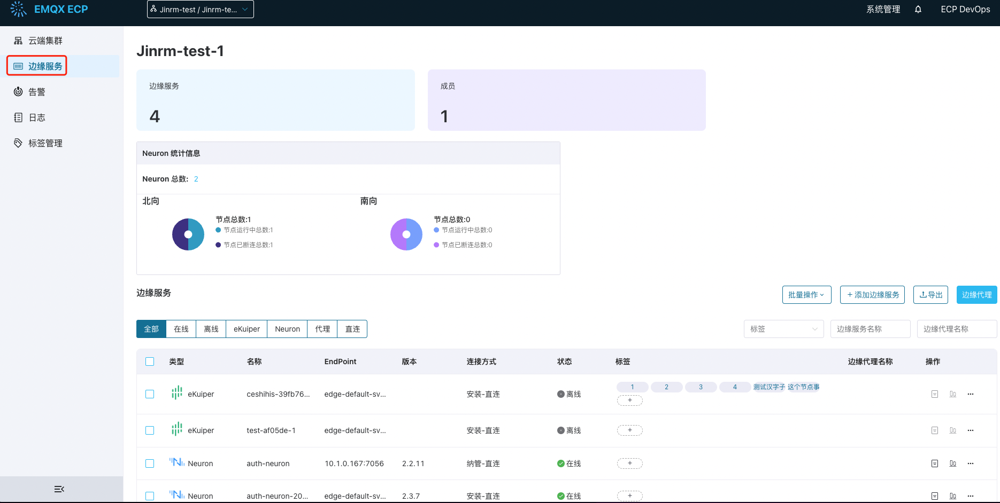

# 边缘服务管理

## 边缘服务
边缘服务 NeuronEX 可以实现对工业设备的数据采集接入、数据预处理、边缘计算等能力，在许多工业场景下，需要部署大量的边缘服务，实现数据的互联互通、全局优化以及敏捷生产。

边缘服务管理是 ECP 平台核心功能之一，ECP 支持在Kubernetes、docker等环境下批量创建并管理数百个边缘服务实例，完成实时数采、边缘计算任务，支持边缘服务配置管理及批量配置下发，加快 IIOT 项目的快速部署实施及项目落地。

## 访问边缘服务页面

用户登陆后，点击工具栏的**工作台**按钮进入**工作台**界面，点击左侧导航栏的**边缘服务**即可进入**边缘服务**页。

:::tip

系统管理员、组织管理员、项目管理员和该项目的普通用户均可访问此页面。

有关不同用户角色的权限说明，见[角色权限一览表](../acl/authorize.md#角色权限一览表)
::: 

 

## 托管与纳管边缘服务的功能差异

**托管边缘服务**：托管边缘服务是指由 ECP 平台创建部署的边缘服务 NeuronEX，称之为托管 NeuronEX 服务。

**纳管边缘服务**：纳管边缘服务是指由用户创建部署的边缘服务 NeuronEX，并在 ECP 平台添加纳入管理，称之为纳管边缘服务。

ECP 支持通过 [Docker](batch_install) 和 Kubernetes的方式，直接由 ECP 来部署边缘服务。托管与纳管的边缘服务在功能上存在差异，具体如下：

|功能类别| 功能名称 | 托管边缘服务 | 纳管边缘服务 |
| :--------------| :-------| :----| :----|
|边缘管理服务|边缘服务 NeuronEX 管理|✅|✅|
||边缘服务监控|✅|✅|
||边缘服务告警|✅|✅|
||边缘服务日志管理|✅|✅|
||边缘服务配置下发|✅|✅|
||标签分组|✅|✅|
||批量安装|✅|❌|
||批量升级|✅|❌|
||批量启停控制|✅|❌|

本章将主要介绍以下主题：

- [Docker方式批量安装边缘服务](batch_install)
- [ECP 边缘节点](docker_node)
- [导入现有边缘服务](batch_import)
- [项目级监控统计](edge_project_statistics)
- [边缘服务认证](e2c)
- [标签及分组](batch_tag)
- [升级边缘服务](batch_upgrade)
- [边缘配置管理和下发](edge_resource_management)
- [边缘服务管理运维](edge_ops)
