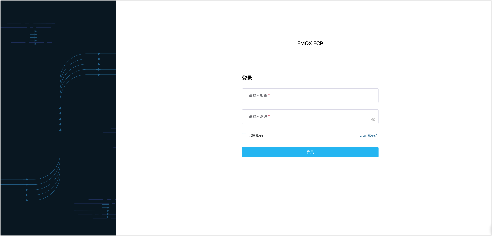

# 基于 Kubernetes 部署 ECP

在本文中，我们将指导您如何在 kubernetes 环境中完成 ECP 及其所需组件的安装与部署。

## 安装条件

部署 EMQX ECP 前，请确认您的环境满足以下要求：

| 软件                     | 版本要求      |
| :----------------------- | :------------ |
| Kubernetes               | 1.22.0 或以上 |
| [Helm](https://helm.sh/) | 3 或以上      |

| 端口               | 协议           |
| :----------------- | :------------ |
|  31900             | TCP+UDP       |

## 获取 Helm chart
通过Helm chart安装 EMQX ECP，您可以通过以下命令获取 EMQX ECP的 Helm chart：

```shell
helm repo add emqx https://repos.emqx.io/charts
helm repo update
helm pull emqx/kube-ecp-stack --untar
```
## 通过 Helm chart 安装、升级EMQX ECP

- 如果可以访问 Internet，请运行以下命令：
   ```shell
   cd kube-ecp-stack
   helm upgrade --install kube-ecp-stack . --namespace emqx-ecp --create-namespace
   ```
- 如果无法访问 Internet，需要将镜像先存储到私有镜像库，然后运行以下脚本命令：
   
   - 为从您的仓库拉取镜像创建密钥
   ```shell
   kubectl create ns ${YOUR_NAMESPACE}
   kubectl create -n ${YOUR_NAMESPACE} secret docker-registry ${YOUR_SECRET_NAME} --docker-username=${YOUR_USERNAME} --docker-password=${YOUR_PASSWORD} --docker-server=${$YOUR_REGISTRY}
   ```
   - 修改values.yaml文件中的密钥名称
   ```shell
   global:
      image:
         registry: "${YOUR_REGISTRY}"
         repository: "${YOUR_REPOSITORY}"
         pullSecrets: &global-image-pullSecrets
            - name: "${YOUR_SECRET_NAME}
   ```
   - 运行以下命令
   ```shell
   cd kube-ecp-stack
   chmod +x priv_deploy.sh
   kubectl apply -f crds
   helm template ${YOUR_RELEASE_NAME} . --namespace ${YOUR_NAMESPACE} | ./priv_deploy.sh
   ```

## 删除 EMQX ECP

- 如果您通过 `helm upgrade --install` 命令安装了 ECP，请运行以下命令删除 ECP：

   ```shell
   helm delete ${YOUR_RELEASE_NAME} --namespace ${YOUR_NAMESPACE}
   ```
- 如果您通过私有镜像库及运行脚本安装了 ECP，请运行以下命令删除 ECP：

   ```shell
   cd kube-ecp-stack
   helm template ${YOUR_RELEASE_NAME} . --namespace ${YOUR_NAMESPACE} | kubectl delete -f -
   ```
- 删除存储卷

   删除存储卷，会清除 ECP 中的所有数据，请谨慎操作。
   ```shell
   kubectl delete pvc -l "app.kubernetes.io/instance=${YOUR_RELEASE_NAME}" -n ${YOUR_NAMESPACE}
   ```


## 创建超级管理员

使用下列命令创建**超级管理员**账号，请妥善保存您的超级管理员账号和密码。

```bash
$ kubectl -n emqx-ecp exec $(kubectl -n emqx-ecp get pod -l 'app=emqx-ecp-main' -o jsonpath='{.items[0].metadata.name}') \
    -c emqx-ecp-main -it -- create-init-admin.sh
Please input username:          # 请设置您的用户名，需要为 email 格式
Please input password:          # 请设置您的账户密码
Please input password again:    # 请重复您的账户密码
Please input your name:         # 请为您的账户设置一个显示名称，比如 ECPAdmin
```

## 登陆 ECP

现在您已经成功部署 ECP，ECP 的默认访问地址为 `http://{kubernetes-node-ip}:31900`。请使用超级管理员账户登录 ECP 系统，开始初始化系统设置。



通过超级用户帐户登录后，您可开始[创建用户](../system_admin/user_management.md)，配置[访问控制规则](../acl/introduction.md)，并开始设置[组织和项目](../system_admin/introduction.md)。

## 如何快速推送镜像到您的私有仓库
- 获取 Helm chart
   ```shell
   helm repo add emqx https://repos.emqx.io/charts
   helm repo update
   helm pull emqx/kube-ecp-stack --untar
   ```
- 修改values.yaml文件中的镜像仓库地址
   ```shell
   global:
     image:
       registry: "${YOUR_REGISTRY}"
       repository: "${YOUR_REPOSITORY}"
   ```
- 运行以下`retag.sh`命令
   ```shell
   cd kube-ecp-stack
   chmod +x retag.sh
   echo "${YOUR_PASSWORD}" | docker login ${YOUR_REGISTRY} -u ${YOUR_USERNAME} --password-stdin
   ./retag.sh
   ```