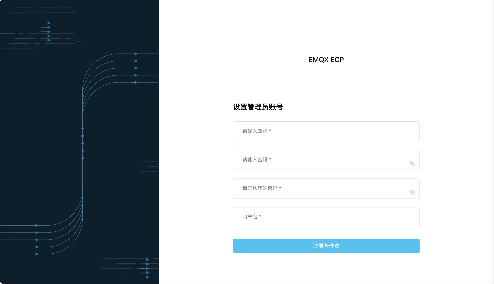

# 基于 Kubernetes 部署 ECP

在本文中，我们将指导您如何在 kubernetes 环境中完成 ECP 及其所需组件的安装与部署。

## 安装条件

部署 EMQX ECP 前，请确认您的环境满足以下要求：

| 软件                                   | 版本要求      |
| :------------------------------------- | :------------ |
| Kubernetes                             | 1.22.0 或以上 |
| kubectl                                | 1.22.0 或以上 |
| [Helm](https://helm.sh/)               | 3 或以上      |
| [yq](https://github.com/mikefarah/yq/) |               |

| 端口  | 协议    |
| :---- | :------ |
| 31900 | TCP+UDP |

## 获取 Helm chart

通过 Helm chart 安装 EMQX ECP，您可以通过以下命令获取 EMQX ECP 的 Helm chart：

```shell
helm repo add emqx https://repos.emqx.io/charts
helm repo update
helm pull emqx/kube-ecp-stack --untar
```

## 通过 Helm chart 安装、升级 EMQX ECP

- 如有必要， 可通过修改 `values.yaml` 来实现:

  - 比如指定使用特定的 `StorageClass`， 默认为 `standard`:

  ```shell
  global:
     image:
        registry: ""
        repository: ""
        pullPolicy: IfNotPresent
        ##
        ## Optionally specify an array of imagePullSecrets.
        ##
        # pullSecrets: &global-image-pullSecrets
        #   - name: "ecp-registry"
        pullSecrets: &global-image-pullSecrets []
     storage:
        className: &global-storage-className "standard"
        accessModes: &global-storage-accessModes
        - ReadWriteOnce
  ```

  - 比如当前环境有 `ElasticSearch` 服务， 可通过以下内容来修改连接信息:

  ```shell
  telegraf:
  replicas: 1
  image:
     repository: "docker.io/library/telegraf"
     tag: "1.27"
  imagePullSecrets: *global-image-pullSecrets
  service:
     type: NodePort
     port: 10514
     targetPort: 10514
     nodePort: 31514
  outputs:
     elasticsearch:
        url: "https://elasticsearch:9200"
        username: "elastic"
        password: "elastic"
  ```
:::tip 注意
由于国内可能无法访问 `hub.docker.com`, 可以将 `global.image.registry` 和 `global.image.repository` 修改为 `registry-intl.cn-shanghai.aliyuncs.com` 和 `bchub`, 然后使用后文提到的 **无法访问 Internet时** 的方式进行安装。
:::

- 如果可以访问 Internet，请运行以下命令：
  ```shell
  cd kube-ecp-stack
  helm upgrade --install kube-ecp-stack . --namespace emqx-ecp --create-namespace
  ```
- 如果无法访问 Internet，需要将镜像先存储到私有镜像库，然后运行以下脚本命令：
  - 为从您的仓库拉取镜像创建密钥
  ```shell
  kubectl create ns ${YOUR_NAMESPACE}
  kubectl create -n ${YOUR_NAMESPACE} secret docker-registry ${YOUR_SECRET_NAME} --docker-username=${YOUR_USERNAME} --docker-password=${YOUR_PASSWORD} --docker-server=${$YOUR_REGISTRY}
  ```
  - 修改 values.yaml 文件中的密钥名称
  ```shell
  global:
     image:
        registry: "${YOUR_REGISTRY}"
        repository: "${YOUR_REPOSITORY}"
        pullSecrets: &global-image-pullSecrets
           - name: "${YOUR_SECRET_NAME}
  ```
  - 运行以下命令
  ```shell
  cd kube-ecp-stack
  chmod +x priv_deploy.sh
  kubectl apply -f crds
  helm template ${YOUR_RELEASE_NAME} . --namespace ${YOUR_NAMESPACE} | ./priv_deploy.sh
  ```

## 删除 EMQX ECP

- 如果您通过 `helm upgrade --install` 命令安装了 ECP，请运行以下命令删除 ECP：

  ```shell
  helm delete ${YOUR_RELEASE_NAME} --namespace ${YOUR_NAMESPACE}
  ```

- 如果您通过私有镜像库及运行脚本安装了 ECP，请运行以下命令删除 ECP：

  ```shell
  cd kube-ecp-stack
  helm template ${YOUR_RELEASE_NAME} . --namespace ${YOUR_NAMESPACE} | kubectl delete -f -
  ```

- 删除存储卷

  删除存储卷，会清除 ECP 中的所有数据，请谨慎操作。

  ```shell
  kubectl delete pvc -l "app.kubernetes.io/instance=${YOUR_RELEASE_NAME}" -n ${YOUR_NAMESPACE}
  ```

## 创建超级管理员

使用下列命令创建**超级管理员**账号，请妥善保存您的超级管理员账号和密码。

```bash
$ kubectl -n emqx-ecp exec $(kubectl -n emqx-ecp get pod -l 'app=emqx-ecp-main' -o jsonpath='{.items[0].metadata.name}') \
    -c emqx-ecp-main -it -- create-init-admin.sh
Please input username:          # 请设置您的用户名，需要为 email 格式
Please input password:          # 请设置您的账户密码
Please input password again:    # 请重复您的账户密码
Please input your name:         # 请为您的账户设置一个显示名称，比如 ECPAdmin
```

> **注意**：
>
> 如果版本大于等于 2.3.0， 也可以通过 Web 首页注册超级管理员。



## 登陆 ECP

现在您已经成功部署 ECP，ECP 的默认访问地址为 `http://{kubernetes-node-ip}:31900`。请使用超级管理员账户登录 ECP 系统，开始初始化系统设置。


通过超级用户帐户登录后，您可开始[创建用户](../system_admin/user_management.md)，配置[访问控制规则](../acl/introduction.md)，并开始设置[组织和项目](../system_admin/introduction.md)。

## 如何快速推送镜像到您的私有仓库

- 获取 Helm chart
  ```shell
  helm repo add emqx https://repos.emqx.io/charts
  helm repo update
  helm pull emqx/kube-ecp-stack --untar
  ```
- 修改 values.yaml 文件中的镜像仓库地址
  ```shell
  global:
    image:
      registry: "${YOUR_REGISTRY}"
      repository: "${YOUR_REPOSITORY}"
  ```
- 运行以下`retag.sh`命令
  ```shell
  cd kube-ecp-stack
  chmod +x retag.sh
  echo "${YOUR_PASSWORD}" | docker login ${YOUR_REGISTRY} -u ${YOUR_USERNAME} --password-stdin
  ./retag.sh
  ```


## 离线安装

1. 下载 docker image 压缩包

2. 解压缩

   ```
   mkdir  image & tar -zxvf   emqx-ecp-dependency-images-2.4.1-alpha.4.tar.gz -C  ./image
   ```

3. 导入docker image

   在 Kubernetes 中，Docker 和 containerd 的区别主要在于它们作为容器运行时的实现方式不同：Docker 通过其自身的容器运行时来管理容器的生命周期，而 containerd 是一个更轻量级的容器运行时，直接与容器交互，通常提供更简洁的接口和更好的性能。这两种导入docker image的方式也有所不同。

   :::tip 注意
   您可以通过以下命令来判断 Kubernetes 集群中使用的是 Docker 还是 Containerd：

   ```bash
   kubectl get nodes -o jsonpath='{.items[*].status.nodeInfo.containerRuntimeVersion}'
   ```

   这条命令将返回每个节点使用的容器运行时版本信息。如果返回的信息包含“docker”，则为 Docker；如果为“containerd”，则为 Containerd。
   :::

   - **docker**

     ```
     cd image 
     for t in *.image; do docker load -i "$t"; done
     ```

   - **containerd**

     ```shell
     #!/bin/bash
     
     # 遍历当前文件夹下所有以 .image 结尾的文件
     for image_file in *.image; do
         # 获取不带 .image 扩展名的文件名
         base_name="${image_file%.image}"
         
         # 重命名文件，将 .image 扩展名改为 .tar.gz
         mv "$image_file" "${base_name}.tar.gz"
         
         # 解压缩 .tar.gz 文件
         gunzip "${base_name}.tar.gz"
         
         # 导入解压缩后的 .tar 文件到 containerd
         ctr -n k8s.io image import "${base_name}.tar"
         
         # 可选：删除解压缩后的 .tar 文件，以节省空间
         # rm "${base_name}.tar"
     done
     ```

     1. 将上述脚本保存为一个文件，例如 `import_images.sh`。

     2. 脚本执行：

        ```
        chmod +x import_images.sh
        ./import_images.sh
        ```

     3. 查看镜像是否导入成功 

        ```
        crictl images
        ```

4. 通过上面的方式安装启动ECP

   ```
   helm pull emqx/kube-ecp-stack --version ${version} --untar
   cd kube-ecp-stack
   helm upgrade --install ${YOUR_RELEASE_NAME} . --namespace ${YOUR_NAMESPACE} --create-namespace
   ```

   

