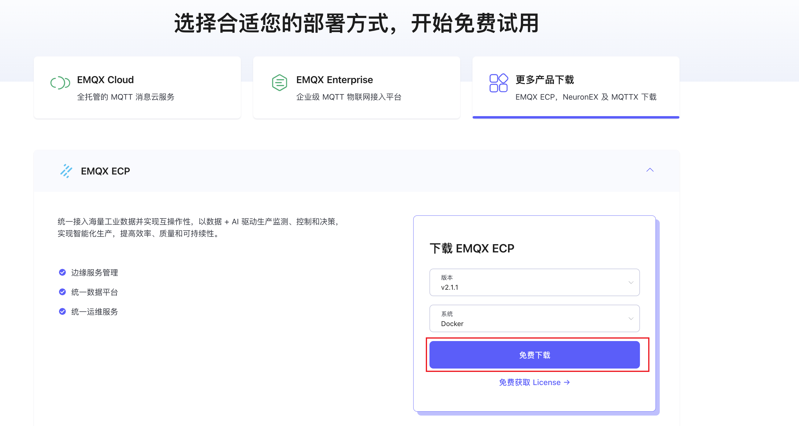
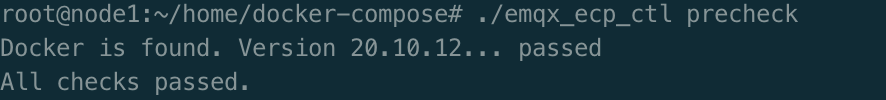
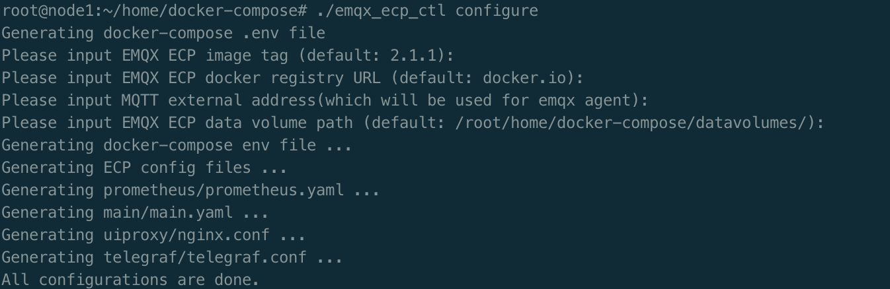
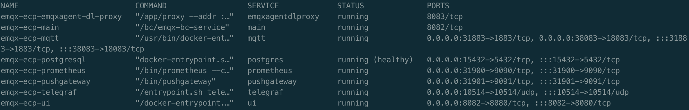

# 基于 Docker 的部署

在本文中，我们将指导您如何在 Docker 中完成 ECP 及其所需组件的安装部署。

## 安装条件

EMQX ECP 部署前，请确认您的环境满足以下要求：

| OS             | 版本要求       |
| :------------- | :------------- |
| Ubuntu         | 20.04 或 22.04 |
| CentOS         | 7.0 或以上     |
| Docker-Compose | 1.27.1 或以上  |
| Docker         | 20.10.0 或以上 |

| 端口 | 协议    |
| :--- | :------ |
| 8082 | TCP+UDP |

## 获取安装包

通过访问 EMQ 官网[ECP 产品下载](https://www.emqx.com/zh/try?product=emqx-ecp)页面，选择系统为`docker`，可直接下载 ECP 的安装包。



## 安装 ECP

将下载的安装包`emqx-ecp-docker-compose-installer-2.1.1.tar.gz`上传到服务器上，解压缩后，进入解压缩后的目录，执行以下步骤完成 ECP 的安装。

### 依赖检查

执行以下命令检查依赖组件及 docker 版本。

```shell
./emqx_ecp_ctl precheck
```

输出如下内容表示检查通过：



### 配置环境

执行以下命令，配置 ECP 安装环境。

```shell
./emqx_ecp_ctl configure
```

全部回车跳过表示，使用默认的 ECP 版本，通过公共 docker 镜像仓库获取镜像，持久化数据保存路径为`[当前脚本路径]/datavolumes/`。


### 启动服务

- 如有必要， 可以修改配置文件 `emqx_ecp.conf`。 - 如已有 `ElasticSearch` 服务， 可能修改如下配置：
  `shell

  # telegraf config

  TELEGRAF_EXTERNAL_PORT=10514
  EL_URL="https://elasticsearch:9200"
  EL_USERNAME="elastic"
  EL_PASSWORD="elastic"
  `
  :::tip 注意
  若没有正确配置 ElasticSearch 连接信息， 日志功能将不可用， 但不影响其它功能。
  :::

- 执行以下命令，启动 ECP 服务。
  `shell
./emqx_ecp_ctl start
`
  :::tip 注意
  在初次启动 ECP 服务时，需要从 ECP 镜像拉取软件镜像，可能需要等待一段时间。您也可以[联系我们](https://www.emqx.com/zh/contact?product=emqx-ecp)，获取离线安装包。
  :::

### 检查服务状态

```shell
./emqx_ecp_ctl status
```



### 停止 ECP 服务

```shell
./emqx_ecp_ctl stop
```

### 更多命令介绍

通过以下命令查看更多命令介绍。

```shell
./emqx_ecp_ctl help
```


## 创建超级管理员

使用下列命令创建**超级管理员**账号，请妥善保存您的超级管理员账号和密码。

```bash
$ ./emqx_ecp_ctl create-user
Please input username:          # 请设置您的用户名，需要为email格式
Please input password:          # 请设置您的账户密码
Please input password again:    # 请重复您的账户密码
Please input your name:         # 请为您的账户设置一个显示名称，比如 ECPAdmin
```

> **注意**：
>
> 如果版本大于等于 2.3.0， 也可以通过 Web 首页注册超级管理员。


## 登陆 ECP

现在您已经成功部署 ECP，ECP 的默认访问地址为 `http://{您的机器IP}:8082` 。请使用超级管理员账户登录 ECP 系统，开始初始化系统设置。


通过超级用户帐户登录后，您可开始[创建用户](../system_admin/user_management.md)，配置[访问控制规则](../acl/introduction.md)，并开始设置[组织和项目](../system_admin/introduction.md)。
