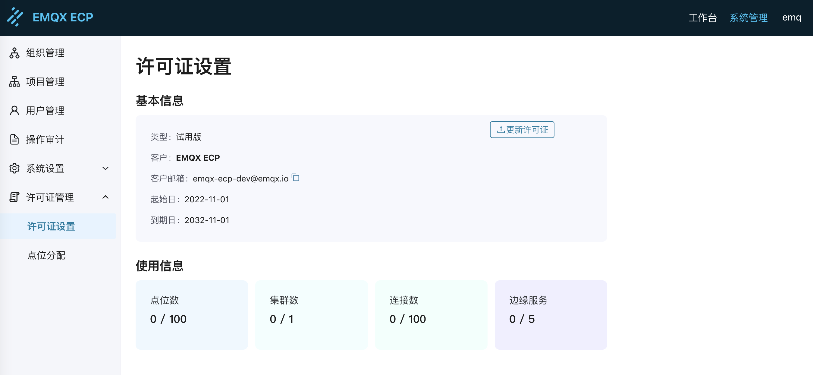
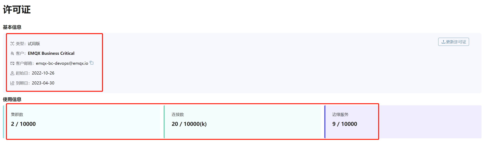
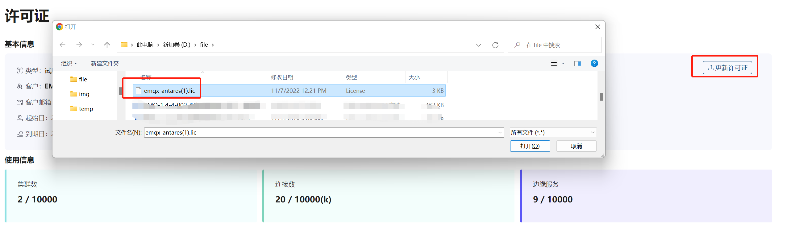
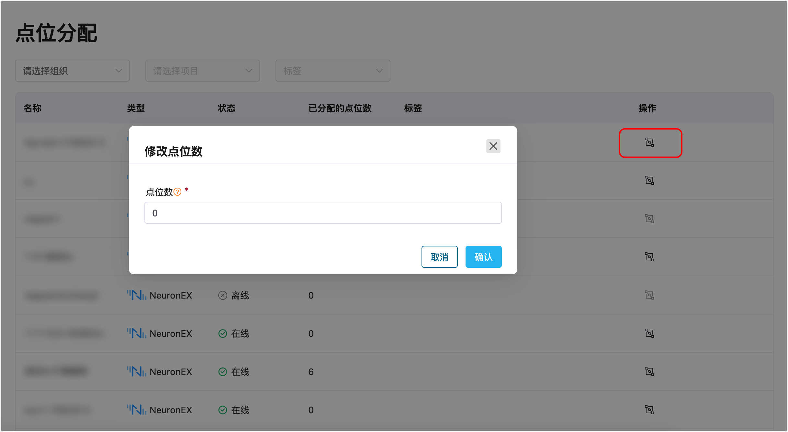

# 配置许可证

安装部署完成后，EMQX ECP 安装包自带试用 License，可直接使用 ECP 产品。下图为 ECP 自带的试用 License 信息。

## ECP 浮动许可证机制

ECP 采用浮动许可证机制，允许多个 NeuronEX 共享许可证点位数，统一分配。ECP 整体控制 NeuronEX 数据点位，可任意分配到各个 NeuronEX 实例，可对点位动态调整及灵活回收。这种授权方式可以帮助企业更有效地分配资源，为开发、测试、生产等不同阶段和环境提供合理的资源。

## 申请许可证

EMQX ECP 安装包自带的试用 License，点位数和边缘服务数均有限制，如需更大规格的 15 天试用 License，请点击[链接](https://www.emqx.com/zh/apply-licenses/emqx-ecp) 下载试用，我们会将您申请的试用 License直接发到您的邮箱。

如您希望长期使用 EMQX ECP 软件进行试用或者商用，您可通过官网[联系我们](https://www.emqx.com/zh/contact?product=emqx-ecp)页面，完成解决方案沟通和采购流程。

1. 进入[联系我们](https://www.emqx.com/zh/contact?product=emqx-ecp)页面。
2. 输入必要的联系信息，如姓名、公司、工作邮箱，国家和地区，以及您的联系方式。
3. 您可在下方的文本框中填写您的应用场景及需求，以便我们为您提供更好的服务。
4. 填写好以上信息后，点击**立即提交**，我们的销售将会尽快与您联系。

## 配置许可证

通过部署时创建的[超级管理员](install_ecp_on_kubernetes.md#创建超级管理员)登录。

ECP 分为**系统管理**和**工作台**两类界面：

- **系统管理**主要负责企业级管理、系统级设置等操作，配置许可证在**系统管理**界面的功能模块**许可证管理**中；
- **工作台**主要负责 EMQX 集群管理、边缘服务管理、监控告警、日志等服务管理和运维类的操作。

如希望配置许可证，在**系统管理**界面，点击左侧**许可证管理**菜单，进入**许可证设置**页面。

**许可证信息**

其中各字段的含义如下：

1. **类型**：试用版或正式版许可证
2. **客户**：客户名称
3. **客户邮箱**：客户邮箱
4. **起始日**：许可证生效日
5. **到期日**：许可证到期日
6. **点位数**：当前许可证支持的边缘服务点位数和已分配的点位数
7. **集群数**：当前许可证支持的集群数量和已创建的集群数
8. **连接数**：当前许可证支持的连接数量和已创建的连接数
9. **边缘服务数**：当前许可证支持的边缘服务数量和已创建/纳管的边缘服务数

## 更新许可证

如需更新许可证信息，只需上传新的许可证文件到 ECP 即可。系统将根据新上传的许可证内容，自动更新以下字段：

- 许可证有效期
- 点位数
- 连接数
- EMQX 集群数
- 边缘服务数

## 分配许可证点位

如需查看或设置各边缘服务的设备点位分配情况，在**系统管理**界面，点击左侧**许可证管理**菜单，进入**点位分配**页面。您可以查看指定组织、项目或标签的边缘服务的状态和点位分配情况，并通过**操作**列中的**修改点位数**选项对在线的边缘服务进行点位分配。

