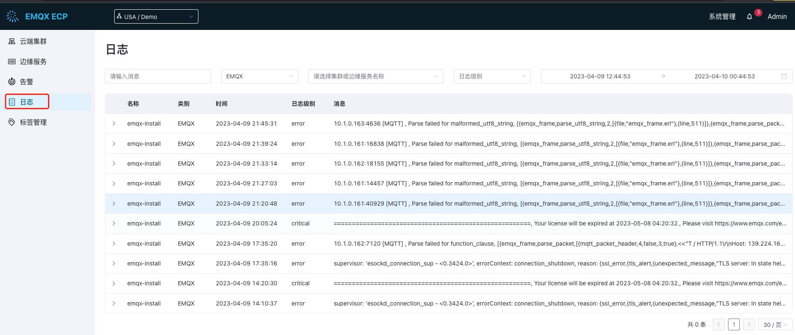
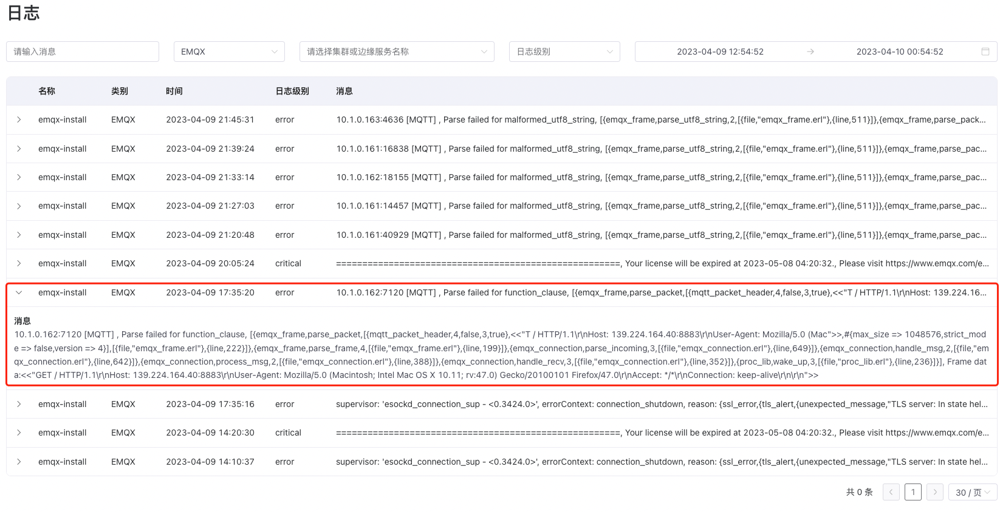
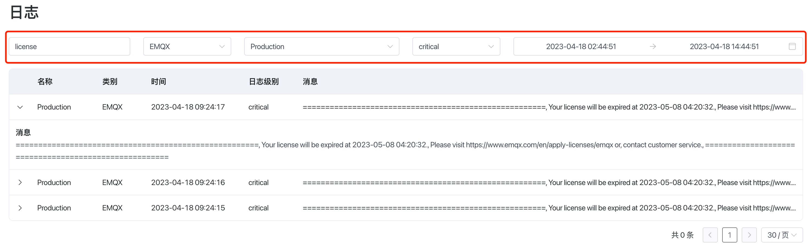

# 统一日志

ECP 的统一日志功能是通过对接第三方的 Elasticsearch 日志服务器，进行收集、聚合、存储及查询云端集群和边缘服务的的运行日志，为运维团队提供一个全局的操作记录和监测系统运行状态的依据。

ECP 的统一日志功能具有以下优势：

1. **实现日志归一化**：不同的云边产品产生的日志格式可能不同，通过统一的日志收集系统可以对所有的日志格式进行归一化处理，方便统一管理和查询。

2. **支持实时收集和存储**：统一日志功能可以像实时流数据一样收集、存储和查询日志，支持灵活的实时查询和分析。

3. **提供数据可视化和分析**：通过统一日志功能，管理员可以在一个平台上快速获取各个产品的实时日志，以数据可视化和分析的形式呈现。

ECP 日志服务默认不开启，启用步骤，见[启用日志服务](../monitor/introduction.md#启用日志服务)。启用后，您可在**工作台**界面查看项目级的日志信息，点击左侧**日志**菜单即可进入日志服务列表，您可在此查看 EMQX、NeuronEX 和 ECP 的日志。




## 日志级别

ECP 统一日志遵循 [RFC 5424](https://www.ietf.org/rfc/rfc5424.txt) 分为8个等级，由低到高分别为：

```
debug < info < notice < warning < error < critical < alert < emergency
```

ECP、EMQX 集群、Neuron 和 eKuiper 支持的日志级别如下：

|产品名称|日志级别|
|:-------|:-----------------------------|
|ECP|debug, info, warning, error, alert, emergency|
|EMQX|debug, info, notice, warning, error, critical, alert, emergency|
|NeuronEX|debug, info, notice, warning, error|


## 查看项目级日志

日志信息可帮助用户快速发现问题、排查错误、修复漏洞、提升系统质量。

在**工作台** -> **日志**页面，您可查看项目级的日志信息。日志列表默认展示 EMQX 集群的最近记录，每条记录包含服务名称、类别、时间、日志级别和简略的日志信息，点击日志记录后可查看日志详情。




## 搜索和过滤

通过 ECP 的日志搜索和过滤功能，用户可快速定位到目标日志。目前 ECP 支持通过消息内容、产品类型、集群或边缘服务名称、日志级别和日期范围进行搜索。

:::tip

当针对所有产品类型进行日志筛选时，ECP 将返回最近 100 条日志。

:::

例如，要定位 **生产** 集群中关于 **EMQX 许可证** 的一条 **Critical** 级别、且发生在 **2023-04-18** 日的一条日志：



## 查看实例级日志

ECP 还提供了实例级的日志查看能力。

- 对于 EMQX 集群，管理员可以导航到**工作台** -> **云端集群**，然后点击目标集群更多图标下的**日志**，即可查看该云端集群的运行日志。
- 对于边缘服务，管理员可以导航到**工作台** -> **边缘服务**，然后点击目标边缘服务更多图标下的**日志**，即可查看该边缘服务的运行日志。