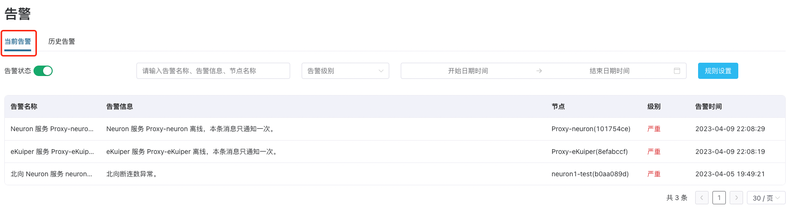
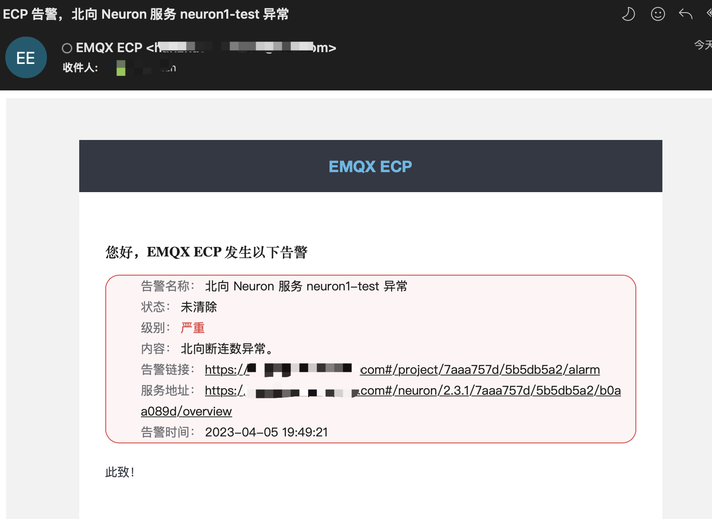

# 告警管理

ECP 统一告警通过设置告警相关规则实现对异常或故障的通知。支持对告警渠道的通知，包括邮件和 Webhook，和通知范围、通知沉默时效的设置，暂不支持对监控数据告警规则的设置。

以管理员或普通用户身份登录 ECP，您可以在顶部菜单的报警图标上查看未解决的报警数量。点击图标或左侧导航菜单上的报警，即可打开**告警**页面，您可在此查看告警名称、消息、关联节点、报警级别和报警生成时间等详细信息。

## 激活项目级告警

在告警页，您可通过滑动**告警状态**按钮确定是否激活项目级告警。

## 当前/历史告警

在**工作台**界面，点击左侧**告警**菜单或点击顶部**告警图标**即可进入当前告警列表，显示当前正在发生的未被处理的告警事件。

- 在**当前告警**选项卡，当前告警列表显示告警名称、告警信息、节点、级别和发生告警的时间。
- 在**历史告警**选项卡，显示历史发生过的已经被处理的告警事件，包括告警名称、告警信息、节点、级别和告警的开始和结束时间。

您同样可以通过 ECP 的过滤和筛选功能，从名称、告警消息、接点、级别和告警产生时间等方面快速定位某条告警。

## 设置告警的规则

以系统/组织/项目管理员的身份登录 ECP，在**工作台**页面，点击**告警** -> **规则设置**，即可进入告警的**规则设置**页。ECP 统一告警支持通过用户自定义告警通知方式，邮件和 Webhook，并支持定制通知范围、通知沉默时效等。

### 邮件通知

1. 设置**邮件通知开关**为启用状态；
2. 根据邮件格式输入收件人地址，可以输入多个收件人地址，目前最多支持 10 个收件人地址，最后点击**确认**完成设置。

3. 发生告警后，设置的邮箱地址会收到告警通知；

### Webhook 通知

1. 设置 **Webhook** 为启用状态；
2. 设置 Webhook 地址；输入完成后，可点击**测试**检查 URL 的连通性；
3. 设置 **HTTP Headers**，您可以在此处设置 URL 的校验信息；
4. 您可点击 **JSON 模版预览**查看 Webhook 告警样式，ECP 支持用户自定义告警样式，具体可参考[系统级告警设置](./introduction.md)
5. 点击**确认** 保存 Webhook 信息，启用 Webhook 通知；

7. 发生告警后，设置好 Webhook 的地址会收到告警通知；

### 告警范围和沉默时效

您还可继续设置告警通知范围和通知沉默时效：

- 通知范围：告警分为`严重`和`一般`两类。`严重`表示需要尽快处理的告警，`一般`表示不对生产环境产生过大影响。勾选（默认）后，将只通知严重类告警事件；如未勾选，将通知所有告警事件。

- 通知沉默时效：在沉默时效时间范围内，ECP 不会就同一个告警反复发送通知，超过沉默时效后，将会继续发送告警。

## 告警清除

当前告警被处理以后恢复正常状态，系统会触发告警恢复通知，并将其从当前告警转到历史告警。

此外，对于超过 24 小时的告警信息，将会自动从当前告警移除，转到历史告警。

## 告警风暴

告警风暴指在短时间内产生大量告警的现象，通常是由于宿主机、Kubernetes 平台或应用程序发生故障或意外情况引起的。

这些告警可能是重复的、不必要的、甚至会对整个系统的稳定性造成影响，ECP 会对告警内容进行收敛和聚合来减少不必要的告警通知，并会发送一封告警风暴的告警邮件，同时也需要评估告警规则和阈值是否正确和合理。

请参考下面的表格，该表格概述了 ECP 将采用的策略来有效地处理各种类型的报警风暴。

| 告警风暴源                   | 防止策略                                                     |
| :--------------------------- | :----------------------------------------------------------- |
| 同一个实例发生相同告警       | 沉默时效控制告警风暴                                         |
| 同一个实例发生不同告警       | 沉默时效控制告警风暴                                         |
| 不同实例同时发生大量不同告警 | 1. 一分钟内，发出30条告警，即视为告警风暴 2. 告警风暴发生后，项目级告警开关自动关闭，同时发送告警风暴邮件 3. 告警列表、邮件通知、Webhook同时关闭 |
| 底层资源发生损坏             | 1. 一分钟内，发出30条告警，即视为告警风暴 2. 告警风暴发生后，项目级告警开关自动关闭，同时发送告警风暴邮件 3. 告警列表、邮件通知、Webhook同时关闭 |
| 告警风暴告警的清除           | 使用定时清除策略，超过24小时的告警信息，自动从当前告警移除，转到历史告警 |