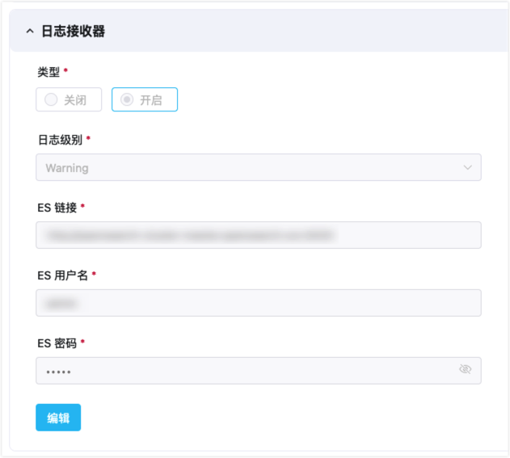
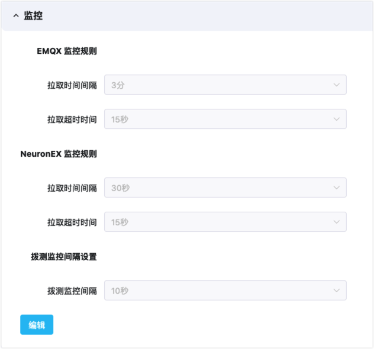

# 统一运维服务

ECP 平台为用户提供了管理和监控众多边缘服务及 EMQX 集群的的统一运维服务能力。通过收集和分析来自边缘服务和 EMQX 集群的监控数据，ECP 能够提供更全面、精细化的管理和监控体验。

ECP 还集成了[Prometheus](https://prometheus.io/docs/introduction/overview/)，用于收集和分析应用程序和服务的度量指标。这种方式实现了实时的数据采集和分析，从而实现更精确的资源管理和性能调优，以及故障预测。

## 日志服务依赖组件配置

ECP 通过配置外部 Elasticsearch 日志服务器获得日志数据，提供日志服务。其中，为了在 ECP 端集中展示边缘服务的日志，边缘服务通过 ECP 指定的 Telegraf 将日志统一接入 Elasticsearch。

系统安装时已包含 Telegraf，您需要自行安装 Elasticsearch。 安装完成后，请按以下步骤，在 Telegraf 的配置文件 telegraf.conf 中指定 Elasticsearch 输出插件的具体信息。其中：

- `urls`  `username`  `password` 分别为 Elasticsearch HTTP 服务器的 URL 地址、基本认证使用的用户名及密码，您可以根据实际情况设置。
- `index_name` 为日志在 Elasticsearch 中对应的索引名称，固定为 <code v-pre>{{appname}}</code>，请勿更改。
- 您也可以按需指定 `health_check_interval` 的周期，以对 Elasticsearch 做健康检查。

```
[[outputs.elasticsearch]]
  urls = [ "http://elasticsearch-server:9200" ]
  username = "elastic"
  password = "elastic"
  index_name = "{{appname}}"
  health_check_interval = "10s"
  insecure_skip_verify = true
```

## 系统级别设置

正式启用 ECP 的日志和监控功能之前，系统管理员需要进行相应的系统级别设置：


### 启用日志服务

如希望启用日志服务，在**系统管理**页面，点击**系统设置** -> **通用配置** -> **日志接收器**，并在类型中选择“开启”

您可在此对 Elasticsearch 进行设置，通过链接测试后，保存日志接收器信息，接通外部日志数据源。

- **日志级别**：表示从边缘服务收集严重程度不低于该级别的日志。
- **ES 链接**：Elasticsearch 服务器地址。
- **ES 用户名**：Elasticsearch 用户名。
- **ES 密码**：Elasticsearch 用户密码。




### 监控

ECP 的监控服务配置中，可以分别设置 EMQX、 NeuronEX 的拉取时间间隔和拉取超时时间规则。

- **EMQX 拉取时间间隔**：表示监控系统每隔 N 秒拉取一次 EMQX 监控指标数据。

- **EMQX 拉取超时时间**：表示如 EMQX 监控系统在 N 秒后未获得响应，则认为拉取失败。

- **NeuronEX 推送时间间隔**：表示 NeuronEX 每隔 N 秒向 ECP 推送一次边缘服务监控指标数据。

- **NeuronEX 探活间隔**：表示 NeuronEX 每隔 N 秒向 ECP 发送一次心跳包，以保持与 ECP 的连通性。

- **Pushgateway 服务地址**：NeuronEX 通过 Pushgateway 将监控数据推送到 Prometheus，由 ECP 进行收集分析。系统提供自动安装并配置 Pushgateway 服务地址的选项，您也可以自行安装，并对配置项进行修改。

  

  

### 告警

ECP 的告警服务，可以自定义 Webhook 通知的模版，当然，您也可以使用系统默认模版，ECP 支持自定义以下告警字段：

- ${name}（必填）：告警名称
- ${contents}（必填）：告警信息
- ${alerttime}（必填）：告警时间
- ${level}：告警级别，严重/一般
- ${link}：告警列表页链接地址
- ${address}：服务地址链接
- ${systemtime}：发送告警时的系统时间

## 章节概览

本章将主要讨论以下主题：

- [日志](../log/introduction.md)

  ECP 的统一日志功能主要负责收集、聚合、存储及查询云端集群和边缘服务的的运行日志，为运维团队提供一个全局的操作记录和监测系统运行状态的依据。

- [监控 EMQX 集群](https://docs.emqx.com/zh/enterprise/v4.4/getting-started/dashboard-ee.html#%E7%9B%91%E6%8E%A7)

  ECP 集成了 EMQX Dashboard 的访问入口，您可直接通过 EMQX Dashboard 监控 EMQX 集群的运行情况。

- [监控边缘服务](./monitor_edge.md)

  您可通过 ECP 查看实例级或项目级的边缘服务统计和监控信息。

- [告警](./alarm_rules)

  ECP 统一告警用于监控和管理云边产品，通过收集和分析各种系统和应用程序的数据，识别并通知用户系统或应用程序中的异常或故障，以便及时处理。

- [操作审计](../system_admin/operation_audit)

  ECP 的操作审计功能会记录下平台中所有用户的关键操作，并对其进行审计和监控。它可以帮助管理员详细了解用户对平台的操作，包括访问记录、操作记录和异常行为等，以及针对这些行为进行分析和监控，及时发现和处理安全问题。