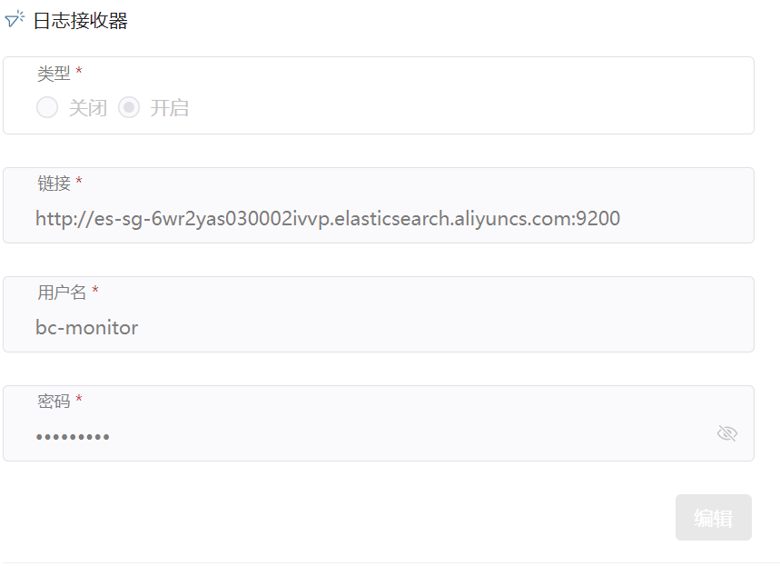
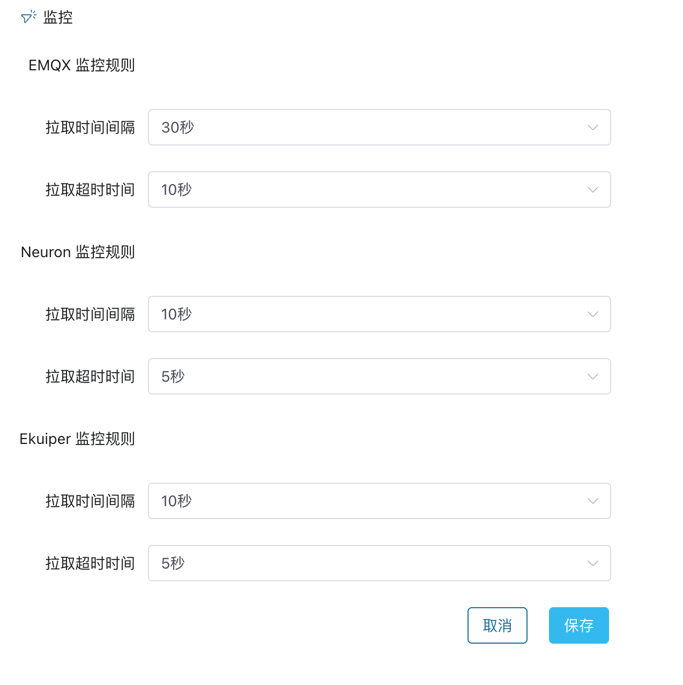

# 日志与可观测性

ECP 平台的日志和可观测性功能为用户提供了一种统一管理和监控云端 EMQX 集群及边缘端的技术方案。通过收集和分析来自云端 EMQX 集群和边缘端的监控数据，ECP 能够提供更全面、精细化的管理和监控体验。

ECP 平台的目标是在云端 EMQX 集群和边缘端提供统一的管理接口和监控体验，用户可以使用同一套工具管理和监控 EMQX 集群、边缘服务和网络连接等组件。

ECP还集成了[Prometheus](https://prometheus.io/docs/introduction/overview/)，用于收集和分析应用程序和服务的度量指标。这种方式实现了实时的数据采集和分析，从而实现更精确的资源管理和性能调优，以及故障预测。

## 系统级别设置

正式启用 ECP 的日志与可观测性功能之前，系统管理员可以进行一系列的系统级别设置：

### 启用日志服务

ECP 通过配置外部 Elasticsearch 日志服务器获得日志数据，提供日志服务。如希望启用日志服务，以系统管理员的身份登录，在**系统管理**页面，点击**系统设置** -> **通用配置** -> **日志接收器**。

您可在此配置 Elasticsearch 地址、用户名和密码，在链接测试通过后，可以保存日志接收器信息，接通外部日志数据源。

:::tip

配置好日志接收器后，不支持修改。

:::

### 监控

ECP 的监控服务，可以分别设置 EMQX、 Neuron、eKuiper 的拉取时间间隔和拉取超时时间规则。

- **拉取时间间隔**：表示监控系统每隔 N 秒拉取一次监控指标数据。

- **拉取超时时间**：表示如监控系统在 N 秒后未获得响应，则认为拉取失败。

  

  

### 告警

ECP 的告警服务，可以自定义 Webhook 通知的模版，当然，您也可以使用系统默认模版，ECP 支持自定义以下告警字段：

- ${name}（必填）：告警名称
- ${contents}（必填）：告警信息
- ${alerttime}（必填）：告警时间
- ${status}：告警状态，未清除/清除
- ${level}：告警级别，严重/一般
- ${link}：告警列表页链接地址
- ${address}：服务地址链接
- ${systemtime}：发送告警时的系统时间

## 章节概览

本章将主要讨论以下主题：

- [日志](../log/introduction.md)

  ECP 的统一日志功能主要负责收集、聚合、存储及查询云端集群和边缘服务的的运行日志，为运维团队提供一个全局的操作记录和监测系统运行状态的依据。

- [监控 EMQX 集群](https://docs.emqx.com/zh/enterprise/v4.4/getting-started/dashboard-ee.html#%E7%9B%91%E6%8E%A7)

  ECP 集成了 EMQX Dashboard 的访问入口，您可直接通过 EMQX Dashboard 监控 EMQX 集群的运行情况。

- [监控边缘服务](./monitor_edge.md)

  您可通过 ECP 查看实例级或项目级的边缘服务统计和监控信息。

- [告警](./alarm_rules)

  ECP 统一告警用于监控和管理云边产品，通过收集和分析各种系统和应用程序的数据，识别并通知用户系统或应用程序中的异常或故障，以便及时处理。
