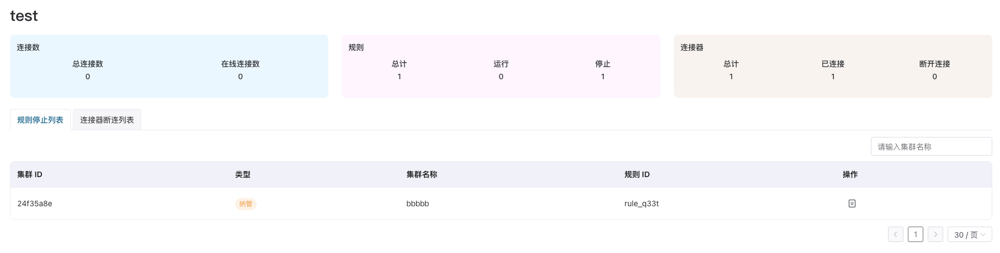

# EMQX 集群监控

ECP 在 **工作台** -> **监控运维** -> **监控** 页面提供了两种不同方式的监控，以展示当前项目下中 EMQX 纳管集群的运行状态和多维度指标。目前仅展示 EMQX v5 的监控数据。

## 数据集成监控

该页面包括项目中所有 v5 纳管集群的整体统计信息，以及数据集成中出现的异常信息。

### 基础统计信息

- 连接数：项目内所有纳管集群的总连接数量、在线连接数量。
- 规则：项目内所有纳管集群的规则总数、运行中规则数量及停止的规则数量。
- 连接器：项目内所有纳管集群的连接器总数、已连接的连接器数量及断开连接的连接器数量。

### 规则和连接器列表

您还可在统计卡片下查看目前项目 ECP 纳管的 EMQX 集群中，停止运行的规则和断开连接的连接器的详细信息。您可以通过集群的名称对列表内容进行筛选。此外，您也可以通过点击操作栏中的“详情”按钮，进入该集群的 Dashboard 进行查看和操作。

## EMQX 指标监控仪表盘

该页面提供基于 EMQX v5 指标的监控仪表盘。默认包含 EMQX 核心 30+ 监控指标，以折线图、统计图、表格、刻度盘等图表类型加以展示。同时也支持用户自定义仪表盘布局及内容。

### 查看仪表盘
- 从顶部操作栏左侧的下拉列表中选择要查看指标的`集群`，以及`采样间隔`。采样间隔决定了图表中数据点之间的间隔时间，您可以根据集群推送指标的周期（默认 10 秒）来确定合适的采样间隔时间。
- 从顶部操作栏右侧选择监控指标数据的`时间范围`，以及`仪表盘自动刷新时间`。

### 编辑仪表盘
- 点击顶部操作栏右侧的“进入编辑模式”。
- 在现有面板的“更多”操作菜单上选择“编辑”，可以对面板的详细配置进行修改，具体的配置请参考“添加与配置面板”部分。选择“复制”，将在仪表盘中复制相同的面板。选择“移除”，将从仪表盘中删除该面板。
- 拖拽面板右下角的控制点，可以调整面板的大小。拖动面板头部，可以调整面板的位置。仪表盘的网格系统用于辅助对齐，使布局更加整洁美观。
- 也可以通过点击顶部操作栏中的“添加面板”按钮，往仪表盘中新增面板以展示自定义的指标数据，具体的配置请参考“添加与配置面板”部分。
- 点击“保存仪表盘”，对仪表盘的修改（包括添加/移除面板、调整布局、更改面板配置）将会生效。

### 添加与配置面板

对话框上方为图表展示区域，下方布局如下：
#### 左侧 - 查询配置区：
- 查询标签页：允许为一个面板配置多个数据查询。可以通过点击 + 来增加新的查询。
- SQL 输入区: 为当前选中的标签页输入 datalayers SQL 查询语句。SQL 中可以使用以下内置变量：
  - `$timeFilter`: 用作表示时间范围。如：`WHERE $timeFilter(ts)` 表示名称为 ts 的列的取值需在仪表盘/面板指定的时间范围内。又如：`$timeFilter[0]` 表示取仪表秀/面板指定时间范围的开始时间，`$timeFilter[1]` 表示取仪表盘/面板指定时间范围的结束时间，`date_bin(interval 1 minute, ts, $timeFilter[0])` 将使用指定时间范围的开始时间戳来对齐时间窗口。
  - `$interval`: 用作表示采样间隔。如果指定的采样间隔为 15 秒，那么 `date_bin($interval, ts)` 实际与 `date_bin(interval 15 second, ts)` 表达式效果一致。
  - `$cluster`: 用作表示集群。
- 别名：为当前标签页的查询结果指定一个显示别名。这对于区分折线图面板中的不同线条，或表格中的不同列非常有用。但是请注意，如果折线图中同一个标签页的查询结果对应多条折线，每条折线根据查询内容会自动生成别名，指定别名反而容易混淆。

#### 右侧 - 面板选项：
- 加载内置默认指标：根据所选的图表类型，加载内置的指标面板，帮助用户快速构建自定义的面板内容。
- 面板标题：（必填项）为该面板指定一个有意义的名称。
- 图表类型：选择数据的展示方式，目前支持：
  - Line（折线图）：适用于展示时序数据的趋势。SQL 查询结果中必须包含一个时间戳列和一个数值列，其余列的值将被作为折线名称的一部分。
  - Stat（统计图）：以醒目的方式显示单个关键数值。如果开启了“显示变化趋势”滑动按钮，对应数据随时间变化的趋势也将同时展示。
  - Table（表格）：以表格形式展示详细数据。当面板中有多个查询标签页时，默认只显示第一个查询结果，如果开启了“合并表格”滑动按钮，多个查询标签页的结果将合并到同一个表格中显示。
  - Gauge（刻度盘）：以刻度盘形式直观展示关键数值与目标值的对比关系。“最小范围”和“最大范围”限制了刻度盘的目标取值范围。
- 单位：该信息会显示在图表上或作为数值的后缀。
- SQL 查询使用 $timeFilter 变量：如果开启，输入的 SQL 语句中必须包含 `$timeFilter`（例如 `WHERE $timeFilter` 或 `AND $timeFilter`），以实现基于仪表盘时间段的查询条件。

### 底部操作按钮:
取消：关闭面板配置对话框，不保存任何配置。
执行查询：根据对话框顶端指定的集群、采样间隔、时间范围，执行当前配置的 SQL 查询，并在对话框上方预览查询结果，帮助用户验证查询的正确性。
确认：保存面板配置。

### 导出仪表盘
- 在非编辑模式下，点击顶部操作栏右侧的“导出”按钮，将当前的仪表盘导出为 JSON 文件，以作为模板，方便今后恢复仪表盘为所需的内容及布局。

### 导入仪表盘
- 在非编辑模式下，点击顶部操作栏右侧的“导入”按钮，将选择的 JSON 模板文件导入，则当前的仪表盘将被覆盖为模板文件中的内容。

### 重置仪表盘
- 在非编辑模式下，点击顶部操作栏右侧的“重置”按钮，则当前的仪表盘将被重置为初始默认状态。