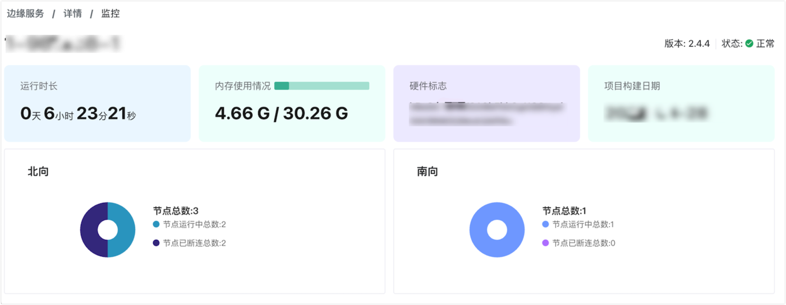
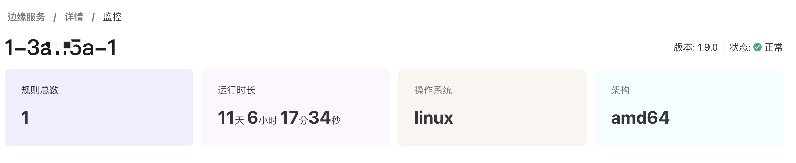

# 边缘服务监控

边缘服务监控分为项目级监控统计和实例级监控两类。

## 项目级监控统计

ECP 在 **工作台** -> **边缘服务**页面提供了边缘服务的运行状态概览。

- 对于 Neuron，您可以查看已部署的服务实例数量、北向应用、南向设备和断开连接的节点数量。

- 对于 eKuiper，您可以查看已部署的服务实例数量、总输入/输出记录数以及每秒输入/输出的数量。

有关字段的详细解释，请参见[边缘服务 - 项目级概览](../edge_service/edge_project_statistics.md)。

## 实例级 Neuron 监控

ECP 为每个 Neuron 实例提供了实时的监控服务。如希望查看实例级状态，点击目标节点**操作**列下的监控图标，随即将跳转到**详情** -> **监控**页面。

以下为该页面每个字段的解释：

- 版本号：Neuron 的当前版本号；
- 服务状态：正常/异常；
- 运行时长：该实例从启动到当前时点的运行时长统计；
- 内存使用情况；
- 硬件标志；
- 项目构建日期；
- 北向：北向统计信息
   - 节点总数：该实例的北向节点数量；
   - 节点运行中总数：该实例中正在运行的北向节点数量；
   - 节点已断连总数：该实例中已断连或离线的北向节点数量；
- 南向：南向统计信息
   - 节点总数：该实例的南向节点数量；
   - 节点运行中总数：该实例中正在运行的南向节点数量；
   - 节点已断连总数：该实例中已断连或离线的南向节点数量；

有关 Neuron 指标的详细信息，见 [Neuron - 统计信息](https://neugates.io/docs/zh/latest/http-api/metrics.html)

## 实例级 eKuiper 监控

ECP 为每个 eKuiper 实例提供实时监控服务。如希望查看实例级状态，点击目标节点**操作**列下的监控图标，随即将跳转到**详情** -> **监控**页面。

1. 版本：eKuiper 当前版本号；
2. 服务状态：正常/异常；
3. 规则总数：该实例的规则总数；
4. 运行时长：该实例从启动到当前时点的运行时长统计；
5. 操作系统：当前运行的操作系统；
6. 架构：硬件 CPU 架构；

有关 eKuiper 指标的详细信息，见 [eKuiper - 统计信息](https://ekuiper.org/docs/zh/latest/operation/usage/monitor_with_prometheus.html)