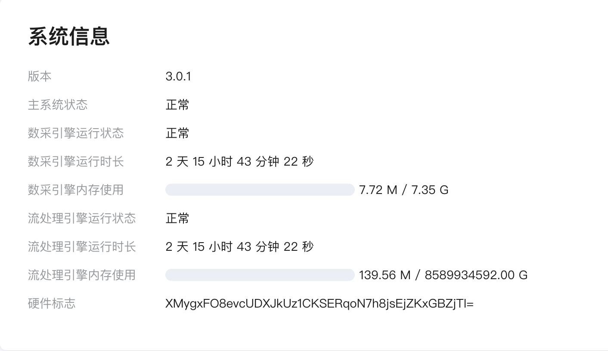

# 边缘服务监控

ECP 在 **工作台** -> **边缘服务**页面提供了边缘服务的运行状态概览。

- 对于 数据采集功能，您可以查看北向应用、南向设备和断开连接或异常的节点数量。

- 对于 数据处理功能，您可以查看总输入/输出记录数以及每秒输入/输出的数量。

有关字段的详细解释，请参见[边缘服务 - 项目级概览](../edge_service/edge_project_statistics.md)。

## NeuronEX 系统信息

ECP 为每个 NeuronEX 实例提供了实时的系统信息查询。

以下为该页面每个字段的解释：

- 版本号：NeuronEX 的当前版本号；
- 主系统状态：正常/异常；
- 数采引擎运行状态；
- 数采引擎运行时长；
- 数采引擎内存使用；
- 流处理引擎运行状态
- 流处理引擎运行时长；
- 流处理引擎内存使用；
- 硬件标志；
