# 链路追踪

[OpenTelemetry 追踪](https://opentelemetry.io/docs/concepts/signals/traces/)是一个用于追踪请求在分布式系统中的流动的规范，用于追踪请求在分布式系统中的流动情况。 ECP 集成 OpenTelemetry 追踪，可用于追踪 EMQX 集群以及 NeuronEX 的链路数据，并提供可视化分析请求的性能和行为的能力。

## 链路追踪配置

以管理员或普通用户身份登录 ECP，您可在**系统管理**->**系统配置**-> **通用配置**查看链路追踪配置，即 [OpenTelemetry Collector](https://opentelemetry.io/docs/collector/getting-started) 的地址，以及链路追踪数据保留天数。试用许可证仅保留 1 天链路数据，正式许可证可以按需调整数据保留天数。

链路追踪 HTTP 服务地址默认为 `[Root Address]:4318`。

链路追踪 gRPC 服务地址默认为 `[Root Address]:4317`。

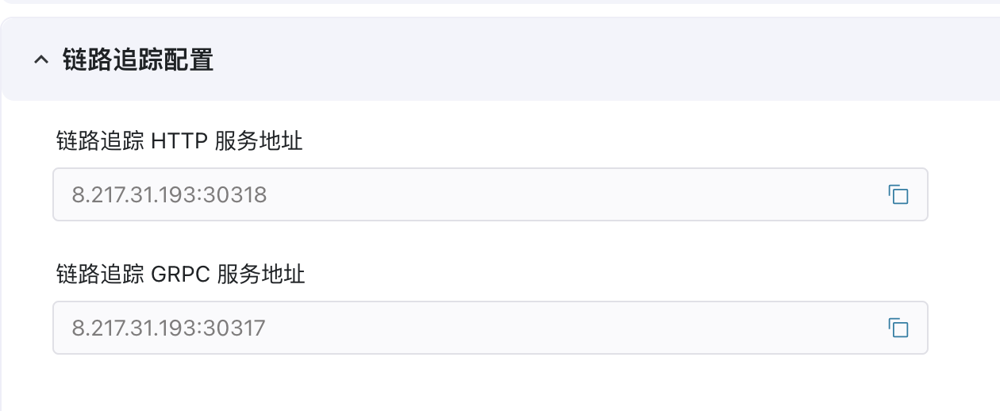

## 链路追踪功能

当链路数据上传到ECP后，在**工作台**界面，点击左侧 **监控运维->链路追踪** 菜单即可进入链路追踪列表。

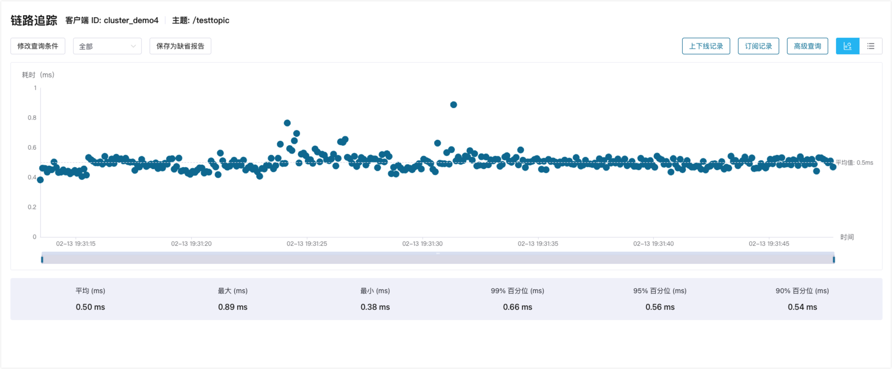

## EMQX 集群链路追踪

### EMQX 集群追踪数据配置

通过添加 EMQX 集群的追踪配置，将 EMQX 集群的链路追踪数据发送到 ECP 端后，方可[查询 EMQX 集群的链路数据](#查询-emqx-集群链路数据)。

通过登录 EMQX 集群的 Web 管理页面，进入 **管理**->**监控**->**监控集成** 页面，选择 **OpenTelemetry** 选项卡，勾选追踪功能，并配置 ECP 提供的 OpenTelemetry Collector 服务地址，即可将 EMQX 集群的链路追踪数据发送到 ECP 端。

- 服务地址：输入 ECP 提供的 OpenTelemetry Collector 服务地址。注意：EMQX 只支持 gRPC 服务地址 - `[Root Address]:4317`
- 追踪模式：选择“端到端”。
- 集群标识符：输入自定义的集群标识符名称，用于区分不同的 EMQX 集群，便于在 ECP 端查询时筛选。下图中为`emqx_test`。
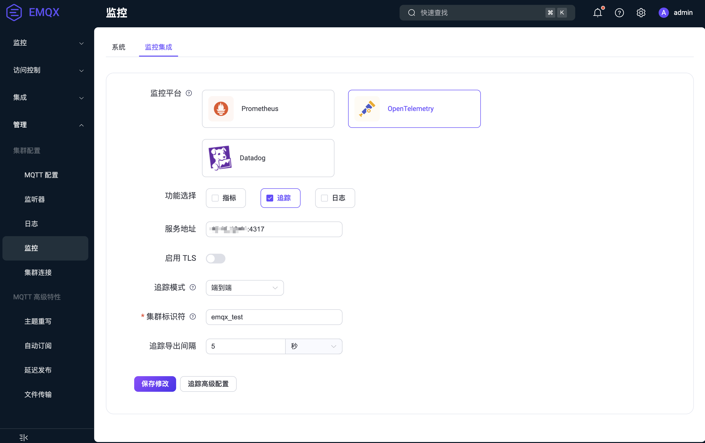

在追踪高级配置中，您可以配置 EMQX 开启追踪的消息类型，包括：

- 跟踪连接/断开连接
- 跟踪订阅/取消订阅
- 跟踪消息

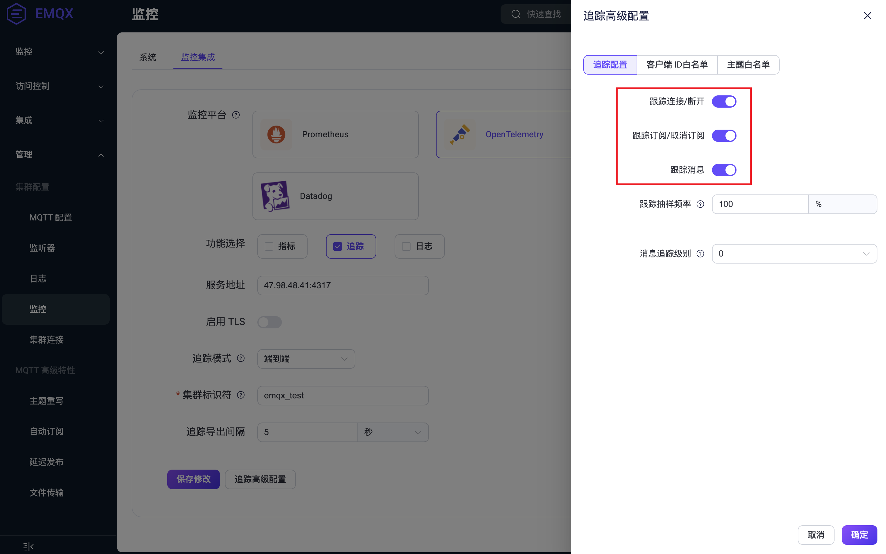

::: tip

EMQX 集群的链路追踪功能，需要 EMQX 版本为 5.8.3 及以上。

:::

### 查询 EMQX 集群链路数据

如果 EMQX 集群启用了端到端追踪，并配置了 ECP 提供的 OpenTelemetry Collector 服务地址，在 ECP 端可以查找指定客户端 ID 及主题的 MQTT 消息追踪链路数据，以及相应的上下线记录和订阅/取消订阅记录。配置方式详细参考[EMQX 集群追踪数据配置](#emqx-集群追踪数据配置)。

点击 **修改查询条件** 按钮，查询方式选择“以客户端 ID 查找”或“以主题查找”。并指定时间范围，输入或选择集群标识符，然后根据查询方式过滤并筛选到所需的客户端 ID 及主题名。

::: tip
首次添加 EMQX 集群追踪配置后，需要在 **修改查询条件** 页面，手动输入集群标识符（如前序步骤中的 `emqx_test`），否则无法查询到 EMQX 集群的链路数据。
:::

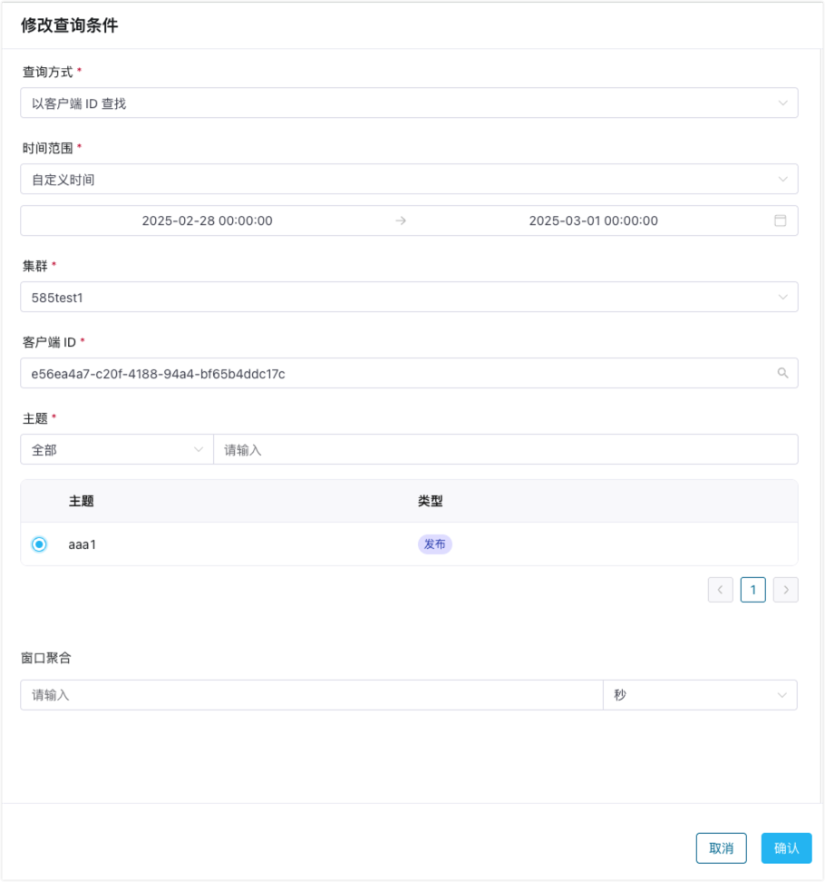

查询结果以图表进行可视化展示，您可以直观地查看到所有符合查询条件的消息追踪链路数据按时间分布的耗时气泡图，以及整体的耗时情况。同样地，您也可以切换为表格形式查看。

点击某条链路数据，可以查看链路详情，观察链路情况。如果某条链路中有异常发生，该链路将在图表中以红色高亮显示，方便您快速排查问题。

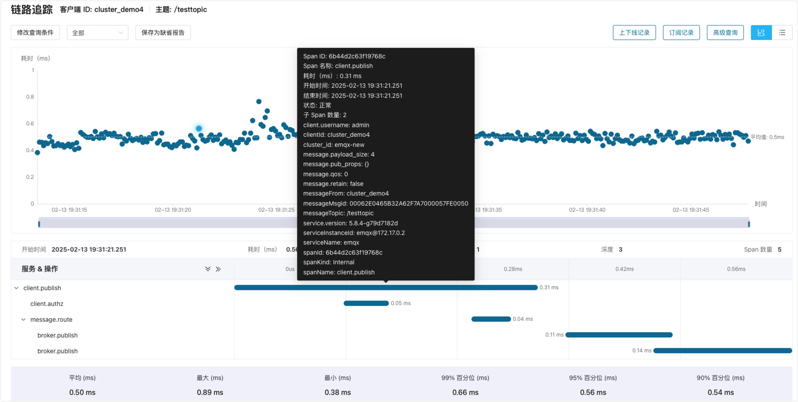

如果查询范围内的链路数据过多，无法在页面上同时展示，请先指定窗口聚合时间后查询，此时将展示按时间聚合的平均耗时趋势图，您可以在趋势图上进行更小范围的框选，以查看框选范围内实际的链路情况。

**上下线记录** 展示指定的客户端 ID 在相应时间范围内的连接和断开的链路数据，**订阅记录** 展示指定的客户端 ID 在相应时间范围内的订阅和取消订阅的链路数据，进一步帮助分析链路行为。

**高级查询** 提供了查询一个或多个客户端 ID 所有链路数据的能力，您可以在此针对客户端进行链路行为的分析。

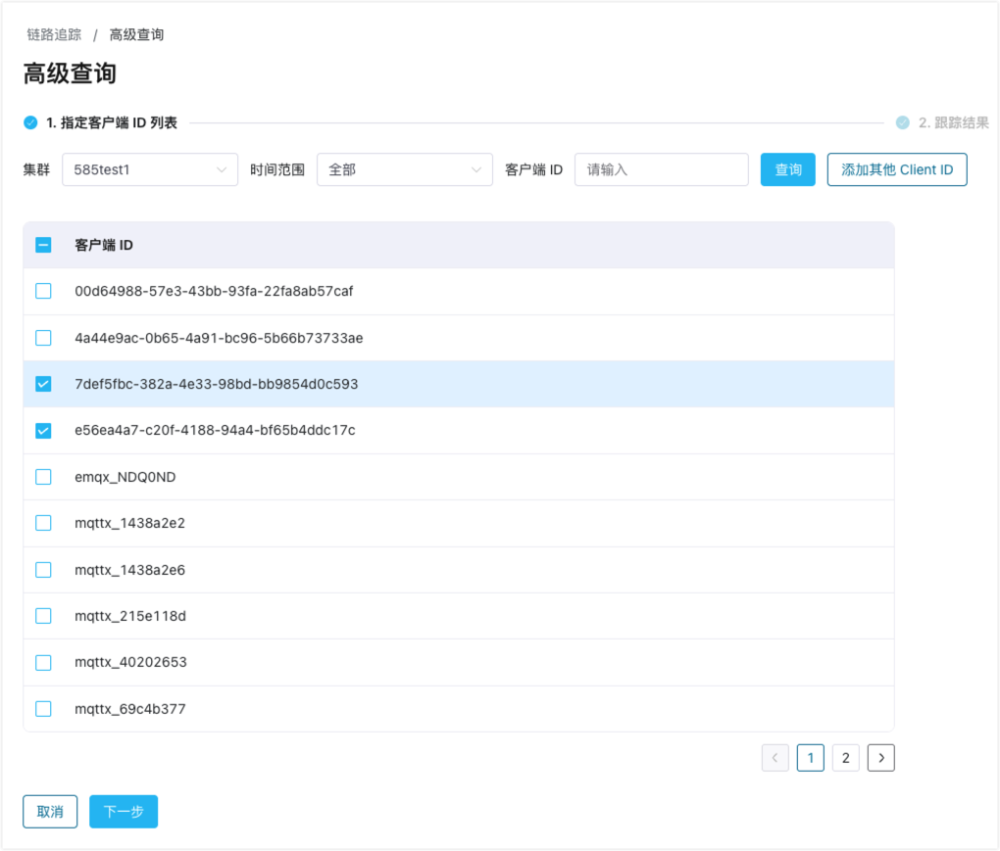

### 链路追踪结果 AI 分析

本章节介绍如何使用大模型 AI 分析链路追踪结果。

#### 1）配置 LLM 模型

在使用 AI 分析链路追踪功能之前，您需要先在**系统管理**->**系统设置**->**通用配置**页面下的**AI 助手配置**项，添加一个 LLM 模型配置信息，包括 LLM 模型的供应商、AI 模型、API API Base等信息。 目前 ECP 已支持以下厂商的模型：

- DeepSeek
- SiliconFlow
- OpenAI
- Azure OpenAI
- xAI
- Anthropic

您可通过以上模型厂商的官方网站获取 API Key，并在该页面添加模型配置并启用。

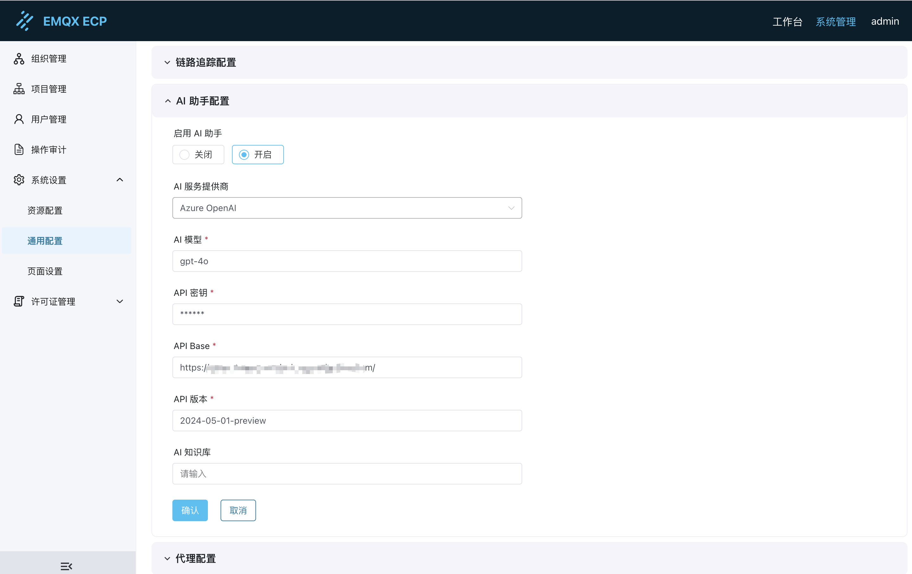

#### 2）查询追踪数据

在**链路追踪**->**高级查询**页面，通过选择对应的客户端 ID 和时间范围，可以查看该客户端的链路数据。

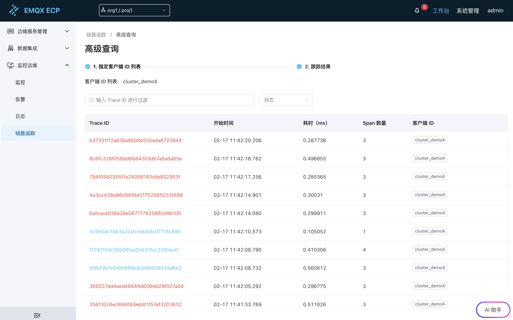

点击**AI 助手**按钮，会弹出 AI 助手对话框，您可以在此输入对追踪结果的分析需求，AI 助手将根据您的问题给出分析结果。

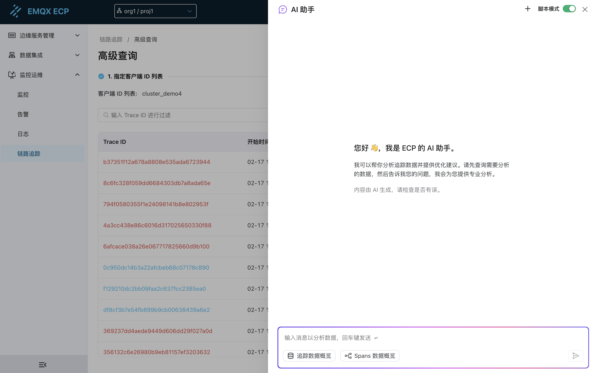

#### 3）追踪数据概览

点击AI 助手输入框的**追踪数据概览**按钮，AI 助手会根据当前查询到的所有追踪数据，给出整体概览分析。

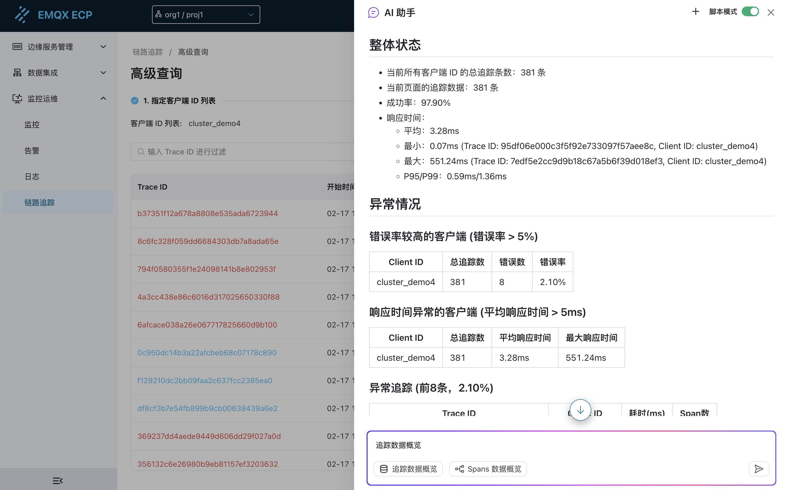

#### 4）Spans 数据概览

点击选中 Trace 列表中的某条 Trace 数据，然后点击 AI 助手输入框的**Spans 数据概览**按钮，AI 助手会根据该条 Trace 数据，给出 spans 数据概览。

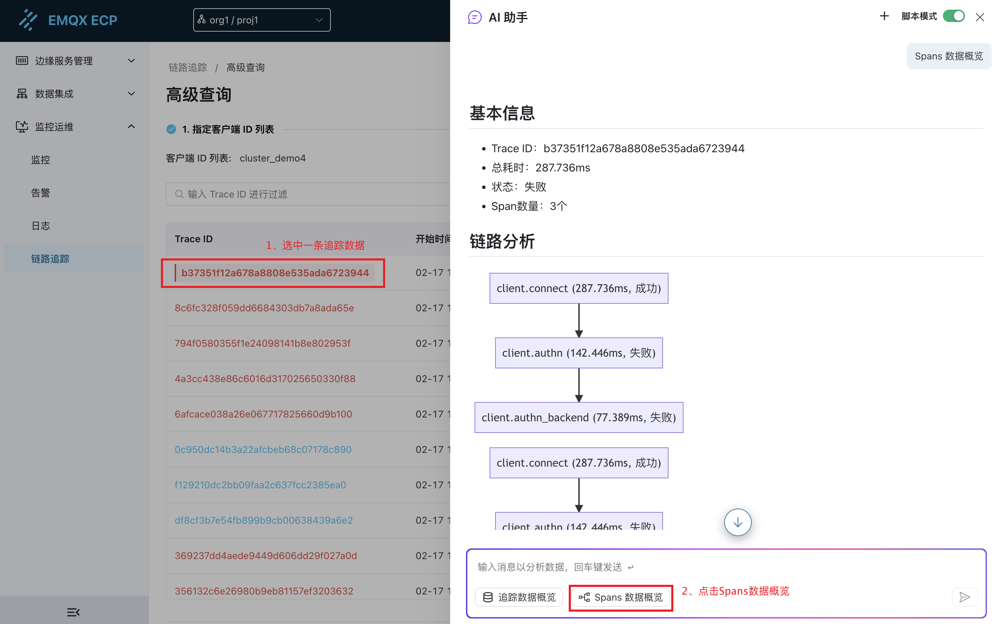

## 查询工业全链路数据

如果 NeuronEX 启用了链路追踪，并配置了 ECP 提供的 OpenTelemetry Collector 服务地址，在 ECP 端也可以查找到相应的链路数据。更进一步，如果该工业链路使用了 EMQX 集群，链路数据中将包含从 NeuronEX 到 EMQX 的全链路信息。

点击 **修改查询条件** 按钮，查询方式选择“工业全链路查找”，并指定时间范围，选择操作类型，并有选择地提供服务名称、Span 名称、属性，来定位所属的工业链路数据。

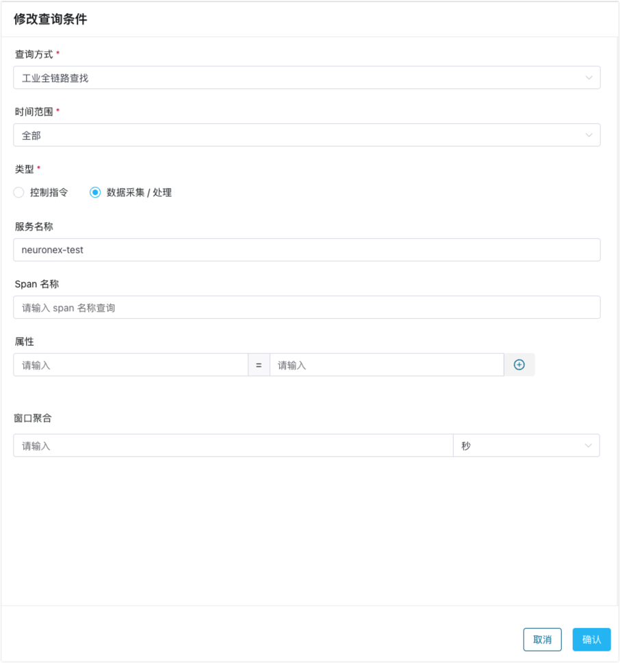