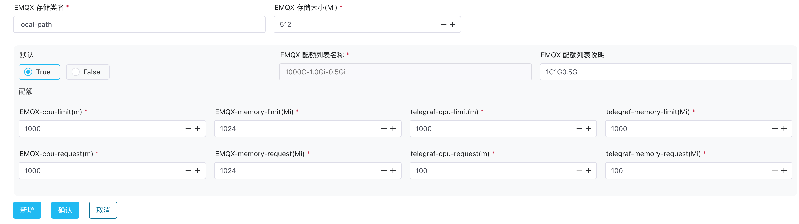
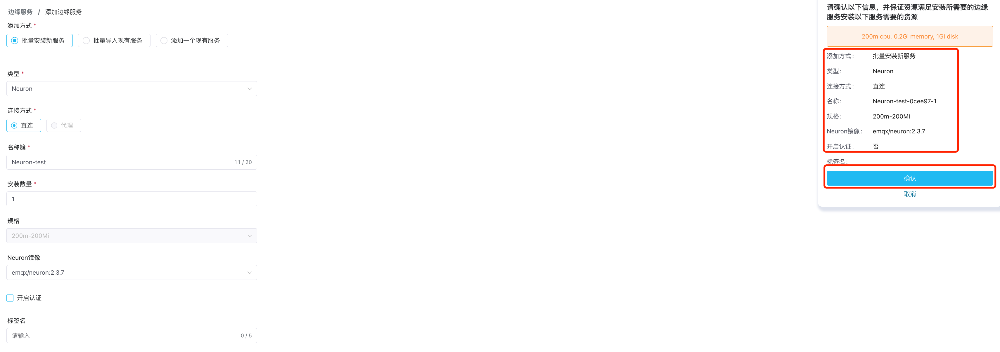

# 快速开始

ECP 提供了基于 Kubernetes 快速部署的方式，帮助用户快速搭建 ECP 云边一体化平台。在本章节中，用户可以通过简单的几步操作，快速体验 ECP 的功能和特性。


1. 首先，[安装 ECP](#安装-ecp)，请准备一个云原生的 Kubernetes 环境并[联系 EMQ](https://www.emqx.com/zh/contact) 获取 ECP 安装包。

2. 以超级用户的身份登陆 ECP，并[初始化环境配置](#初始化环境配置)。

3. 通过 ECP [一键部署 EMQX 集群和边缘服务 Neuron/eKuiper](#通过-ecp-创建服务)，体验平台的各种服务和功能。


## 安装 ECP

请参考[基于 Kubernetes 部署 ECP](../install/install_ecp_on_kubernetes)。


## 初始化环境配置

安装完成以后，还要经过以下步骤的初始化环境配置，才能通过 ECP 创建服务。

|     步骤     | 说明                                                        |
| :----------| :-------------------------------------------------------|
|[配置许可证](#配置许可证)|准备并安装 ECP 许可证授权。|
|[配置 Kubernetes 连接](#配置-kubernetes-连接)|配置 ECP 到 Kubernetes 的连接，从而让 ECP 管理、控制和认证 Kubernetes 资源。|
|[配置存储类](#配置存储类)|存储类是 Kubernetes 资源类型的一种，ECP 将 Kubernetes 的存储类用作集群和边缘服务的存储资源。|
|[EMQX 集群镜像及规格配置](#emqx-集群镜像配置)|配置 EMQX 集群版本，并配置 EMQX 集群在安装、升级时使用底层资源的规格。|
|[边缘服务镜像及规格配置](#边缘服务镜像配置)|配置边缘服务版本，并配置边缘服务在安装、升级时使用底层资源的规格。|


### 配置许可证
在使用 ECP 之前，您可先前往 [EMQ - 联系我们](https://www.emqx.com/zh/contact?product=emqx-ecp)页面申请一个免费许可证。已经有付费许可证的用户请忽略此步。

1. 安装完成 ECP 以后，使用安装时创建的[超级管理员](../install/install_ecp_on_kubernetes.md#创建超级管理员)登录，切换到**系统管理**界面，点击左侧菜单**许可证管理**。
2. 点击**更新许可证**，上传 ECP 许可证；
3. 此时，许可证管理页会显示许可证的集群使用数、连接数和边缘服务数的使用限制；


### 配置 Kubernetes 连接

1. 登录到 Kubernetes master 节点。

2. 在 Kubernetes 命令行工具中，通过以下命令查看 `kubeconfig` 的默认位置。下载 `kubeconfig` 文件到本地。

   ```
   ~/.kube/config
   ```

3. 在 ECP 的**系统管理**界面，点击左侧菜单**系统设置** -> **资源配置**，点击 **Kubernetes 连接设置**。
4. 上传 `kubeconfig` 文件并保存，此时，ECP 已经可以调用 Kubernetes API和资源了。


### 配置存储类

存储类是云端集群和边缘服务在配置资源规格时必不可少的一步，本节将以配置 EMQX 集群为例介绍存储类的配置方法。

1. 首先，通过命令行登录到 Kubernetes 环境；

2. 通过以下命令查看存储类列表，包含系统自带的存储类或自建的存储类；

   ```
   kubectl get sc
   
   NAME                    PROVISIONER                      RECLAIMPOLICY  VOLUMEBINDINGMODE     ALLOWVOLUMEEXPANSION        AGE
   alicloud-disk-ssd       diskplugin.csi.alibabacloud.com  Delete         Immediate             true                        170d
   alicloud-disk-topology  diskplugin.csi.alibabacloud.com  Delete         WaitForFirstConsumer  true                        170d
   local-path              rancher.io/local-path            Delete         WaitForFirstConsumer  false                       169d
   ```

3. 返回 ECP，选择一个存储类（**系统管理** -> **系统设置** -> **资源配置** -> **云端集群配置** -> **集群资源配额**）。注意：存储类的名称要和 Kubernetes 存储类列表的名称一致，设置存储大小和是否默认存储类；

   

   

4. **保存**设置，新建的存储类会立即生效；

### EMQX 集群镜像配置

本快速上手教程将以 EMQX 4.4.15（ `emqx/emqx-ee:4.4.15`） 为例演示如何通过 ECP 安装 EMQX 云端集群。在 ECP **系统管理**页，点击**系统设置** ->  **资源配置** -> **云端集群配置** -> **EMQX 容器镜像列表**。

在镜像文本框中，输入  `emqx/emqx-ee:4.4.15`，并设为默认镜像，随即点击**确认**完成设置。


### EMQX 集群规格配置

本篇将以配置 CPU 为 1 核，内存为 1 Gi，存储为 512 Mi 的规格为例，演示 EMQX 集群规格的配置，具体配置见下图。




有关每个配额配置项的详细解释，见[集群资源配额](../system_admin/resource_config.md#configure-emqx-cluster-quota)。

### 边缘服务镜像配置

本快速上手教程将以 eKuiper 1.9.0（ `lfedge/ekuiper:1.9.0-slim-python`）和 Neuron 2.3.7 （`emqx/neuron:2.3.7`） 为例演示如何通过 ECP 安装边缘服务。在 ECP **系统管理**页，点击**系统设置** ->  **资源配置** -> **边缘服务配置** -> **边缘服务容器镜像列表**。

- 在 eKuiper 下的镜像文本框中，输入 `lfedge/ekuiper:1.9.0-slim-python`，并设为默认镜像，随即点击**确认**完成设置。
- 在 Neuron 下的镜像文本框中，输入 `emqx/neuron:2.3.7` ，并设为默认镜像，随即点击**确认**完成设置。


### 边缘服务规格配置

本节将分别为 eKuiper 和 Neuron 进行如下规格配置：CPU 为 1 核，内存为 1 Gi，磁盘为 100 Mi，具体配置如下图所示


## 通过 ECP 创建服务
初始化 ECP 的运行环境之后，本教程将通过创建/管理 ECP 集群和边缘服务，带您体验 ECP 的各项功能。

|     步骤     | 说明                                                        |
| :----------| :-------------------------------------------------------|
|创建组织/项目|ECP 通过组织/项目管理功能实现了企业级多租户管理。通过 ECP 进行云边协同之前，您需要首先完成组织和项目的创建。|
|创建并管理 EMQX 集群|体验使用 ECP 创建、管理 EMQX 集群。|
|创建并管理边服务|体验使用 ECP 创建、管理边缘服务。|


### 创建组织/项目

ECP 是多租户多项目的管理方式，搭建 EMQX 集群、安装 Neuron 和 eKuiper 都需要建立在具体项目上，所以我们首先需要创建组织和项目。


1. 以系统管理员的身份登录 ECP，切换到**系统管理**界面。
2. 点击左侧菜单栏的**组织管理**。
3. 在组织管理列表页点击**新建组织**，在弹出的对话框中，进行如下设定：

   - **组织名称**填入 **EMQ**；
   - 在左侧的**组织成员**列选择组织成员，并设置为**组织管理员**；
   - 点击**确认**保存输入内容；

4. 组织列表内出现新建的组织 **EMQ**。


随即切换到**项目管理**页面，重复上述步骤创建项目 ECP。

完成组织和项目的创建后，即可开始通过 ECP 创建和管理云端 EMQX 集群和边缘服务。

### 创建并管理 EMQX 集群
切换到**工作台**界面，并切换到刚刚创建的组织 **EMQ** 和项目 **ECP** 中；ECP 将默认进入云端集群页面。


在**云端集群**页面，点击页面右上角的**添加集群**，并进行如下设置：

- 集群类型选择**新建集群**
- 输入一个集群名称，如 **emqx-test**
- 连接数使用默认的 **10**
- 规格选择默认的 **1C2G**
- 节点数选择 **1**
- 使用默认镜像
- 点击**确认**创建集群。

此时集群列表页将出现刚创建好的集群；等待大概1分钟完成集群初始化，当集群状态显示**运行中**时，表示集群已经创建完成。


完成集群创建后，您可以体验使用 ECP 快速管理、运维和控制 EMQX 集群，如集群启停、水平和垂直扩展、修改网络类型、修改连接数、一键升级、监控告警和日志等功能，也可以进入 EMQX 集群详情，进入 EMQX 控制台监控和修改 EMQX 的各项配置。 具体内容，见[云端集群管理](../cluster/introduction)。


### 创建并管理边缘服务

边缘服务 Neuron 和 eKuiper 的安装方式类似，这里将以安装 Neuron 为例进行说明。切换到**工作台**界面，并切换到刚刚创建的组织 **EMQ** 和项目 **ECP** 中；点击左侧的**边缘服务**进入边缘服务页。

在边缘服务管理列表页，点击**添加边缘服务**，在弹出的对话框中进行如下设置


- 添加方式选择**批量安装新服务**
- 类型选择 **Neuron**
- 连接方式选择**直连**
- 名称簇填写 **Neuron-test**
- 安装数量填写 **1**
- 规格使用默认
- 使用默认的 Neuron 镜像
- 不开启认证
- 在右侧确认设置的各项数据，点击**确认**进行安装



ECP 随即将弹出安装进程页，您可在此查看安装过程和结果。


完成边缘服务的安装后，您即可开始通过 ECP 管理和运维边缘服务，包括监控告警、日志等运维服务，批量安装和批量导入服务，使用标签系统进行业务分组，使用配置批量下发配置多个边缘服务实例。 边缘服务的详细功能请参考[边缘服务管理](../edge_service/introduction)。


