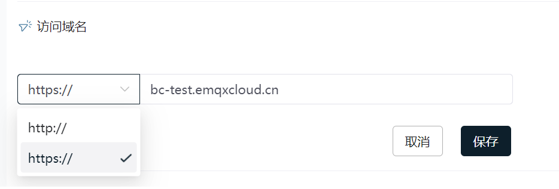
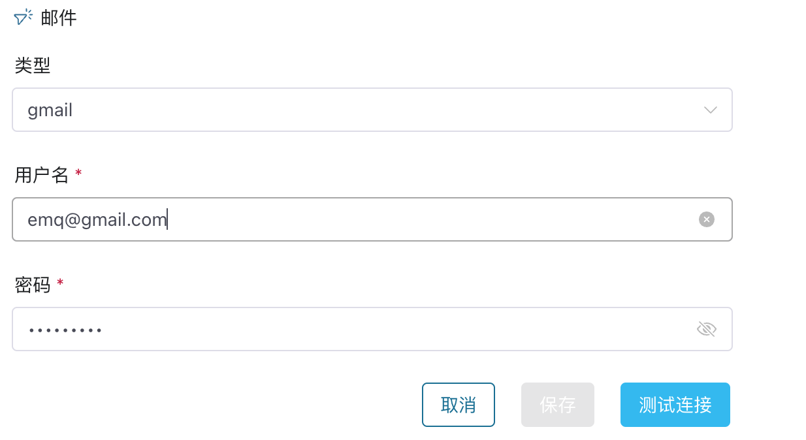
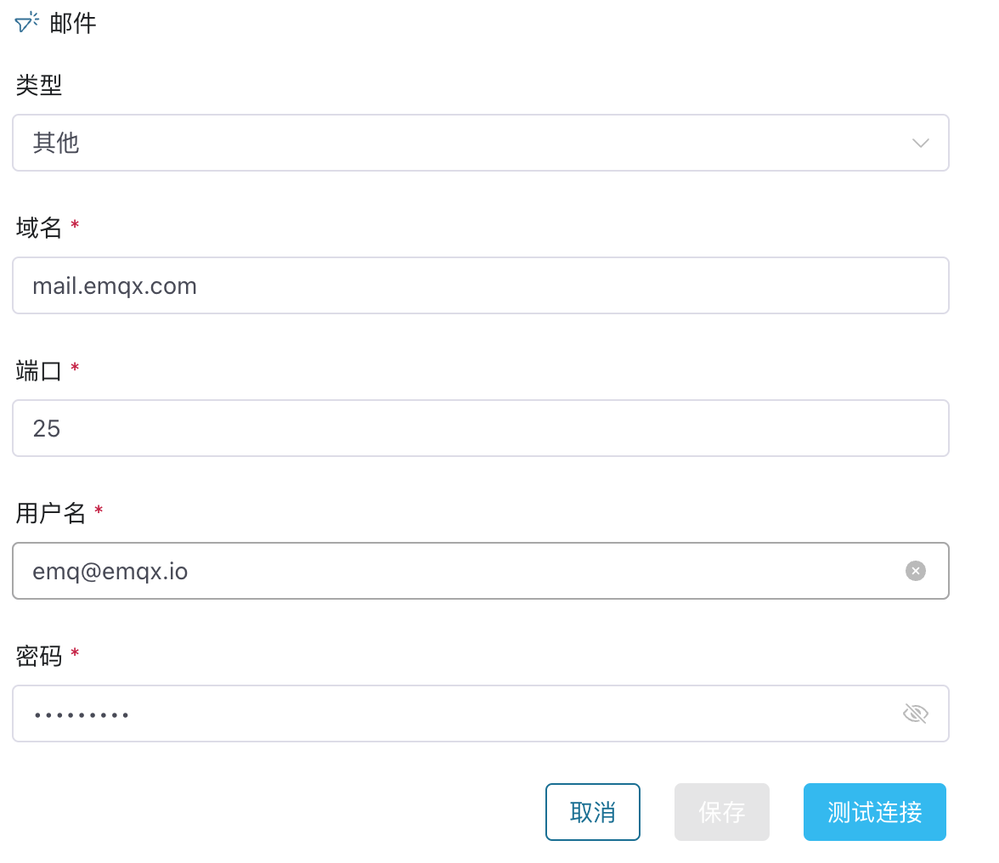

# 通用配置

通用配置设置一些通用的系统配置，如邮件服务器地址、访问域名、单点登录、用户邀请方式、日志接收器、Telegraf 镜像、系统级监控、系统级告警和系统语言等。

本页面将主要介绍邮件、访问域名、用户邀请方式、Telegraf 镜像和系统语言等的设置方式。

- 关于单点登录，可以阅读[ECP 登录认证 - 配置单点登录](../acl/ecp_login.md#对接第三方认证)。
- 关于日志、告警、监控等的设置，可以阅读[统一运维服务](../monitor/introduction.md)。

## 访问域名

配置可在外网或内网环境访问 ECP 的地址。边缘服务 NeuronEX 向 ECP 推送状态信息时会使用该地址,此外，ECP 在发送系统邮件、消息时，消息内容也会引用该链接地址。ECP 支持 HTTP 和 HTTPS 两种协议。

:::tip 注意
该配置项是必填项， 域名或 IP 地址皆可；例如， `http://192.168.1.100:8082`。
:::

## 邮件配置

ECP 支持通过外部邮件服务器发送系统邮件，用于实现添加用户后的邮件认证、重置密码、忘记密码和邮件告警等功能。当前我们支持QQ、网易163、Gmail、和自定义邮件服务器配置。

1. QQ、网易163、Gmail邮件服务器，需要配置正确的用户名和密码，即可使用。

   

   

2. 自定义邮件服务器，是为使用内网邮件服务器的用户提供的，类型选择**其他**后，需要配置邮件服务器的域名、端口号，并填入正确的用户名和密码。

   

   

## 用户邀请方式管理

系统管理员可以直接创建用户，或通过电子邮件邀请他们加入 ECP 平台。对于对用户名或密码要求较高的用户，可通过邮件邀请的方式为其新建 ECP 账户。ECP 管理员同样可以通过邮件邀请的方式实现批量用户添加。

通过邮件邀请用户之前，ECP 系统管理员需要首先将用户邀请方式设为邮件邀请。

### 设置用户邀请方式

1. 以系统管理员的身份登录 ECP。

2. 在左侧导航栏，点击**系统设置** -> **通用配置**。

3. 展开**用户邀请方式管理**，点击**编辑**。

4. 将**验证方式**设为**邮件**。

5. 设置**邀请邮件有效期**和**密码重置有效期**，也可保留默认值。

6. 点击**确认**完成设置。

   

   

## SYSLOG 推送

可以通过该功能将 ECP 的日志跟审计信息推送到指定的 Syslog 服务器， 用于对接第三方的日志系统。

## 监控

可以通过监控配置页来设置 EMQX 的监控规则、NeuronEX 的监控规则、NeuronEX 的探活间隔设置、监控指标收集等配置项。

其中监控指标收集需要指定一个 Prometheus 服务的地址，跟访问用户名、密码， 和一个 PushGateway 的服务地址。

## Floating License 配置

可以通过该功能将  NeuronEX 的离线活跃时间进行配置。NeuronEX 的离线活跃时间指脱离 ECP 管理后，可以正常运行的时间。如设置为 14 天，则在脱离 ECP 管理后，NeuronEX 会在 14 天内正常运行，超过 14 天后，NeuronEX 运行功能会受限。

## 系统语言

初始化安装后，系统默认语言为 **English**，可以在这里设置系统语言，支持 **English** 和**中文**。

