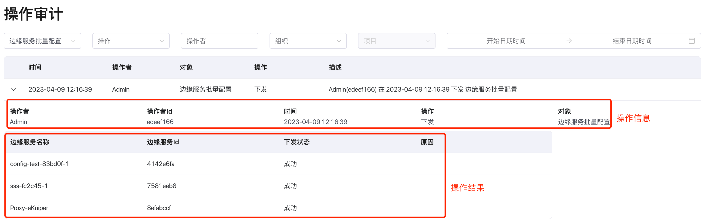
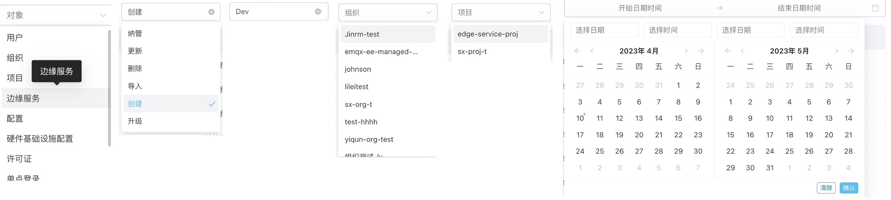

# 操作审计

## 简介

ECP 的操作审计功能会记录下平台中所有用户的关键操作，并对其进行审计和监控。它可以帮助管理员详细了解用户对平台的操作，包括访问记录、操作记录和异常行为等，以及针对这些行为进行分析和监控，及时发现和处理安全问题。

### 操作审计列表

筛选操作后，可以看到想要得到的操作审计记录，点击具体的**操作记录**，会弹出详细操作审计信息。操作审计记录可分为两个部分，操作信息和操作结果记录。

1. **操作信息**：所有操作审计都有的共通部分，记录时间、操作者、对象和操作动作

2. **操作结果**：不同对象的操作，操作结果记录各不相同，根据对象和操作记录执行结果

### 搜索和过滤

通过搜索和过滤筛选操作审计记录，方便审计人员快速获取有效信息。

1. 通过**对象**筛选，选择具体操作**对象**，筛选操作审计记录；

2. 选择**对象**后，再通过对象的具体**操作**筛选审计记录；

3. 输入**操作者**名称，模糊匹配近似的操作者记录；

4. 可以通过选择一个具体**组织**进行过滤；

5. 选择**组织**后，可以继续选择该组织下的一个**项目**继续缩小审计记录范围；

6. 通过选择**时间范围**，框定需要查找的审计记录发生的时间段。

