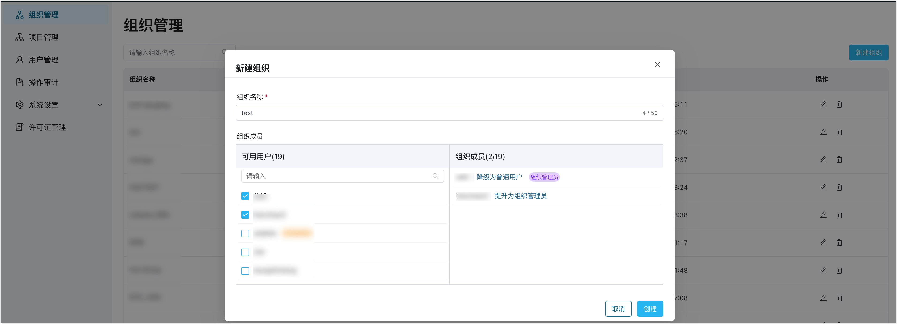
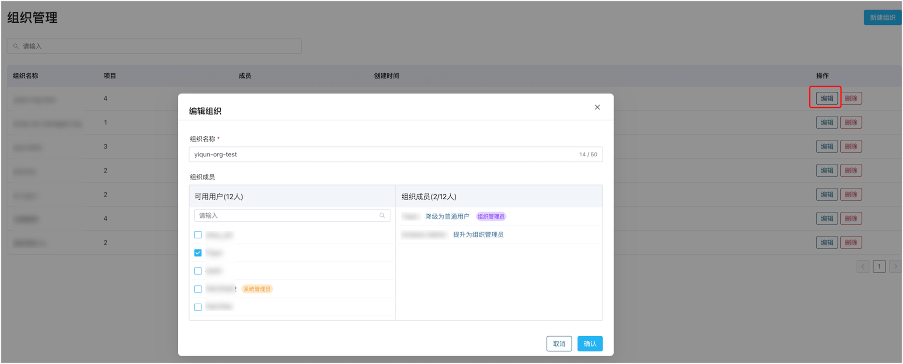

# 组织管理

ECP 通过组织管理功能实现了企业级的多租户管理。在 ECP，管理员可对组织结构进行管理和授权，为每个组织分配独立的资源和服务，从而实现企业不同部门间或不同企业间的业务和数据的隔离。

在 ECP 中，系统/组织管理员可以创建、修改、删除组织和组织下的资源和服务，并控制其访问范围。  

## 新建组织及成员

1. 以系统管理员的身份登录 ECP。

2. 在**系统管理**页面的左侧导航栏，点击**组织管理**。

3. 点击**新建组织**，在弹出的新建组织页进行如下设定：

   - 按组织命名规则填入组织名称；1-50 个字符，并支持"-"、"_" 和空格。
   - 在左侧**可用用户**，勾选待添加的组织成员，勾选后，该成员将出现在右侧的**组织成员**中。
   - 在右侧的**组织成员**列表中，设置用户角色，如**提升为组织管理员**或**降级为普通用户**。
   - 最后，点击**创建**按钮，保存新建组织的内容。

   

完成组织的创建后，新建组织就会出现在**组织管理**页面，您可在此查看组织名称、项目数、用户数和创建时间，并可以通过组织名称进行模糊搜索。

## 编辑组织及成员

组织创建完成后，系统/组织管理员可以通过**操作**栏下的编辑按钮，对组织名称、组织成员进行编辑操作。

如希望移除组织成员，只需在**可用用户**栏取消勾选对应账户，该成员将自动从**组织成员**列表中清除。

## 删除组织

组织创建完成后，系统/组织管理员可以通过**操作**栏下的删除按钮删除组织，在弹出的对话框中确认删除操作，即可删除对应组织。注意：组织删除后不可恢复。

:::tip
删除组织前，需首先移除组织下的项目。
:::
