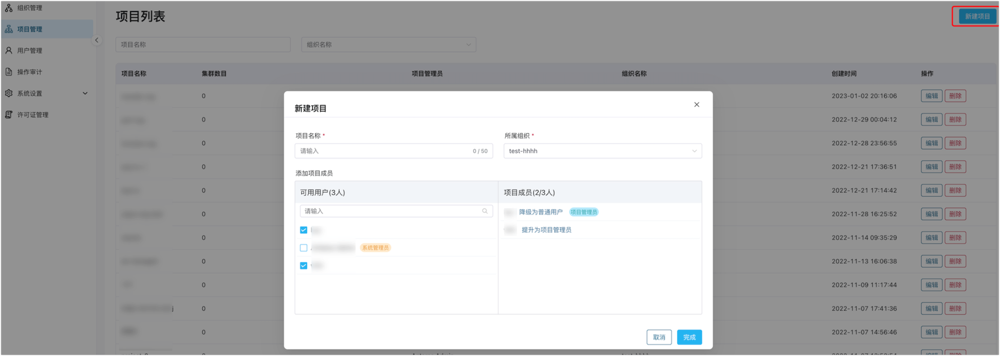
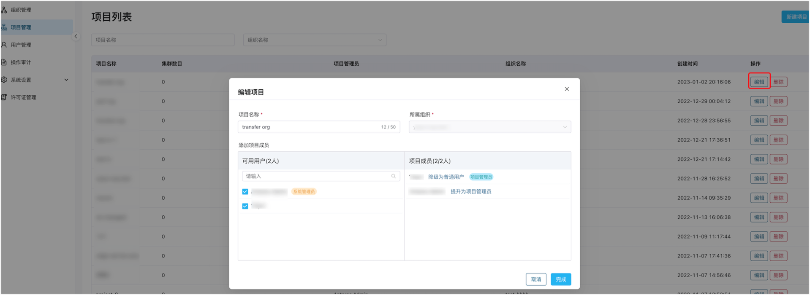

# 项目管理

项目管理是在组织管理上更进一步的细分资源，一个组织可以有多个项目，最终的云端集群、边缘服务等资源被分配到具体项目中。**系统管理员**、**组织管理员**、**项目管理员**都可以对项目中的各种资源进行管控、运维。

## 新建项目及成员

1. 以系统/组织/项目管理员的身份登录 ECP。
2. 在**系统管理**页面的左侧导航栏，点击**项目管理**。
3. 点击**新建项目**，在弹出的新建项目页进行如下设定：
   - 按项目命名规则填入项目名称；1-50 个字符，并支持"-"、"_" 和空格。
   - 在左侧**可用用户**，勾选待添加的项目成员，勾选后，该成员将出现在右侧的**项目成员**中。
   - 在右侧的**项目成员**列表中，设置用户角色，如**提升为项目管理员**或**降级为普通用户。
   - 最后，点击**创建**按钮，保存新建项目的内容。

完成项目的创建后，新建项目就会出现在**项目管理**页面，您可在此查看项目名称、集群数、项目管理员、所属组织和创建时间，并可以通过项目名称、组织名称进行模糊搜索。

## 编辑项目及成员

项目创建完成后，系统/组织/项目管理员可以通过**操作**栏下的编辑按钮，对项目名称、项目成员进行编辑操作。

如希望移除项目成员，只需在**可用用户**栏取消勾选对应账户，该成员将自动从**项目成员**列表中清除。

## 删除项目

项目创建完成后，系统/组织/项目管理员可以通过**操作**栏下的删除按钮删除项目，在弹出的对话框中确认删除操作，即可删除对应项目。注意：项目删除后不可恢复。

:::tip
删除项目前，需首先移除项目下的所有集群。
:::