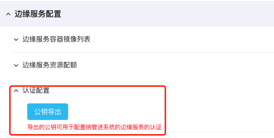
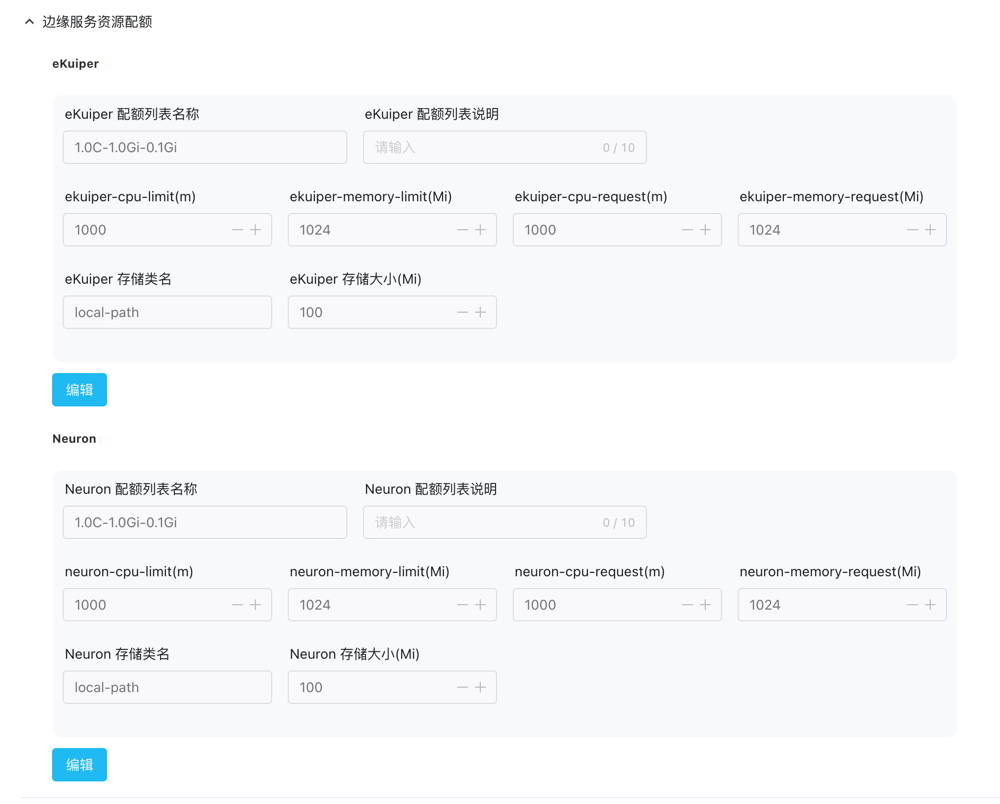
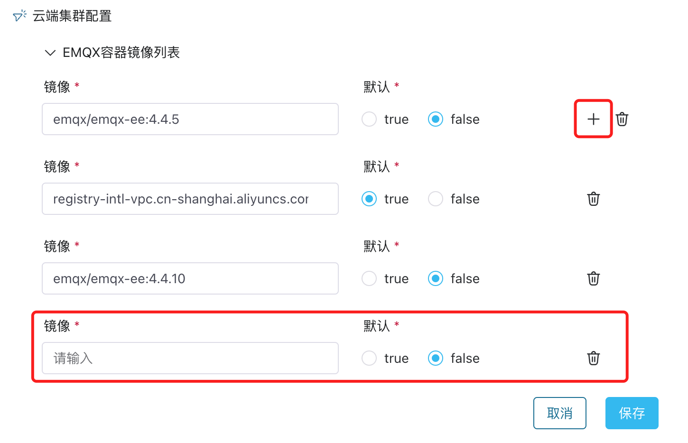
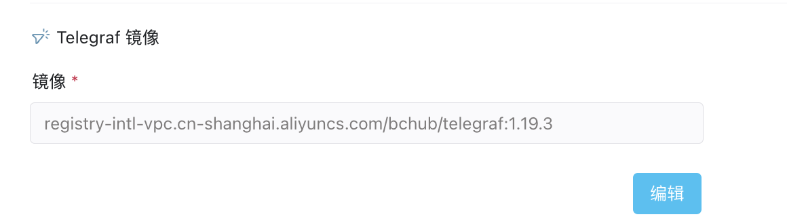

# 资源配置

资源配置是基于 Docker 或 Kubernetes 安装部署的 ECP 对资源层的配置，主要包括 Docker 与 Kubernetes 连接设置、镜像仓库、云端集群和边缘服务的初始化配置工作。
是基于 Kubernetes 安装部署的 ECP 初始化 Paas 层配置的模块，主要包括 [基础配置](#基础配置)、[Docker部署模式配置](#Docker部署模式配置)、[Kubernetes部署模式配置](#Kubernetes部署模式配置)三大类。

## 基础配置

### 镜像服务信息

ECP 支持连接内部私有镜像仓库，通过镜像仓库，ECP 可以完成边缘服务 NeuronEX 及 EMQX 集群的软件镜像拉取部署工作。如希望建立到内部私有镜像仓库的连接：

1. 以系统管理员的身份登录 ECP，在系统管理页面，点击**系统设置** -> **资源配置**。
2. 点击展开**镜像服务信息**部分。
1. 点击**编辑**，进入编辑页面。
2. 输入链接地址、用户名和密码。
2. 完成设置后，点击**测试连接**检查连接的有效性。
3. 最后点击**确认**，完成配置。


### 边缘服务镜像列表

系统管理员可以新增、编辑或删除边缘服务的镜像地址。在有公网连接的情况下，管理员可以直接配置公有镜像地址。如在使用私服镜像，也可以参照[镜像服务信息部分](#镜像服务信息)。

1. 以系统管理员的身份登录 ECP，在系统管理页面，点击**系统设置** -> **资源配置**。

2. 点击展开**基础配置**部分，点击展开**边缘服务容器镜像列表**。

3. 点击在 NeuronEX 下的**编辑**，进入编辑页面。

4. 您可点 + 新增一条镜像，并确定是否设为默认镜像。也可点击删除图标删除一条镜像。

5. 点击**确认**完成设置。


### 纳管边缘服务认证配置

可以从**纳管边缘服务认证配置**获取 ECP 在安装时自动生成的公钥文件，用于当**纳管**的 NeuronEX 开启认证时的秘钥。关于云边认证和 Neuron 开启认证请参考[边缘服务认证](../edge_service/e2c)。




## Docker部署模式配置

### Docker连接配置  

ECP 在 Docker 部署模式环境下提供了自定义连接信息功能，同时也提供了默认的配置。

1. 以系统管理员的身份登录 ECP，在系统管理页面，点击**系统设置** -> **资源配置**。
2. 点击展开**Docker部署模式**部分，点击展开**Docker连接配置**。
3. 点击**编辑**，进入编辑页面，您可在此调整设置。

:::tip 

在通过 ECP [Docker方式批量安装边缘服务](../edge_service/batch_install.md)时，请先配置正确的`Docker连接配置`。

:::


### 边缘服务配置

可以通过边缘服务配置修改**NeuronEX**的默认配置值，如修改默认的端口号、数据存储路径、日志存储路径等。ECP 通过Docker 批量创建边缘服务时，会根据此处的配置值创建容器。

1. 以系统管理员的身份登录 ECP，在系统管理页面，点击**系统设置** -> **资源配置**。
2. 点击展开**边缘服务配置**部分。
3. 点击**编辑**，进入编辑页面，您可在此调整设置。



## Kubernetes部署模式配置

### 配置 Kubernetes 连接设置

使用 ECP 管理 Kubernetes 资源之前，需要先配置 ECP 到 Kubernetes 的连接信息，方便 ECP 管理、控制和认证 Kubernetes 资源。

#### 在 Kubernetes 获取 `kubeconfig` 文件

获取 Kubernetes master 集群的 `kubeconfig` 文件，一般该文件路径是`~/.kube/config`。

如所下载的 `kubeconfig` 文件中的以下三个字段指向外部文件路径

- `certificate-authority-data`  
- `client-certificate-data`  
- `client-key-data`  

则需要将证书文件转换为 base64 编码过后的字符串：

macOS & Linux

```bash
cat "certificate file" | base64
```

Windows

```bash
certutil -f -encode "certificate file" "output file"
```

完成转换后，更新 `Kubeconfig` 文件

1. 将 `certificate-authority` 改为 `certificate-authority-data`，并且将 `*/ca.crt` 证书文件经 base64 编码后的字符串填入该位置。
2. 将 `client-certificate` 改为 `client-certificate-data`，并且将 `*/client.crt` 证书文件经 base64 编码后的字符串填入该位置。
3. 将 `client-key` 改为 `client-key-data`，并且将 `*/client.key` 证书文件 base64 编码后的字符串填入该位置。

#### 上传 `kubeconfig` 文件至 ECP

1. 以系统管理员的身份登录 ECP，在系统管理页面，点击**系统设置** -> **资源配置**。
2. 点击展开 **Kubernetes 连接设置**部分。
3. 点击新建 Kubernetes 连接，并在弹出的对话框中上传  `kubeconfig` 文件。更新将即刻生效。


:::warning
Kubernetes 的连接已建立、并有实际集群运行后，请尽量避免修改连接配置，否则当前运行的所有集群都会停止服务。
:::


### 配置云端集群

为 EMQX 云端集群配置初始化资源，便于 EMQX 集群的升级、动态扩缩容和配置网络。

#### EMQX 容器镜像列表

系统管理员可以新增、编辑或删除 EMQX 集群的镜像地址。在有公网连接的情况下，管理员可以直接配置公有镜像地址。如在使用私服镜像，也可以参照[配置镜像服务信息部分](#配置镜像服务信息)。

1. 以系统管理员的身份登录 ECP，在系统管理页面，点击**系统设置** -> **资源配置**。
2. 点击展开**云端集群配置**部分，点击展开**EMQX容器镜像列表**。
3. 点击**编辑**，进入编辑页面。
1. 您可点 + 新增一条镜像，并确定是否设为默认镜像。也可点击删除图标删除一条镜像。
1. 点击**确认**完成设置。



#### 集群资源配额

ECP 在 Kubernetes 环境下提供了自定义资源配额的功能，同时也提供了默认的配额配置。

1. 以系统管理员的身份登录 ECP，在系统管理页面，点击**系统设置** -> **资源配置**。
2. 点击展开**云端集群配置**部分，点击展开**集群资源配额**。
3. 点击**编辑**，进入编辑页面，您可在此新增一条集群资源配额，调整配额，或者删除一条配额，删除配额不会对已运行的集群产生任何影响。


以配置 CPU 为 1 核，内存为 1 Gi （ 1 Gi= 1024 Mi)，存储为 512 Mi 的规格，举例说明 EMQX 集群规格配置：


|规格名称|规格/单位|解释|
| :----------| :---------|:-------------------------|
|EMQX 存储类名| `local-path`|Kubernetes 存储类名|
|EMQX 存储大小|512Mi|占用磁盘空间大小|
|是否默认|`true` 或 `false` |`true` 表示该规格被设置为默认选择规格，其他规格被自动设置为 `false`|
|EMQX 配额列表说明|1C1G0.5G|最终在 EMQX 集群安装时显示的规格名称|
|EMQX-cpu-limit|1000m|集群使用 CPU 的上限为 1 核|
|EMQX-memory-limit|1024Mi|集群使用内存的上限为 1024Mi = 1Gi|
|EMQX-cpu-request|1000m|集群使用 CPU 的下限为 1 核|
|EMQX-memory-request|1024Mi|集群使用内存的下限为 1024Mi = 1Gi|
|telegraf-cpu-limit|1000m|为 telegraf 分配 CPU 使用上限为 1 核|
|telegraf-memory-limit|1024Mi|为 telegraf 分配内存上限为 1024Mi = 1Gi|
|telegraf-cpu-request|100m|为 telegraf 分配 CPU 使用下限为 0.1 核|
|telegraf-memory-request|100Mi|为 telegraf 分配内存下限为 100Mi|


#### 配置负载均衡

在公有云环境下，ECP 支持通过 Annotation （注解）配置公网负载均衡的服务。目前 ECP 已支持在阿里云上通过注解配置负载均衡功能。具体操作步骤，见[阿里云 - 注解配置负载均衡](https://help.aliyun.com/document_detail/86531.html) 。


此服务提供了如下策略：

- 新增配置并设置连接数的范围；
- 可以建立多个配置并让多个配置生效；
- 配置默认按照业务连接数匹配生效；
- 当配置的连接数有重叠时，默认匹配最早建的配置；
- 配置的个数最大为100个；


### 配置存储类

存储类是 Kubernetes 资源类型的一种，是为了创建集群时，指定给集群使用的存储资源在 Kubernetes 上的 PV 卷。

存储类是云端集群和边缘服务在配置资源规格时必不可少的一步。本节将以配置 EMQX 集群为例介绍存储类的配置方法。

#### 在 Kubernetes 获取存储类

1. 首先，我们通过命令行登录到 Kubernetes 环境；

2. 通过以下命令查看存储类列表，包含系统自带的存储类或自建的存储类；

   ```
   kubectl get sc
   
   NAME                    PROVISIONER                      RECLAIMPOLICY  VOLUMEBINDINGMODE     ALLOWVOLUMEEXPANSION        AGE
   alicloud-disk-ssd       diskplugin.csi.alibabacloud.com  Delete         Immediate             true                        170d
   alicloud-disk-topology  diskplugin.csi.alibabacloud.com  Delete         WaitForFirstConsumer  true                        170d
   local-path              rancher.io/local-path            Delete         WaitForFirstConsumer  false                       169d
   ```

#### 配置 EMQX 存储类

1. 以系统管理员的身份登录 ECP，在系统管理页面，点击**系统设置** -> **资源配置**。
2. 点击展开**云端集群配置**部分，点击展开**集群资源配额**。
3. 点击**编辑**，进入编辑页面。
4. 填入上一步中获取的 Kubernetes 存储类，名称应和 Kubernetes 存储类列表的名称一致，并设置存储大小和是否默认选项。


4. **保存**设置，新建的存储类会立即生效；


### Telegraf 镜像

Telegraf 服务用于配置由ECP托管创建的 EMQX 集群的日志采集。

:::tip

仅当 ECP 通过 Kubernetes 部署时，并且由ECP托管创建的 EMQX 集群才需要配置 Telegraf 镜像，ECP 纳管的 EMQX 集群不需要配置 Telegraf 镜像。

:::



